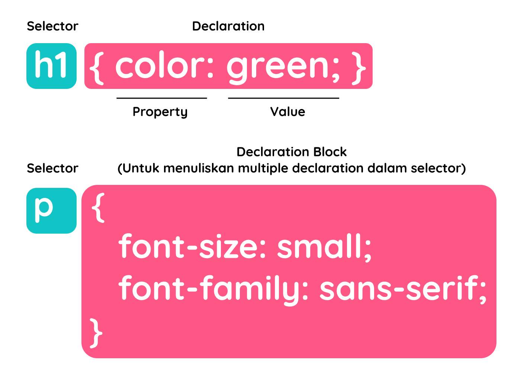

#programming 
Sebuah style sheet dibuat terdiri dari satu atau lebih aturan _styling_ (biasa disebut dengan **_rules_** atau **_rule-sets_**) yang mendeskripsikan cara sebuah elemen atau sebuah kelompok elemen ditampilkan dalam jendela browser. 

Langkah awal belajar CSS adalah dengan memahami sebuah bagian _rule_. Berikut adalah dua contoh rules yang dituliskan dalam sebuah CSS. Rule pertama menetapkan sebuah warna hijau pada elemen `<h1>` dan kedua menetapkan ukuran font dan tipe font pada sebuah elemen paragraf.

```css
h1 {
  color: green;
}
 
p {
  font-size: small;
  font-family: sans-serif;
}
```

Dalam penggunaan CSS, terdapat **dua bagian** pada sebuah rule. Bagian pertama adalah identitas elemen atau elemen yang akan menerapkan rule (singkatnya kita akan sebut _selector_) dan kedua adalah deklarasi atau instruksi yang akan diterapkan pada sebuah selector.


### Selector
Pada contoh di atas,` <h1>` dan `<p>` digunakan sebagai selector. Ia dipanggil melalui tipe elemennya dan ini merupakan teknik dasar dari pemanggilan selector. Properti dan nilainya yang terdapat dalam _declaration_/_declaration block_ akan diterapkan pada seluruh elemen h1 dan p yang ada pada dokumen HTML.

### Declarations
Bagian deklarasi terdiri dari pasangan properti dengan nilainya. Kita bisa menetapkan lebih dari satu deklarasi pada satu rule; contohnya seperti pada selector p di atas, kita menetapkan lebih dari satu deklarasi pada _declaration block_. Setiap deklarasinya harus diakhiri dengan _semicolon_ (**;**) sebagai tanda diakhirinya sebuah deklarasi.

### Fitur Komentar

Komentar digunakan untuk menjelaskan kode dan dapat membantu ketika Anda mengedit kode sumber di lain waktu. Hal yang tertulis akan diabaikan oleh browser dan tidak akan ditampilkan di browser. Hal ini menjadi opsi baik untuk memberi catatan atau informasi dokumentasi pada kode.

Sebagaimana contoh yang telah beberapa kali Anda lihat di atas, CSS comments ditempatkan dalam elemen `<style> dengan cara penulisan diawali` “/*” dan diakhiri “*/” seperti kode berikut.
```css
/* ini merupakan komentar satu baris */
 
/* CSS juga mendukung komentar lebih dari satu baris,
  seluruh teks yang berada pada pembuka dan penutup sebuah komentar
  akan diabaikan oleh browser sebagai compiler.
*/
 
 
p {
  font-size: small;
 
  /* memilih sans-serif sesuai hasil diskusi klien pada 2 Januari 2021 */
  font-family: sans-serif;
}
```

