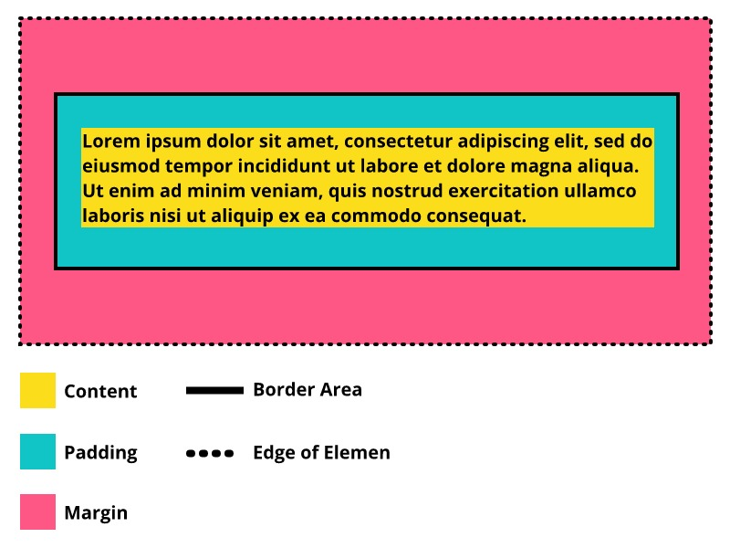
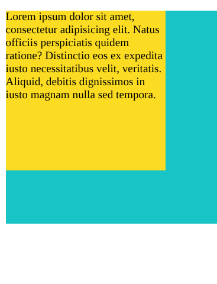
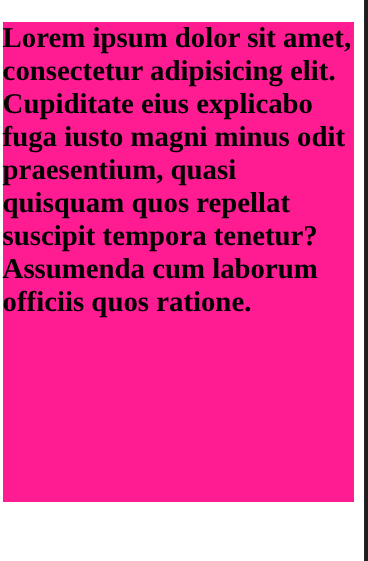
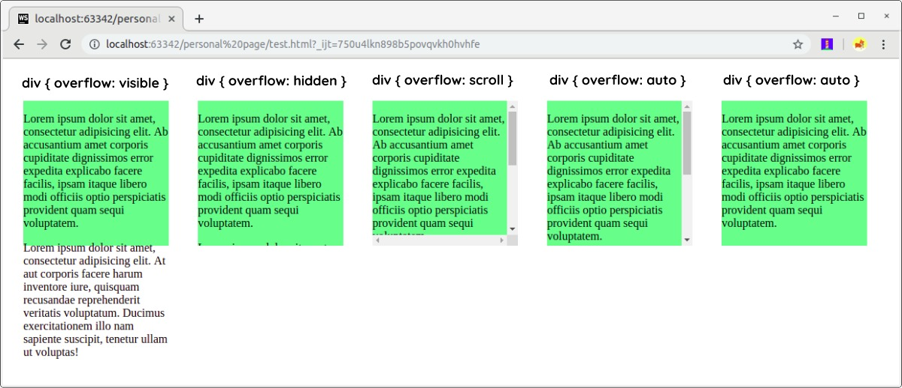
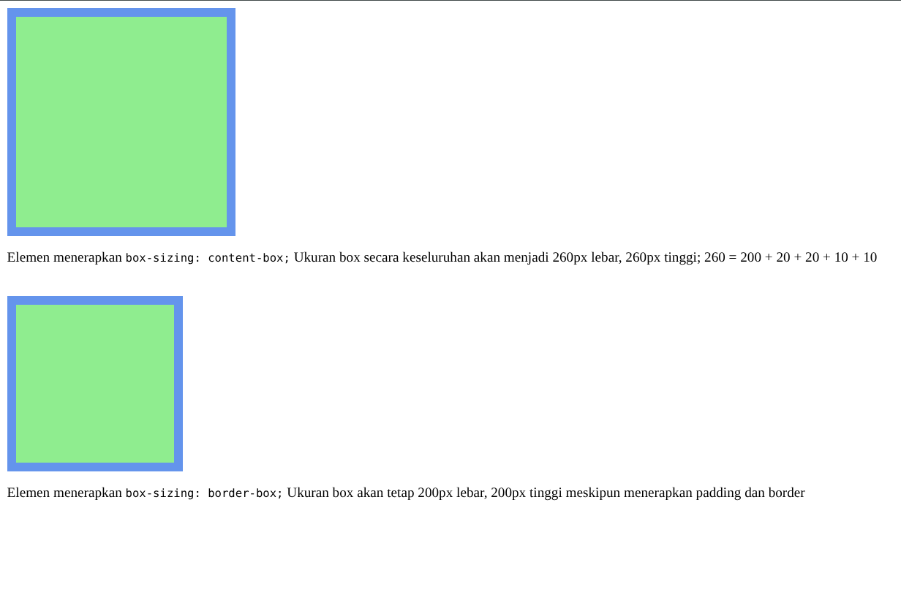
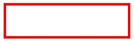
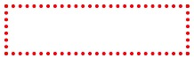
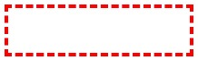
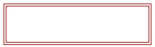

#programming 
# Box Model

Pada pembahasan background-color disinggung bahwa setiap elemen ditampilkan seperti sebuah _boxes_ atau kotak. Setiap elemen yang dibuat pada HTML akan menciptakan sebuah kotak untuk menampung kontennya. Layaknya bentuk kotak pada umumnya, ada beberapa nilai atau komponen padanya.

- Lebar dan tinggi pada kotak (konten).
- Ruang kosong antara konten dengan border (padding).
- Garis tepi (border).
- Jarak dari elemen lain (margin). 

Pada CSS, kita dapat mengatur nilai-nilai tersebut. Inilah yang disebut dengan box model.


Sebagaimana yang kita lihat pada gambar di atas, setiap elemen pada HTML, baik _block-level_ maupun inline-level, akan menghasilkan kotak elemen. dengan menerapkan CSS berikut.
```css
* {
  border: 1px solid red;
}
```



Berikut adalah penjelasan dari gambar di atas.

- **Content**  
    Content atau konten merupakan sebuah inti dari kotak elemen yang merupakan konten dari elemen itu sendiri.  
      
    
- **Padding**  
    Area yang menjadi jarak antara border elemen dengan konten yang ditampilkan. Ketika kita menerapkan background-color, warna tersebut diterapkan pada area padding. Penerapan ukuran padding pada elemen adalah opsional.  
      
    
- **Border**  
    Border merupakan garis yang mencakup konten beserta padding. Penerapan border pada elemen adalah opsional.  
      
    
- **Margin**  
    Berbeda dengan padding, margin merupakan area jarak di luar border. Pada ilustrasi di atas, margin ditunjukkan dengan warna merah muda. Namun, pada aslinya margin selalu transparan dan penerapan margin pada elemen adalah opsional.  
      
    
- **Edge of Element**  
    Edge of element merupakan batas dari suatu elemen. Di dalamnya terdapat margin, border, padding, dan konten. Pada ilustrasi di atas, batas elemen ditunjukkan dengan garis putus, tetapi pada aslinya batas elemen selalu tidak terlihat.

### Dimension

Standarnya, sebuah box yang dihasilkan tiap elemen selalu cukup untuk menampung konten. Namun, kita dapat mengatur nilai dimensi dari box tersebut dengan properti **width** dan **height**. 

Cara yang paling banyak digunakan dalam menentukan dimensi kotak adalah menggunakan piksel, persentase, atau em. Secara tradisional, piksel merupakan cara yang paling populer karena kita dapat merancang dan mengontrol ukuran secara akurat. 

Berbeda ketika kita menggunakan persentase, ukuran kotak akan relatif atau menyesuaikan dari ukuran lain, seperti ukuran jendela browser atau ukuran induk yang menaunginya. Namun ketika menggunakan em, nilai dimensi kotak akan menyesuaikan berdasarkan ukuran teks yang ditampilkan pada konten elemen tersebut.

Pada saat ini, banyak developer mulai merancang menggunakan persentase dan em untuk menetapkan ukuran box agar dapat menyesuaikan dengan berbagai macam ukuran layar.

HTML:
```html
<!DOCTYPE html>
<html>
  <head>
    <meta charset="UTF-8" />
    <title>Judul Dokumen</title>
    
    <link rel="stylesheet" href="styles.css" />
  </head>
  <body>
    <div class="box">
      <p>
        Lorem ipsum dolor sit amet, consectetur adipisicing elit. Natus officiis perspiciatis quidem
        ratione? Distinctio eos ex expedita iusto necessitatibus velit, veritatis. Aliquid, debitis
        dignissimos in iusto magnam nulla sed tempora.
      </p>
    </div>
  </body>
</html>
```
CSS:
```css
.box {
  height: 300px;
  width: 300px;
  background-color: #11c5c6;
}

p {
  height: 75%;
  width: 75%;
  background-color: #fbdd1c;
}
```
Output:


Pada contoh di atas, kita dapat melihat elemen `<div>` memiliki dimensi elemen dengan lebar 300px dan tinggi 300px. Di dalamnya terdapat elemen `<p>` yang memiliki ukuran elemen 75% dari lebar dan tinggi elemen induknya. Dengan demikian, elemen `<p>` memiliki ukuran 225px untuk panjang dan lebarnya.

### Limiting Dimension

Beberapa website yang ada sekarang menampilkan layout yang dapat melebar dan menyempit mengikuti ukuran layar pengguna. Pada prinsip tampilan tersebut, mungkin kita memerlukan sebuah limitasi ukuran yang harus ditetapkan agar konten selalu ditampilkan secara proporsional. Untuk melakukannya kita manfaatkan properti **min-width** dan **max-width**.

- **min-width**: menetapkan nilai lebar minimal yang harus dimiliki elemen.
- **max-width**: menetapkan nilai lebar maksimal yang harus dimiliki elemen.

Keduanya merupakan properti yang sangat membantu untuk memastikan konten halaman dapat terbaca oleh pengguna (terutama ketika pengguna menggunakan ponsel). Misalnya, kita dapat menggunakan properti max-width untuk memastikan bahwa baris teks yang muncul tidak terlalu lebar.

HTML:
```html
<!DOCTYPE html>
<html>
  <head>
    <meta charset="UTF-8" />
    <title>Judul Dokumen</title>
    
    <link rel="stylesheet" href="styles.css" />
  </head>
  <body>
    <div class="content">
      <p>
        Lorem ipsum dolor sit amet, consectetur adipisicing elit. Cupiditate eius explicabo fuga
        iusto magni minus odit praesentium, quasi quisquam quos repellat suscipit tempora tenetur?
        Assumenda cum laborum officiis quos ratione.
      </p>
    </div>
  </body>
</html>
```
CSS:
```css
.content {
  max-width: 800px;
  height: 400px;

  margin-left: auto;
  margin-right: auto;
  background-color: deeppink;
}

p {
  font-size: 1.5em;
  font-weight: bold;
}
```

Dengan cara yang sama, mungkin kita juga perlu membatasi ukuran panjang. Kita bisa gunakan **min-height** dan **max-height**.


### Overflowing Content
Dimensi box yang dihasilkan elemen selalu cukup untuk menampung konten, tetapi hal ini tidak berlaku jika kita tetapkan secara manual panjang dan lebarnya. Tak jarang terjadi _overflow_ ketika kita menerapkan ukuran pada elemen dengan konten di dalamnya yang begitu banyak.
Contohnya berikut.

HTML
```html
<!DOCTYPE html>
<html>
  <head>
    <meta charset="UTF-8" />
    <title>Judul Dokumen</title>
    
    <link rel="stylesheet" href="styles.css" />
  </head>
  <body>
    <div>
      <p>
        Lorem ipsum dolor sit amet, consectetur adipisicing elit. Ab accusantium amet corporis
        cupiditate dignissimos error expedita explicabo facere facilis, ipsam itaque libero modi
        officiis optio perspiciatis provident quam sequi voluptatem.
      </p>
      <p>
        Lorem ipsum dolor sit amet, consectetur adipisicing elit. At aut corporis facere harum
        inventore iure, quisquam recusandae reprehenderit veritatis voluptatum. Ducimus
        exercitationem illo nam sapiente suscipit, tenetur ullam ut voluptas!
      </p>
    </div>
  </body>
</html>
```
CSS:
```css
div {
  height: 200px;
  width: 200px;
  background-color: lightgreen;
}
```
Output:

Untuk menangani kasus seperti ini kita bisa gunakan properti overflow, properti ini dapat bernilai berikut.

- **visible**  
    Visible merupakan nilai default pada properti ini. Konten yang tidak tertampung (overflow) akan tetap ditampilkan seperti pada standarnya.
- **hidden**  
    Jika terjadi overflow, konten yang tidak tertampung akan disembunyikan.
- **scroll**  
    Memunculkan scroll bar pada pinggir elemen sehingga konten yang tidak tertampung akan ditampilkan dengan scroll bar. Jika menggunakan nilai ini, scroll bar akan tetap muncul walaupun konten tidak terjadi overflow.
- **auto**  
    Sama seperti scroll, hanya jika tidak terjadi overflow, nilai visible yang akan diterapkan.

Berikut adalah contoh penerapan seluruh nilai properti ini:


### Box-Sizing

Sebelum CSS3, ukuran lebar dan panjang elemen mengacu pada konten elemen (content-box). Itu berarti ukuran elemen seluruhnya merupakan nilai panjang (width) dan lebar (height) yang kita spesifikasikan ditambah dengan nilai padding dan border yang diterapkan pada elemen. Hal tersebut membuat sebagian developer menjadi sulit dalam menetapkan ukuran dimensi.

Pada CSS3, kita dapat memilih tipe pengukuran lain dalam menentukan dimensi elemen. Dengan menggunakan properti box-sizing, kita dapat menentukannya berdasarkan border box. Ukuran elemen sudah termasuk content, padding, dan border. Dengan metode ini, hasil elemen yang ditampilkan (termasuk padding dan border) akan memiliki dimensi yang sama persis seperti yang kita tentukan.

HTML:
```html
<!DOCTYPE html>
<html>
  <head>
    <meta charset="UTF-8" />
    <title>Judul Dokumen</title>
    
    <link rel="stylesheet" href="styles.css" />
  </head>
  <body>
    <div class="content"></div>
    <p>
      Elemen menerapkan <code>box-sizing: content-box;</code> Ukuran box secara keseluruhan akan
      menjadi 260px lebar, 260px tinggi; 260 = 200 + 20 + 20 + 10 + 10
    </p>
    <br />
    <div class="box"></div>
    <p>
      Elemen menerapkan <code>box-sizing: border-box;</code> Ukuran box akan tetap 200px lebar,
      200px tinggi meskipun menerapkan padding dan border
    </p>
  </body>
</html>
```
CSS:
```css
div {
  height: 200px;
  width: 200px;
  background-color: lightgreen;
  border: 10px solid cornflowerblue;
  padding: 20px;
}

.content {
  box-sizing: content-box;
}

.box {
  box-sizing: border-box;
}
```
Output:



## Box Model: Border

Border merupakan sebuah garis yang mengelilingi area konten dan padding (opsional). Kita bisa mengatur tipe, ketebalan, serta warna garis yang ditampilkan sesuai dengan yang kita inginkan. Kita juga bisa mengatur dalam menampilkan sebagian atau keseluruhan garis pada elemen. Mari kita eksplorasi properties yang dapat mengatur border.

### Border Width

Properti border-width digunakan untuk mengatur ketebalan dari border, nilai dari properti ini dapat berupa piksel atau menggunakan predefined names value, seperti **thin**, **medium**, dan **thick**. Kita tidak bisa menggunakan nilai persentase (%) pada properti ini.

Kita dapat mengatur ukuran garis secara individual dengan menggunakan empat properti terpisah seperti berikut.

```css
.box {
  border-top-width: 2px;
  border-right-width: 1px;
  border-bottom-width: 1px;
  border-left-width: 2px;
}
```


Namun, kita juga dapat menetapkan nilai keempatnya sekaligus dalam satu properti seperti ini.

```css
.box {
  border-width: 2px 1px 1px 2px; /*top right bottom left*/
}
```

Properti border-width dapat ditentukan dengan menggunakan satu, dua, tiga, atau empat nilai. Berikut penjelasannya.

- Ketika satu nilai ditentukan, nilai berlaku untuk empat sisi.
- Ketika dua nilai ditentukan, nilai pertama berlaku untuk sisi atas dan bawah, nilai kedua untuk sisi kiri dan kanan.
- Ketika tiga nilai ditentukan, nilai pertama berlaku untuk sisi atas, nilai yang kedua untuk sisi kiri dan kanan, nilai ketiga untuk sisi bawah.
- Ketika empat nilai ditentukan, nilai pertama berlaku untuk sisi atas, nilai yang kedua untuk sisi kanan, nilai yang ketiga untuk sisi bawah, dan nilai yang keempat untuk sisi kiri. Urutan tersebut berdasarkan arah jarum jam (_clockwise_).

  

### Border Style

Kita bisa menetapkan tipe border dengan menggunakan properti **border-style**. Berikut adalah nilai-nilai yang dapat digunakan pada properti ini.

| **Nilai Properti** | **Penjelasan**                                                                                                                                     | **Gambar**            |
| ------------------ | -------------------------------------------------------------------------------------------------------------------------------------------------- | --------------------- |
| solid              | Tipe garis padat (tidak terputus-putus).                                                                                                           |   |
| dotted             | Garis yang dibentuk dari serangkaian titik-titik (jika ketebalan garis 2px, titik-titik akan berukuran 2px dan memiliki jarak 2px antar titiknya). |  |
| dashed             | Garis yang dibentuk dari serangkaian garis pendek.                                                                                                 |  |
| double             | Garis yang dibentuk dari dua buah garis padat.                                                                                                     |  |
| groove             | Tipe garis yang berbentuk seperti frame.                                                                                                           |  |
| hidden             | Digunakan untuk menyembunyikan garis pada elemen.                                                                                                  |                       |

Kita juga bisa menetapkan tipe garis secara individual pada sisi elemen dengan menggunakan empat properti terpisah. Contohnya berikut.

### Border Color

Properti terakhir adalah border-color. Properti ini digunakan untuk menentukan warna pada garis dengan menggunakan nilai RGB, Hex, atau nama warna pada CSS.

```css
/* menggunakan rgb format */
border-color: rgb(80, 138, 212);
```

```css
/* menggunakan format hex */
border-color: #4ee717;
```

```css
/* menggunakan nama warna */
border-color: red;
```

Sama seperti properti border yang lain, kita dapat menentukan warna individual sisi pada elemen dengan menggunakan properti yang terpisah.

Untuk menyingkat cara, kita juga dapat menetapkan nilai keempatnya sekaligus dalam satu properti seperti berikut.

```css
border-color: #919191 #111111 #4ee717 #00c8eb;
```

### Shorthand

Untuk menerapkan border pada elemen kita harus mendefinisikan seluruh properti border yang ada. Dimulai dari menetapkan ketebalan (border-width), tipe (border-type), dan warna (border-color). Jika kita lupa menetapkan salah satu properti tersebut, garis tidak akan tampak pada elemen.

Dengan demikian, kita butuh menuliskan properti yang banyak untuk menetapkan border pada elemen, bukan? Ya memang, tetapi CSS menyediakan jalan pintas (_shorthand_) untuk membuat border dengan satu properti saja.

Perhatikan gambar berikut.

[
Properti **border** memiliki tiga buah nilai yang digunakan untuk menentukan ketebalan, tipe, dan warna pada border. Berikut contoh penerapannya.

Beberapa di antara Anda mungkin bertanya-tanya, "Apakah urutan nilainya akan mempengaruhi hasil". Jawabannya, tidak. Anda tidak perlu pusing dengan aturan peletakkan nilai ini karena tidak menjadi masalah.

