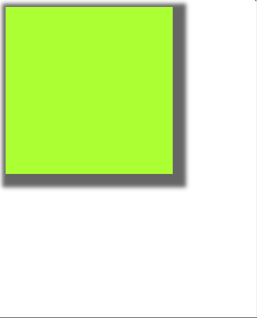

#programming 

Pada materi _formatting text_ kita sudah belajar cara menambahkan drop shadow pada teks. Pada CSS3, kita juga dapat menambahkan drop shadow di sekitar kotak elemen (tidak termasuk margin) dengan menggunakan properti box-shadow.

Nilai dan cara kerja dari properti box-shadow mirip seperti text-shadow, yaitu nilainya menentukan jarak vertikal dan horizontal, tingkat keburaman, dan warna pada bayangan. Pada box shadow, kita juga dapat menentukan tingkat sebaran (_spread_) bayangan. Jika nilai semakin besar, bayangan yang tampak akan semakin luas.

Berikut adalah contoh penerapan box shadow pada CSS.

HTML:
```html
<!DOCTYPE html>
<html>
  <head>
    <meta charset="UTF-8" />
    <title>Judul Dokumen</title>
    
    <link rel="stylesheet" href="styles.css" />
  </head>
  <body>
    <div class="box"></div>
  </body>
</html>
```

CSS:
```css
.box {
  width: 200px;
  height: 200px;

  background-color: greenyellow;

  box-shadow: 6px 6px 5px 10px #666666;
}
```

Output:


Berikut adalah penjelasan tiap-tiap nilai dari propertinya.

- Nilai pertama: menunjukkan seberapa jauh ke kiri atau kanan (horizontal) bayangan harus ditampakkan.
- Nilai kedua: menunjukkan jarak ke atas atau ke bawah (vertical) bayangan harus ditampakkan. 
- Nilai ketiga (opsional): menentukan tingkat keburaman yang harus diterapkan pada bayangan.
- Nilai keempat (opsional): tingkat sebaran (_spread_) bayangan. Semakin besar nilai yang ditentukan, bayangan yang tampak akan semakin luas.
- Nilai kelima: menentukan warna yang digunakan pada bayangan.
