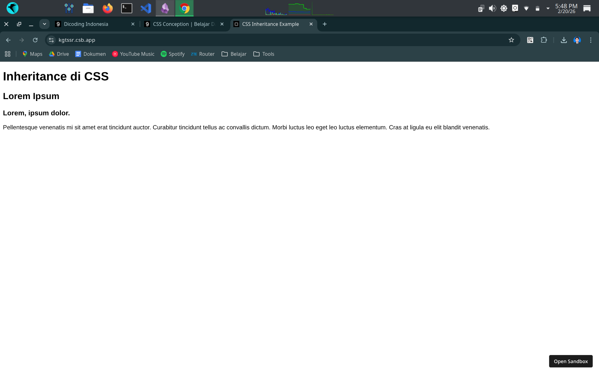

#programming 
### Inheritance

Styling HTML bersifat _inheritance_ yang berarti dapat mewarisi properti style “tertentu” dari suatu elemen ke elemen-elemen di dalamnya (_child-elements_).

Contohnya, CSS rules yang ditetapkan untuk elemen `<body>` akan diterapkan pada seluruh child-elements secara otomatis. Contoh lainnya, CSS rules yang diterapkan pada elemen `<footer>` dengan properti `color: white` akan diterapkan pada seluruh elemen yang ada di dalamnya. Hal ini menjadi alasan memahami struktur dokumen itu penting.

```html
<!DOCTYPE html>
<html>
<head>
  <meta charset="UTF-8" />
  <title>CSS Inheritance Example</title>

  <link rel="stylesheet" href="styles.css" />
</head>
<body>
  <header>
    <h1>Inheritance di CSS</h1>
  </header>
  <main>
    <h2>Lorem Ipsum</h2>

    <article>
      <h3>Lorem, ipsum dolor.</h3>
      <p>
        Pellentesque venenatis mi sit amet erat tincidunt auctor. Curabitur tincidunt tellus ac
        convallis dictum. Morbi luctus leo eget leo luctus elementum. Cras at ligula eu elit
        blandit venenatis.
      </p>
    </article>
  </main>
  <footer>
    <p>Hak Cipta &copy; 2023</p>
  </footer>
</body>
</html>
```
```css
body {
  font-family: sans-serif;
}

footer {
  color: white;
}
```
output:


### Group Selector

Jika beberapa selector yang berbeda memiliki penerapan properti-propeti yang sama, kita dapat menggabungkannya menggunakan group selector. Hal ini dapat meminimalkan penulisan kode yang berulang.
```css
h2 {
  color: #00A2C6;
}
 
h3 {
  color: #00A2C6;
}
```
Jika terdapat kasus seperti di atas, kita dapat menuliskan dua selector sekaligus dalam satu struktur rule. Gunakan tanda koma (,) untuk memisahkan tiap selector-nya, seperti ini:
```css
h2, h3 {
  color: #00A2C6;
}
```

### Rule Order

Sesuai dengan namanya, _cascading_ artinya “mengalir”. Demikian halnya dengan alur kerja CSS dalam membaca kode, mengalir dari atas ke bawah. Oleh karena itu, kita harus memperhatikan urutan dalam penulisan rules, terutama saat terjadi sebuah konflik. Konflik dapat terjadi karena kita menerapkan beberapa styling pada satu dokumen HTML dan menimpa styling yang telah diterapkan sebelumnya, baik disadari maupun tidak.

Contohnya, apa yang akan ditampilkan oleh browser ketika eksternal css mengharuskan elemen `<p>` menampilkan warna merah, tetapi pada embedded css `<p>` harus menampilkan warna biru? Kembali pada alur kerja CSS yang membaca dari atas ke bawah sehingga warna yang akan diterapkan adalah warna yang paling akhir didefinisikan.

Namun, kita bisa membuat sebuah **property styling** agar dianggap penting oleh browser untuk diterapkan dan urutan tidak diperhatikan. Kita bisa menambahkan _keyword_ `!important` pada akhir nilai propertinya.

```css
p {
  color: red !important;
}
```
Gunakan !important ketika memang benar-benar dibutuhkan saja. Sebaiknya kita pahami aturan urutan pada CSS dengan baik sehingga meminimalisir penggunaan tanda tersebut.

