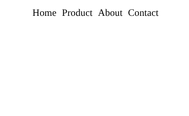

#programming 
Kita pernah membahas mengenai inline dan block pada modul HTML sebelumnya bahwa standarnya setiap elemen HTML memiliki dua tipe, yaitu block dan inline. Untuk lebih jelasnya berikut adalah sifat-sifat yang ada pada elemen block dan inline.

|                    | Keterangan                                                                                                                                                                                                                                                                                                              |
| ------------------ | ----------------------------------------------------------------------------------------------------------------------------------------------------------------------------------------------------------------------------------------------------------------------------------------------------------------------- |
| **Inline Element** | - Elemen HTML yang secara default tidak menambahkan baris baru ketika dibuat.<br>- Nilai lebar dan tinggi elemen inline sebesar konten di dalamnya, dan tidak dapat diubah.<br>- Margin dan padding hanya mempengaruhi elemen secara horizontal, tidak vertikal.                                                        |
| **Block Element**  | - Elemen HTML secara default menambahkan baris baru ketika dibuat.<br>- Jika tidak diatur lebarnya, lebar dari elemen block akan memenuhi lebar dari browser atau elemen yang menaunginya.<br>- Kita dapat mengatur dimensi dari elemen block.<br>- Di dalam elemen block, kita dapat menyimpan tag elemen HTML lainnya |

Dengan menggunakan properti display, kita dapat mengubah sebuah elemen inline menjadi block, begitu pun sebaliknya. Properti ini juga dapat digunakan untuk menyembunyikan elemen yang ditampilkan.

Nilai dari properti ini dapat berupa hal berikut.

- inline: mengubah elemen block berperilaku seperti elemen inline.
- block: mengubah elemen inline berperilaku seperti elemen block.
- inline-block: membuat elemen block tidak menambahkan baris baru ketika dibuat, tetapi tetap mempertahankan sifat lain dari elemen block.
- none: menyembunyikan elemen dari halaman.

Properti ini banyak sekali digunakan dalam kasus pembuatan navigasi. Biasanya, navigasi dibuat menggunakan elemen list yang memiliki sifat block sehingga item list selalu ditampilkan dalam baris baru. Dengan menggunakan properti display, kita dapat mengubah perilaku elemen list tersebut dengan menerapkan inline. Jadi, item list dapat ditampilkan secara horizontal.

HTML:
```html
<!DOCTYPE html>
<html>
  <head>
    <meta charset="UTF-8" />
    <title>Judul Dokumen</title>
    
    <link rel="stylesheet" href="styles.css" />
  </head>
  <body>
    <ul>
      <li>Home</li>
      <li>Product</li>
      <li>About</li>
      <li>Contact</li>
    </ul>
  </body>
</html>
```

CSS:
```css
li {
  display: inline;

  margin-left: 5px;
}
```

Output:


