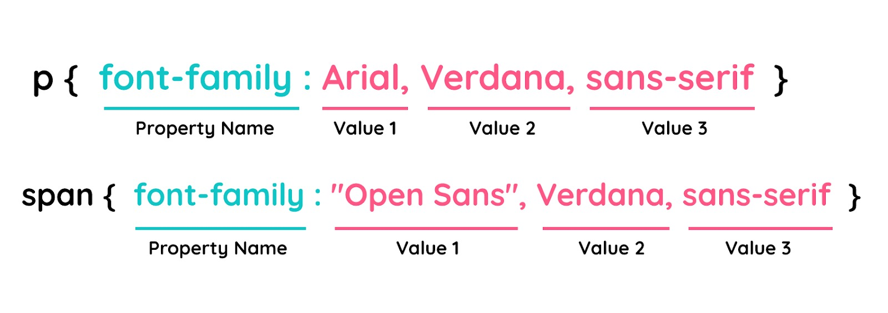

#programming 
### Font-family
```html
<!DOCTYPE html>
<html>
  <head>
    <meta charset="UTF-8" />
    <title>Judul Dokumen</title>
    
    <link rel="stylesheet" href="styles.css" />
  </head>
  <body>
    <header>
      <div class="jumbotron">
        <h1>Bandung</h1>
        <p>
          Kota metropolitan terbesar di Provinsi Jawa Barat, sekaligus menjadi ibu kota provinsi
          tersebut.
        </p>
      </div>

      <nav>
        <ul>
          <li><a href="#">Sejarah</a></li>
          <li><a href="#">Geografis</a></li>
          <li><a href="#">Wisata</a></li>
        </ul>
      </nav>
    </header>
  </body>
</html>
```
```css
body {
  font-family: sans-serif;
}
```
Pada rule tersebut, kita mengubah standar font yang digunakan browser dengan font ‘sans-serif’. Sebenarnya untuk nilai dari properti ini dapat lebih dari satu (dikenal sebagai _font stack_), tujuannya adalah sebagai _fallback_ jika terjadi kegagalan dalam menggunakan font yang kita gunakan.

Untuk menuliskan lebih dari satu nilai font, berikut adalah aturan yang harus kita perhatikan.

Penjelasannya sebagai berikut.
- Seluruh nilai font yang bukan merupakan _generic font families_ harus dituliskan secara kapital. Contohnya, “Arial” bukan dituliskan “arial”.
- Gunakan tanda koma (,) untuk memisahkan antara nilai font yang digunakan. 
- Selalu tanda kutip (“) untuk membungkus nilai font yang memiliki spasi pada namanya. Contohnya “Open Sans”.

mengapa perlu memberikan lebih dari satu nilai pada font-family? Hal tersebut penting karena tidak semua browser mendukung semua jenis font. Jadi, menambahkan lebih dari satu nilai font dapat memberikan alternatif pada browser dalam menampilkan font jika font utama yang diterapkan tidak didukung oleh browser. 

Bagaimana urutan prioritasnya? Dimulai dari jenis font yang pertama dituliskan. Jika font pertama didukung oleh browser, ia akan digunakan. Jika tidak, lantas browser akan memeriksa nilai font yang kedua dan menggunakannya apabila didukung, begitupun selanjutnya.

Hal yang perlu kita perhatikan adalah pastikan untuk menggunakan _generic font families_ pada akhir nilai properti font-family. Nilai ini dipastikan didukung oleh seluruh browser saat ini. Lantas, apa saja nilai dari generic font families ini? Berikut adalah nilai-nilai generic font families yang dapat kita gunakan untuk _fallback mechanism_.

- **Serif**: jenis font yang memiliki runcing pada garis akhir karakternya. Times New Roman merupakan salah satu jenis serif font.
- **Sans-serif**: jenis font yang tidak meruncing pada garis akhir karakternya. Contohnya, “Open Sans”, “Fira Sans” dan lainnya.
- **Monospace**: jenis font yang memiliki nilai lebar tiap karakternya sama. Consolas merupakan salah satu jenisnya.
- **Cursive**: jenis font yang tampak seperti _handwriting_ atau hasil tulisan tangan.
- **Fantasy**: jenis font yang merepresentasikan karakteristik yang menyenangkan.
- **System-ui**: jika menerapkan nilai ini maka font yang diterapkan akan sama seperti font yang digunakan pada sistem operasi kita.
- **Math**: jenis font yang digunakan untuk penulisan rumus-rumus matematika.
- **Emoji**: jenis font yang digunakan untuk menampilkan emoji.
- **Fangsong**: jenis font yang menampilkan gaya penulisan Chinese.

#### @font-face
Kita sudah mengetahui cara mengubah font pada website dan juga mengetahui tipe font standar yang tersedia pada browser. Berbicara tentang tipe font, tidak jarang kita menemukan website yang menggunakan font unik atau yang tidak dimiliki pada komputer kita ketika menjelajah beberapa website yang ada di internet. Lantas, bagaimana cara font tersebut dapat ditampilkan?

Untuk hal ini, CSS memiliki fitur yang digunakan untuk memasukkan font eksternal ke dalam CSS, yakni menggunakan @font-face. Berikut adalah contoh penulisan @font-face pada CSS.
```css
@font-face {
  font-family: "Dicoding Font";
  src: url('FILE-FONT.TTF');
}
```

Setelah mendefinisikan font-face tersebut, ada nilai font-family baru bernilai “Dicoding Font” untuk diterapkan pada elemen HTML. 

### Font-size
Mengubah nilai font pada sebuah dokumen adalah hal yang sangat wajar terjadi, begitu pula pada website. Untuk menetapkan ukuran font, kita perlu menerapkan properti **font-size** dengan menetapkan nilai dari properti ini dengan menuliskan langsung nilai dan satuannya.

HTML:
```html
<!DOCTYPE html>
<html>
  <head>
    <meta charset="UTF-8" />
    <title>Judul Dokumen</title>
    
    <link rel="stylesheet" href="styles.css" />
  </head>
  <body>
    <h1>Bandung</h1>
  </body>
</html>
```

CSS:
```css
h1 {
  font-size: 1.5em;
}
```

Hal yang perlu kita perhatikan adalah ketika menuliskan nilai dan satuannya. Pastikan tidak ada jarak (spasi) di antaranya.

Satuan dalam menetapkan ukuran font terbagi dua jenis.

- **Relative Unit**  
    Satuan yang nilainya tergantung pada suatu hal. Contohnya, ukuran viewport, induk elemen, atau ukuran teks standar.
- **Absolute Unit**  
    Satuan yang nilainya telah ditentukan atau digunakan dalam dunia nyata.

Berikut adalah daftar satuan yang dapat kita manfaatkan dalam menetapkan ukuran font beserta fungsinya.

#### Relative Unit

| Satuan | Relative to     | Fungsi                                                                                                                                         |
| ------ | --------------- | ---------------------------------------------------------------------------------------------------------------------------------------------- |
| em     | Font size       | Satuan relatif terhadap ukuran font yang sedang digunakan pada elemen (contohnya, 2em berarti 2 kali lebih besar dari ukuran font seharusnya). |
| ex     | Font height     | Satuan relatif terhadap tinggi font saat ini, satuan ini sangat jarang sekali digunakan                                                        |
| rem    | Font size       | Mirip seperti em, tetapi rem merupakan satuan relatif terhadap ukuran font dari root element.                                                  |
| ch     | Font width      | Satuan relatif terhadap lebar dari karakter “0” nol.                                                                                           |
| vw     | Viewport width  | Satuan relatif terhadap 1% lebar viewport. Contoh 1vw = 1% dari lebar viewport. Satuan ini tidak didukung pada browser IE8 ke bawah.           |
| vh     | Viewport height | Satuan relatif terhadap 1% tinggi viewport. Contoh 1vh = 1% dari tinggi viewport. Satuan ini tidak didukung pada browser IE8 ke bawah.         |

#### Absolute Unit

| Satuan | Fungsi                                                          |
| ------ | --------------------------------------------------------------- |
| px     | Menetapkan nilai font berdasarkan ukuran pixel.                 |
| pt     | Menetapkan nilai font berdasarkan points (1/72 inch di CSS2.1). |
| pc     | Menetapkan nilai font berdasarkan picas (1 pica = 12 point).    |
| mm     | Menetapkan nilai font berdasarkan millimeters.                  |
| cm     | Menetapkan nilai font berdasarkan centimeters.                  |
| in     | Menetapkan nilai font berdasarkan inches.                       |

### Font-weight

Setelah mengenal font families dan font size, selanjutnya ada juga font-weight yang digunakan untuk mengatur ketebalan dari font yang ditampilkan. Nilai dari properti ini dapat ditentukan dengan menggunakan numeric values (**100** sampai **900**) atau dengan menggunakan descriptive terms (**normal**, **bold**, **bolder**, dan **lighter**).

contoh penerapan
```css
.normal {
  font-weight: normal;
}

.bold {
  font-weight: bold;
}

.bolder {
  font-weight: bolder;
}

.lighter {
  font-weight: lighter;
}

.fw100 {
  font-weight: 100;
}

.fw200 {
  font-weight: 200;
}

.fw300 {
  font-weight: 300;
}

.fw400 {
  font-weight: 400;
}

.fw500 {
  font-weight: 500;
}

.fw600 {
  font-weight: 600;
}

.fw700 {
  font-weight: 700;
}

.fw800 {
  font-weight: 800;
}

.fw900 {
  font-weight: 900;
}
```


### Font-style

Properti selanjutnya adalah font-style, properti ini digunakan untuk menentukan postur dari teks yang ditampilkan, yakni bentuknya vertikal (**normal**) atau miring (**italic** dan **oblique**).
```css
.normal {
  font-style: normal;
}

.italic {
  font-style: italic;
}

.oblique {
  font-style: oblique;
}
```
Italic dan oblique keduanya menampilkan teks yang miring. Perbedaannya adalah italic menerapkan tipe miring (italic font version) dari suatu font sedangkan oblique adalah font normal yang hanya dibuat miring.