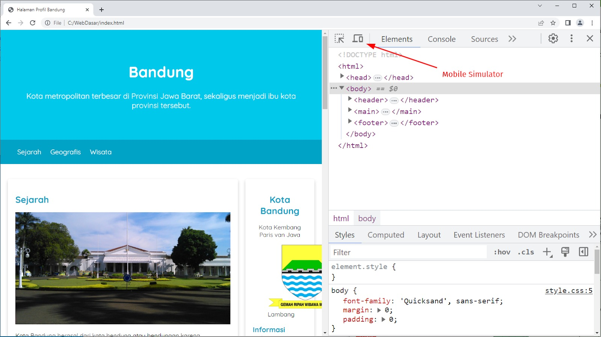
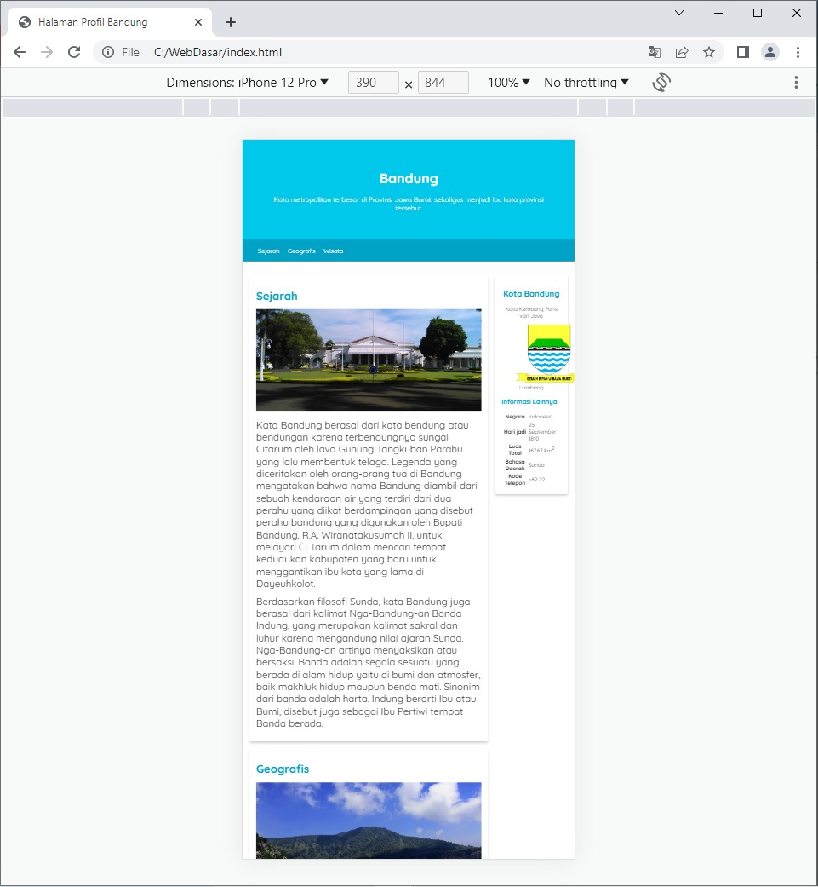
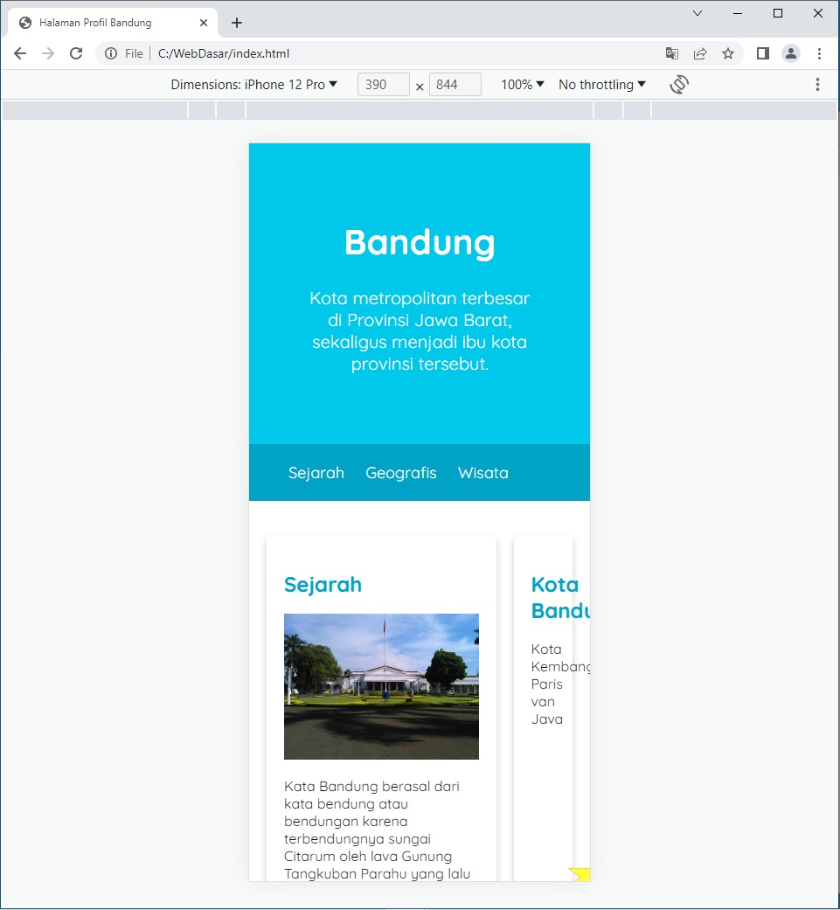

#programming 

Setelah berhasil membuat layout menggunakan float, apakah terpikirkan bagaimana tampilan yang dihasilkan pada _mobile device_? Tampilan website kita terlihat baik ketika dibuka menggunakan laptop atau desktop, tetapi belum tentu akan sama pada _mobile device_.

Pada browser Google Chrome dan Mozilla Firefox, ada fitur inspeksi elemen. Fitur ini sangat banyak dan bermanfaat bagi developer web dalam membantu mengembangkan website. Hal yang pasti, pada inspector tersebut, ada fitur yang dapat mensimulasikan halaman website dalam tampilan yang lebih kecil, seperti perangkat mobile atau tablet. Untuk membuka fitur inspector, kita dapat gunakan _keyboard shortcut_, seperti “CTRL + SHIFT + I” atau klik kanan dan pilih “Inspect”/”Inspect Page”.

gambar di atas menunjukkan fitur inspection pada Google Chrome dan Mozilla Firefox. Untuk mensimulasikan tampilan _mobile device_, kita dapat menekan icon yang dilingkari pada gambar di atas.

Di sini, kita bisa memilih device apa yang akan digunakan untuk mensimulasikan halaman. Untuk melihat tampilan dalam _mobile devices_, kita bisa memilih salah satu opsi _handphone_ yang tersedia. Contohnya iPhone 12 Pro.

Lalu, setelah memilih tampilan pada _mobile devices_, apakah tampilan website sekarang sudah tampak baik? Tentu jawabannya tidak. Hal ini karena tampilan pada simulasi device di browser Google Chrome akan tampak seperti berikut.


Viewport merupakan area yang dapat dilihat oleh pengguna kita pada halaman website. Ukuran viewport bervariasi berdasarkan _device_-nya. Ukuran viewport pada sebuah peranti _mobile_ lebih kecil dibandingkan dengan layar komputer desktop.

Sebelum adanya tablet ataupun _handphone_, halaman website didesain hanya untuk ukuran layar komputer desktop. Dengan demikian, banyak sekali website yang menerapkan tampilan dan ukuran yang statis. Jadi, ketika halaman tersebut diakses melalui _handphone_ atau tablet, tampilannya akan mengecil karena tidak disesuaikan.

Untuk mengatasi masalah di atas, kita perlu menetapkan meta tag viewport untuk mengendalikan dan menentukan bentuk dari viewport browser, terutama pada perangkat mobile. Jadi, kita dapat melihat ukuran halaman web layaknya diakses pada desktop device. Namun, hal tersebut tetap memerlukan penggunaan teknik peningkatkan responsivitas karena ukuran viewport-nya yang berbeda–kita akan mempelajari ini pada materi berikutnya.

Mengatur viewport dapat dilakukan melalui tag `<meta>` yang disisipkan dalam elemen `<head>`. Contohnya berikut.
```html
<meta name="viewport" content="width=device-width, initial-scale=1">
```
Seharusnya sekarang tampilan pada mobile device menjadi seperti berikut.


Terlihat lebih baik, bukan? Tampilan halaman web sudah tidak kecil lagi dan level kebesarannya terlihat sama dengan tampilan yang dibuka pada layar desktop.

Namun, permasalahan lain muncul. Elemen `<article>` terlalu kecil dan sempit dan elemen `<aside>` tidak ditampilkan dengan baik. Kami tahu Anda merasa resah dengan hal tersebut. Sebagaimana telah disinggung sebelumnya, kita akan memerlukan teknik peningkatan responsivitas pada halaman web.

## Specific Style dengan Media Query
Walaupun sudah menetapkan meta tag, viewport tampilan pada _mobile device_ belum baik. Hal ini karena informasi yang ditampilkan pada elemen `<article> `terlalu sempit, malahan informasi dalam elemen `<aside>` sulit terbaca.

Untuk mengatasi masalah di atas, CSS menyediakan sebuah fitur untuk menentukan styling hanya pada kondisi browser dan device tertentu yang sesuai dengan aturan yang kita tetapkan. Contohnya, kita memerintahkan ke CSS bahwa “tolong terapkan kode styling ini jika ukuran viewport lebih lebar dari 480 piksel”. Fitur tersebut dinamakan CSS Media Query.

Berikut adalah aturan penulisan media query.
```css
@media media-type and (media-feature-rule) {
  /* CSS rules apa pun ada di sini */
}
```

Pada aturan di atas, kita dapat jabarkan sebagai berikut.

- Media-type: jenis media sebagai acuan bagi browser dalam menerapkan kode styling. Tipe yang dapat diberikan adalah print, screen, atau semuanya.
- Media-feature-rule: aturan atau kondisi yang harus terpenuhi agar kode styling dapat diterapkan. Kondisi yang dimaksud seperti ukuran viewport, orientasi layar, dan jenis penggunaan perangkat tunjuk (touchsceen, keyboard navigation, atau mouse).
- Media-block: sekumpulan CSS rule yang akan diterapkan jika kedua poin sebelumnya terpenuhi.

Jika dicontohkan, inilah contoh penerapan riilnya.

```css
@media screen and (min-width: 400px) {
  h1 {
    color: red;
  }

  h2 {
    color: green;
  }
}
```
