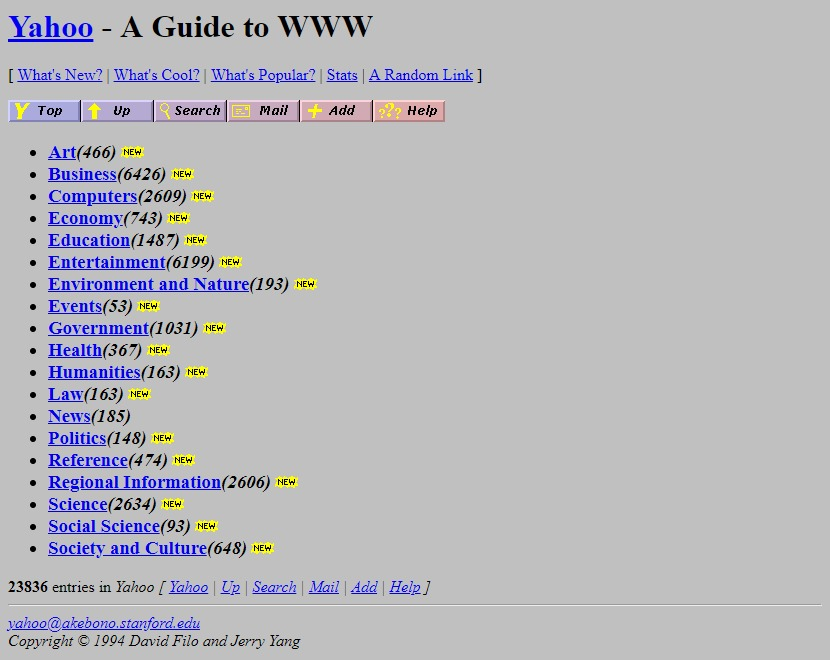
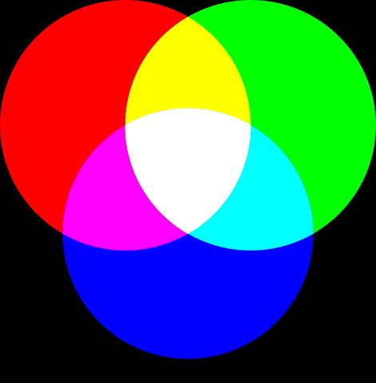
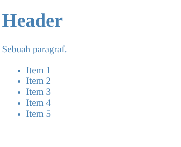
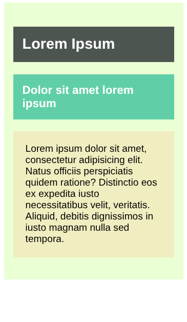
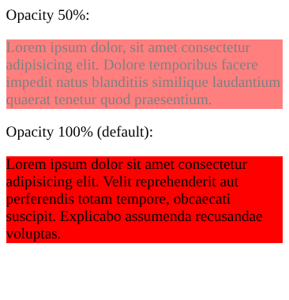

#programming 

Warna memberikan kesan hidup pada sebuah website. Jika kembali pada tahun 1993, kita akan hidup ketika website hanya memiliki _background_ berwarna abu dengan teks hitam. Bisa dibayangkan betapa membosankan tampilan tersebut, kan?

Gambar di atas merupakan tampilan halaman dari situs Yahoo sebagai mesin pencari pada tahun 1994. Jika ingin melihat tampilan Yahoo lainnya dari tahun ke tahun, Anda dapat membuka [tautan ini](https://www.webdesignmuseum.org/timeline/yahoo-1994).

Pada saat itu, memang belum ada browser yang dapat mengatur pewarnaan hingga hadirnya Netscape Navigator yang memungkinkan untuk melakukannya meskipun belum sesempurna saat ini. Syukurlah, kita cukup menggunakan properti-properti yang ada pada CSS untuk mengatur warna pada teks dan _background_ pada saat ini. Terlebih, seluruh browser saat ini sudah mendukung _styling_ menggunakan CSS sehingga kita tidak perlu memikirkan kompatibilitasnya.

Kali ini, kita akan membahas tentang pewarnaan pada CSS. Tentunya, caranya dengan mengenal properti yang digunakan untuk mengatur warna teks dan _background_. Namun sebelum itu, mari kita pelajari dahulu cara menetapkan warna pada CSS.

## Menetapkan Nilai Warna

Setiap warna pada layar komputer kita terdiri dari campuran warna merah, hijau, dan biru. Layar komputer dibuat dari ribuan kotak kecil yang biasa disebut piksel. Ketika layar monitor tidak menyala, piksel pun tidak akan menyala. Ketika layar monitor menyala, tiap piksel dapat menghasilkan warna yang berbeda sehingga dapat menampilkan gambar.

Dalam piksel terdapat tiga buah lampu kecil berwarna merah, hijau, dan biru. Ribuan warna dapat dihasilkan dari kombinasi tiga warna tersebut.

Ketika ingin menetapkan warna, kita tidak perlu menghafal kombinasi dari ketiga warna tersebut. Banyak pemilih warna untuk membantu kita dalam menetapkan warna yang diinginkan. Contohnya seperti color picker yang ada pada Photoshop, GIMP, atau Gravit Designer.

Kita bisa melihat nilai RGB yang dipilih melalui _color picker_. Lantas, bagaimana jika kita tidak memiliki aplikasi desain seperti yang telah disebutkan tadi? Tenang, sekarang _color picker_ banyak tersedia _online_, bahkan ketika kita menuliskan “color picker” pada Google Search, tools tersebut tersedia pada hasil pencariannya.

Pada CSS, kita dapat menggunakan _numeric value_ dan _predefined color name_ untuk menetapkan nilai warna. Apakah kedua hal tersebut? Mari kita bahas satu per satu.

### Numeric Value

Penetapan warna menggunakan _numeric value_ adalah cara yang paling banyak digunakan karena dengan menggunakannya, kita dapat menentukan warna yang diinginkan dengan tepat. Terlebih dengan bantuan _color picker_, kita tidak perlu repot-repot memahami dan mencari nilai kode warna secara manual.

Berikut adalah contoh penulisan nilai warna pada CSS dengan numeric value.
```css
/* Warna hijau menggunakan format RGB */
color: rgb(78,231,23);
 
/* Warna hijau Menggunakan format HEX */
color: #4ee717;
 
/* Warna hijau menggunakan format HSL (hanya di CSS3)*/
color: hsl(104, 82%, 50%);
```
Kode tersebut merupakan nilai warna hijau yang dituliskan dalam beberapa format. Dari kode tersebut, kita tahu tidak hanya format RGB yang dapat digunakan dalam menetapkan warna, selain RGB ada format Hex dan HSL (Hue, Saturation, Lightness).

### Predefined Color Name

Selain menggunakan format angka, menentukan warna juga dapat menggunakan sebuah kata, seperti blue, yellow, red dan lainnya.
```css
color: black;
color: white;
color: blue;
```
Dengan menggunakan kata, tentu kita dapat lebih mudah dan cepat dalam menentukan warna, tetapi mungkin hanya warna dasar yang dapat kita hafal. Sebab hampir seluruh browser saat ini mendukung 140 nama warna, kita dapat melihat apa saja warna yang tersedia pada pembahasan bertopik [HTML color names](https://www.w3schools.com/colors/colors_names.asp) dari w3schools.com.


### Text Color
Pada modul pengenalan CSS, sebetulnya kita sudah mencoba dengan mudahnya mengganti warna pada teks yang ditampilkan. Mungkin sebagian dari Anda sudah mengetahuinya. Sejujurnya, bagi Anda yang sudah mengerti tentang ini, tidak ada lagi yang perlu dibahas di sini. Kita dapat dengan mudahnya mengganti warna teks menggunakan properti **color**.

Nilai dari properti color dapat berupa _predefined color name_ atau sebuah _numeric value_ dengan menggunakan RGB, RGBA, Hex, HSL, ataupun HSLA. Berikut contohnya, seluruh elemen `<p>` akan diberi warna abu-abu (gray) dengan menggunakan beberapa cara.
```css
p { color: gray; }
p { color: #666666; }
p { color: #666; }
p { color: rgb(102,102,102); }
```
Properti color dapat diaplikasikan ke seluruh elemen yang ada dalam HTML dan nilainya dapat diturunkan pada elemen turunannya. Jadi kita bisa mengubah warna teks dalam seluruh dokumen HTML dengan menerapkan properti color pada elemen body, seperti berikut.

HTML:
```html
<!DOCTYPE html>
<html>
  <head>
    <meta charset="UTF-8" />
    <title>Judul Dokumen</title>
    
    <link rel="stylesheet" href="styles.css" />
  </head>
  <body>
    <main>
      <h1>Header</h1>
      <p>Sebuah paragraf.</p>

      <ul>
        <li>Item 1</li>
        <li>Item 2</li>
        <li>Item 3</li>
        <li>Item 4</li>
        <li>Item 5</li>
      </ul>
    </main>
  </body>
</html>
```
CSS:
```css
body {
  color: steelblue;
}
```
Hasilnya:


### Background Color
CSS memperlakukan setiap elemen HTML seperti berada pada sebuah kotak (kita akan tahu lebih tentang ini pada pembahasan box model) dan properti **background-color** dapat mengatur warna untuk background dari kotak tersebut. 

Sama seperti _text color_, kita dapat menspesifikasikan warna yang dipilih dengan numeric values atau dengan predefined color name. Properti background-color akan bernilai transparan jika tidak kita tetapkan.

Kebanyakan browser menetapkan nilai putih sebagai standar untuk nilai background-color, tetapi nilai standar tersebut dapat pengguna ubah melalui pengaturan browser-nya. Jadi, untuk memastikan website kita memiliki tampilan background putih, kita dapat terapkan nilai **background-color: white;** pada elemen body.

Biasanya kita juga menetapkan padding ketika menetapkan background-color untuk memberikan jarak antara konten dan pinggiran kotak elemen.

HTML:
```html
<!DOCTYPE html>
<html>
  <head>
    <meta charset="UTF-8" />
    <title>Judul Dokumen</title>
    
    <link rel="stylesheet" href="styles.css" />
  </head>
  <body>
    <main>
      <h2>Lorem Ipsum</h2>
      <h3>Dolor sit amet lorem ipsum</h3>
      <p>
        Lorem ipsum dolor sit amet, consectetur adipisicing elit. Natus officiis perspiciatis quidem
        ratione? Distinctio eos ex expedita iusto necessitatibus velit, veritatis. Aliquid, debitis
        dignissimos in iusto magnam nulla sed tempora.
      </p>
    </main>
  </body>
</html>
```
CSS:
```css
body {
  font-family: sans-serif;
}

main {
  background-color: rgb(235, 255, 213);
  padding: 20px 15px;
}

main > h2 {
  background-color: #4c5450;
  padding: 15px;
  color: white;
}

main > h3 {
  background-color: #60d0a8;
  padding: 15px;
  color: white;
}

main > p {
  background-color: hsl(56, 62%, 85%);
  padding: 20px;
}
```




## Opacity
Apakah Anda pernah melihat suatu objek atau gambar yang tak terlihat atau tembus pandang? Pada dunia nyata, Anda dapat menemukan objek yang memiliki sifat tersebut. Contohnya adalah plastik mika. Jika mengingat tugas makalah di sekolah, biasanya plastik mika dibutuhkan sebagai sampulnya. Ia memiliki banyak macam warnanya, tetapi kita tidak membahas hal tersebut. Kita lebih fokus untuk berbicara tentang bahannya yang terlihat transparan.

Plastik mika tersebut memiliki tingkat opacity tertentu. Bayangkan ia adalah sebuah elemen HTML. Satu lembar mika akan memiliki tingkat opacity lebih kecil sehingga transparansinya semakin tinggi. Namun, bagaimana cara memperbesar tingkat opacity-nya? Jawabannya, tentu dengan menambah lembar mika menjadi dua, tiga, atau lebih. Alhasil, tingkat transparansinya semakin rendah. Inilah konsep dari opacity. Makin tinggi tingkat atau nilai opacity maka makin besar kemungkinan elemen HTML akan terlihat.

Mungkin sebagian dari Anda ada yang bertanya, “Apa perbedaan antara transparan dan opacity?” Jawabannya, transparan adalah seberapa besar tingkat tembus pandang atau tak terlihatnya suatu objek, sedangkan opacity adalah seberapa besar tingkat terlihat suatu objek. Semakin besar tingkat transparansi suatu objek, semakin tak terlihat objek tersebut. Namun, semakin besar tingkat opacity suatu objek, semakin terlihat objek tersebut (solid).

|**Nilai**|**Deskripsi**|
|---|---|
|0%|Elemen tak akan terlihat.|
|Persentase berapa pun di antara 0% sampai 100%|Elemen akan tembus cahaya alias masih dapat terlihat.|
|100%|Elemen sepenuhnya terlihat (tak transparan).|
  
Berikut adalah contoh penerapan opacity pada CSS.

HTML:
```html
<!DOCTYPE html>
<html>
  <head>
    <meta charset="UTF-8" />
    <title>Judul Dokumen</title>
    
    <link rel="stylesheet" href="styles.css" />
  </head>
  <body>
    <div>Opacity 50%:</div>
    <p class="opacity-50">
      Lorem ipsum dolor, sit amet consectetur adipisicing elit. Dolore temporibus facere impedit
      natus blanditiis similique laudantium quaerat tenetur quod praesentium.
    </p>

    <div>Opacity 100% (default):</div>
    <p class="opacity-100">
      Lorem ipsum dolor sit amet consectetur adipisicing elit. Velit reprehenderit aut perferendis
      totam tempore, obcaecati suscipit. Explicabo assumenda recusandae voluptas.
    </p>
  </body>
</html>
```
CSS:
```css
p {
  background-color: red;
}

p.opacity-50 {
  opacity: 50%;
}

p.opacity-100 {
  opacity: 100%;
}
```
Hasilnya:



### Opacity pada Warna
Sebenarnya, opacity akan memberikan efek transparansi pada keseluruhan elemen, termasuk konten maupun child element di dalamnya. Ada kalanya, kita hanya ingin menerapkan opacity pada warnanya saja tanpa memberikan efek pada keseluruhan elemen.

Selain komponen warna-warna, CSS memiliki fitur bernama opacity yang dapat ditetapkan dalam warna. Ini merupakan komponen keempat setelah red, blue, dan green. Biasanya, ia disebut sebagai alpha channel. Untuk melakukannya, kita bisa menggunakan format warna RGBA, HSLA, dan Hex.

Berikut adalah contoh penerapan dari alpha channel pada warna.

HTML:
```html
<!DOCTYPE html>
<html>
  <head>
    <meta charset="UTF-8" />
    <title>Judul Dokumen</title>
    
    <link rel="stylesheet" href="styles.css" />
  </head>
  <body>
    <main>
      <div class="box-1">Box 1</div>
      <div class="box-2">Box 2</div>
      <div class="box-3">Box 3</div>
    </main>
  </body>
</html>
```
CSS:
```css
body {
  font-family: sans-serif;
}

div {
  width: 50%;
  height: 200px;

  line-height: 200px;
  text-align: center;
}

.box-1 {
  background-color: rgb(255, 255, 0, 0.75);

  float: left;
}

.box-2 {
  background-color: hsl(120, 100%, 25%, 0.75);

  float: left;
  margin-left: -25%;
}

.box-3 {
  background-color: #0000ffaa;

  float: left;
  margin-left: -25%;
}
```
Hasilnya:


