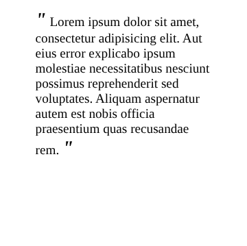

#programming 
Selain beberapa selector yang sudah kita pelajari, CSS masih memiliki dua selector lagi yang dapat kita manfaatkan untuk membantu menyeleksi elemen dalam menerapkan sebuah rule, yakni pseudo-class dan pseudo-element.

Sebelum menjelaskan lebih detail tentang kedua selector tersebut, perlu kita ketahui pseudo selector berbeda dari selector yang sudah dibahas sebelumnya. Selector ini menargetkan elemen pada bagian yang “tidak terlihat”, seperti sifat pada elemen sehingga untuk menetapkannya tidak bisa menggunakan selector biasa. Salah satu contoh yang paling sering kita terapkan adalah **:hover**, pseudo selector tersebut kita gunakan untuk menetapkan rule ketika cursor diarahkan ke target elemen.
```css
a:hover {
  color: blue;
}
```
Contoh kode di atas merupakan salah satu pseudo-class selector, yang menyebabkan elemen anchor menerapkan warna biru ketika kursor diarahkan pada elemen tersebut.

### Pseudo-class Selector
Pseudo-class merupakan sebuah class “semu” yang sebenarnya ada pada tiap elemen HTML. Pada contoh sebelumnya, kita sudah mengetahui salah satu pseudo-class selector. Dengan menggunakan selector ini kita dapat memilih elemen berdasarkan class yang tidak tampak pada dokumen. Kita bisa menetapkan rule hanya ketika sebuah tautan telah dikunjungi (:visited) atau ketika sebuah elemen diarahkan dengan kursor (:hover).

Untuk menggunakan pseudo-class, kita gunakan tanda titik dua (:) pada basic selector dan diikuti dengan pseudo-class-nya. Berikut adalah contoh penerapan beberapa pseudo-class pada sebuah elemen anchor.

HTML:
```html
<!DOCTYPE html>
<html>
  <head>
    <meta charset="UTF-8" />
    <title>Pseudo Class Selector</title>
    
    <link rel="stylesheet" href="styles.css" />
  </head>
  <body>
    <p>
      Dapatkan pekerjaan impian di 
      <a target="_blank" href="https://jobs.dicoding.com/">
        Dicoding Jobs
      </a>.
    </p>
  </body>
</html>
```
CSS:
```css
/* rule akan diterapkan pada sebuah tautan yang belum pernah dikunjungi */
a:link {
   color: red;
}

/* rule akan diterapkan pada sebuah tautan yang sudah pernah dikunjungi */
a:visited {
   color: green;
}

/* rule akan diterapkan pada sebuah tautan ketika diarahkan dengan kursor */
a:hover {
   color: pink;
}

/* rule akan diterapkan pada sebuah tautan ketika ditekan */
a:active {
   color:orange;
}
```

### Pseudo-elemen Selector
Sama seperti pseudo-class, pseudo-element merupakan sebuah elemen “semu” yang sebenarnya ada, tetapi tidak tampak secara tertulis pada berkas HTML. Selector ini biasa digunakan ketika kita ingin menambahkan konten tepat sebelum dan setelah sebuah elemen paragraf. _Yup_, kita tidak perlu menuliskan elemen/konten baru pada berkas HTML untuk menambahkan konten. Namun, kita dapat memanfaatkan pseudo-element untuk melakukannya. Pseudo-element yang dimaksud adalah `::before` dan `::after`.

Konten yang dibuat dengan pseudo-element dituliskan pada CSS. Contohnya, kita ingin menambahkan tanda kutip sebelum dan sesudah elemen blockquote sehingga kita cukup menuliskannya seperti berikut.

HTML:
```html
<!DOCTYPE html>
<html>
  <head>
    <meta charset="UTF-8" />
    <title>Pseudo Element Selector</title>
    
    <link rel="stylesheet" href="styles.css" />
  </head>
  <body>
    <blockquote>
      Lorem ipsum dolor sit amet, consectetur adipisicing elit. Aut eius error
      explicabo ipsum molestiae necessitatibus nesciunt possimus reprehenderit sed
      voluptates. Aliquam aspernatur autem est nobis officia praesentium quas
      recusandae rem.
    </blockquote>
  </body>
</html>
```
CSS:
```css
blockquote::before,
blockquote::after {
  content: '"';
  font-size: 24px;
  font-style: italic;
  font-weight: bold;
}
```


