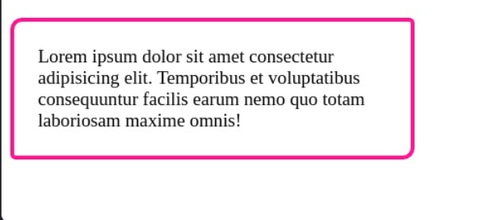

#programming 

CSS3 memperkenalkan kemampuan untuk membuat _rounded corner_ atau sudut bundar pada box dengan menggunakan properti border-radius. Nilai dari properti ini merupakan tingkat lengkungan border dalam piksel.

Contohnya berikut.

HTML:
```html
<!DOCTYPE html>
<html>
  <head>
    <meta charset="UTF-8" />
    <title>Judul Dokumen</title>
    
    <link rel="stylesheet" href="styles.css" />
  </head>
  <body>
    <p class="rounded">
      Lorem ipsum dolor sit amet consectetur adipisicing elit. Temporibus et voluptatibus
      consequuntur facilis earum nemo quo totam laboriosam maxime omnis!
    </p>
  </body>
</html
```

CSS:
```css
.rounded {
  width: 300px;
  padding: 20px;
  border: 4px solid deeppink;

  border-radius: 10px;
}
```

Output:


Kita bisa menetapkan nilai pada individu siku kotak dengan menggunakan properti yang terpisah seperti berikut.

```css
.rounded {
  border-top-right-radius: 5px;
  border-bottom-right-radius: 10px;
  border-bottom-left-radius: 5px;
  border-top-left-radius: 10px;
}
```

Selain itu, kita dapat menggunakan shorthand property sehingga dapat menetapkan keempat nilainya dalam satu properti.
```css
.rounded {
  border-radius: 10px 5px 10px 5px;
}
```