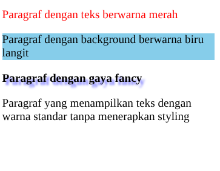
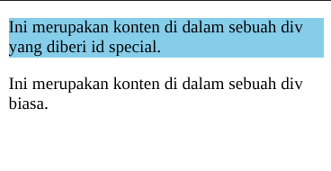
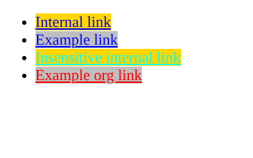

#programming 

Ada banyak jenis selector untuk menargetkan aturan ke elemen tertentu dalam dokumen HTML. Mari kita bahas satu per satu tipe basic selector yang ada:

### Type Selector
Type Selector menggunakan nama elemen sebagai target untuk diterapkannya rule. Dalam kata lain, ketika menggunakan selector ini tentu rule akan diterapkan pada seluruh elemen target yang ada pada dokumen HTML. Contohnya sebagai berikut.
```css
/* Semua elemen span */
span {
  color: red;
}
```
Teks yang berada pada setiap elemen `<span>` akan berwarna merah.

### Class Selector
Class selector menetapkan target elemen berdasarkan nilai dari atribut **class** yang diterapkan pada elemennya. Untuk penulisan selector-nya diawali dengan tanda titik (.) dan dilanjutkan dengan nama class-nya. Contohnya berikut.
HTML:
```html
<!DOCTYPE html>
<html>
  <head>
    <meta charset="UTF-8" />
    <title>Judul Dokumen</title>
    
    <link rel="stylesheet" href="styles.css" />
  </head>
  <body>
    <p class="red">Paragraf dengan teks berwarna merah</p>
    <p class="skyblue-bg">Paragraf dengan background berwarna biru langit</p>
    <p class="fancy">Paragraf dengan gaya fancy</p>
    <p>
      Paragraf yang menampilkan teks dengan warna standar tanpa menerapkan
      styling
    </p>
  </body>
</html>
```

CSS:
```css
.red {
  color: red;
}

.skyblue-bg {
  background-color: skyblue;
}

.fancy {
  font-weight: bold;
  text-shadow: 4px 4px 3px #77f;
}
```


Class bersifat _shareable_ sehingga dapat diterapkan pada banyak elemen dengan tipe elemen yang berbeda-beda. Misalnya sebuah class **red** dapat diterapkan pada elemen paragraf dan juga heading untuk menampilkan teks berwarna merah.
```html
<h1 class="red">Heading dengan teks berwarna merah</h1>
<p class="red">Paragraf dengan teks berwarna merah</p>
```
Tidak hanya itu, sebuah elemen juga memungkinkan memiliki banyak nilai class sehingga kita dapat menerapkan lebih dari satu rule atau gabungan rule pada elemen target. Untuk menggunakannya, pada atribut class kita cukup tuliskan nama kelasnya dan dipisahkan dengan spasi untuk tiap nilai kelasnya.
```html
<h1 class="red skyblue-bg">Heading dengan teks berwarna merah dan background biru langit</h1>
<p class="red fancy">Paragraf dengan teks berwarna merah dan bergaya fancy</p>
```

### ID Selector

ID selector menetapkan target elemen berdasarkan nilai dari atribut **id** yang diterapkan pada elemennya. Mirip dengan class, atribut **id** dapat diterapkan pada seluruh elemen HTML dan kebanyakan atribut ini digunakan untuk memberikan sebuah arti pada _generic element_, seperti **`<div>`** dan **`<span>`**. Namun, atribut id ini tidak bersifat _shareable_. Artinya, nilai id harus unik dan digunakan pada satu elemen saja.

kenapa element ID bersifat unik? karena ID dikhususkan untuk membuat frontend lebih interactive menggunakan js, dan ID juga memiliki spesifisitas (prioritas) lebih tinggi daripada class.

Untuk menetapkan selector dengan menggunakan id, kita gunakan tanda _octothorpe_ (#) atau lebih familiar disebut dengan _hash_. Berikut contohnya.
HTML:
```html
<!DOCTYPE html>
<html>
  <head>
    <meta charset="UTF-8" />
    <title>Judul Dokumen</title>
    
    <link rel="stylesheet" href="styles.css" />
  </head>
  <body>
    <div id="special">
      <p>Ini merupakan konten di dalam sebuah div yang diberi id special.</p>
    </div>
    <div>
      <p>Ini merupakan konten di dalam sebuah div biasa.</p>
    </div>
  </body>
</html>
```

CSS:
```css
#special {
  background-color: skyblue;
}
```


Hal yang harus ditekankan lagi adalah id ini bersifat unik. Jika ingin menerapkan sebuah rule pada banyak elemen, sebaiknya gunakan atribut class dibandingkan dengan id.

### Attribute Selector

Attribute selector merupakan cara menetapkan target elemen berdasarkan sebuah atribut yang digunakan atau bahkan bisa lebih spesifik dengan nilainya. Contohnya sebagai berikut.
HTML:
```html
<!DOCTYPE html>
<html>
  <head>
    <meta charset="UTF-8" />
    <title>Attribute Selector</title>
    
    <link rel="stylesheet" href="styles.css" />
  </head>
  <body>
    <ul>
      <li><a href="#internal">Internal link</a></li>
      <li><a href="http://example.com">Example link</a></li>
      <li><a href="#InSensitive">Insensitive internal link</a></li>
      <li><a href="http://example.org">Example org link</a></li>
    </ul>
  </body>
</html>
```
CSS:
```css
ul {
  font-size: 18px;
}

/* <a> element yang menerapkan href attribute */
a[href] {
  color: blue;
}

/* <a> element yang menerapkan nilai pada href dengan awalan "#" */
a[href^='#'] {
  background-color: gold;
}

/* <a> element yang menerapkan nilai pada href yang mengandung teks "example" */
a[href*='example'] {
  background-color: silver;
}

/* <a> element yang menerapkan nilai pada href yang mengandung teks "insensitive" tidak mementingkan huruf kapital*/
a[href*='insensitive' i] {
  color: cyan;
}

/* <a> element yang menerapkan nilai pada href dengan akhiran ".org" */
a[href$='.org'] {
  color: red;
}

```


### Universal Selector
Universal selector digunakan untuk diterapkan pada seluruh elemen. Namun, selector ini juga bisa secara spesifik menargetkan sebuah elemen dengan menggabungkannya bersama selector yang lain. Berikut contohnya.
HTML:
```html
<!DOCTYPE html>
<html lang="id">
  <head>
    <meta charset="UTF-8" />
    <title>Judul Dokumen</title>
    
    <link rel="stylesheet" href="styles.css" />
  </head>
  <body>
    <p>
      Ini merupakan paragraf biasa atau tidak menerapkan atribut apapun. Maka
      teks pada paragraf ini akan berwarna hijau
    </p>
    <p lang="en-us">
      This is an English paragraph contains en-us value of lang attribute, so
      this text will be green and italic.
    </p>

    <h1>Ini merupakan sebuah header biasa</h1>
    <h1 lang="en-us">This is an English Header</h1>

    <p class="warning">
      Perhatikan paragraf ini! Paragraf ini merupakan paragraf yang memiliki
      kelas bernilai warning, sehingga teks dari paragraf ini akan berwarna
      merah
    </p>

    <div id="content">
      <p>
        Ini merupakan sebuah teks di dalam sebuah div yang memiliki id bernilai
        "content", seharusnya paragraf ini dibungkus dalam border yang memiliki
        padding 20px
      </p>
    </div>
  </body>
</html>
```
CSS:
```css
/* Menargetkan seluruh tipe elemen */
* {
  color: green;
}

/* Menargetkan seluruh tipe elemen yang mengandung nilai "en" pada atribut lang */
*[lang^='en'] {
  font-style: italic;
}

/* Menargetkan seluruh tipe elemen yang memiliki nilai "warning" pada atribut class */
*.warning {
  color: red;
}

/* Menargetkan seluruh tipe elemen yang memiliki nilai "content" pada atribut id */
*#content {
  border: 1px solid blue;
  padding: 20px;
}
```


styling diatas menetapkan ke semua teks menjadi warna hijau, tetapi yang berbahasa inggris jadi italic, dan yang memiliki class warning menjadi warna merah, dan yang memiliki nilai "content" pada atribut id amakn memiliki border pada teks nya.
