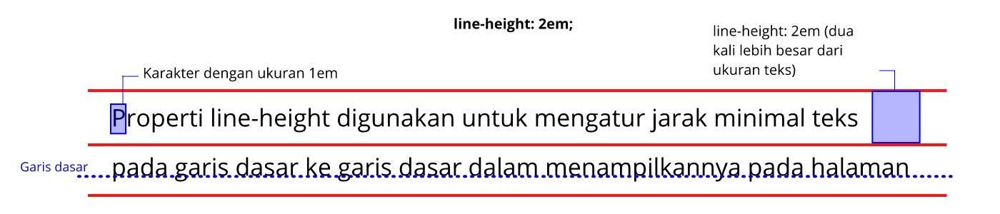
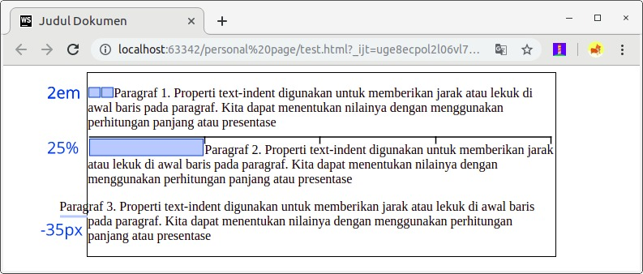
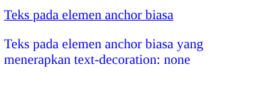
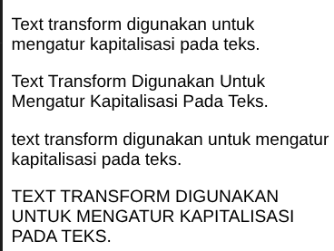
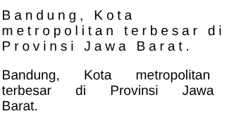
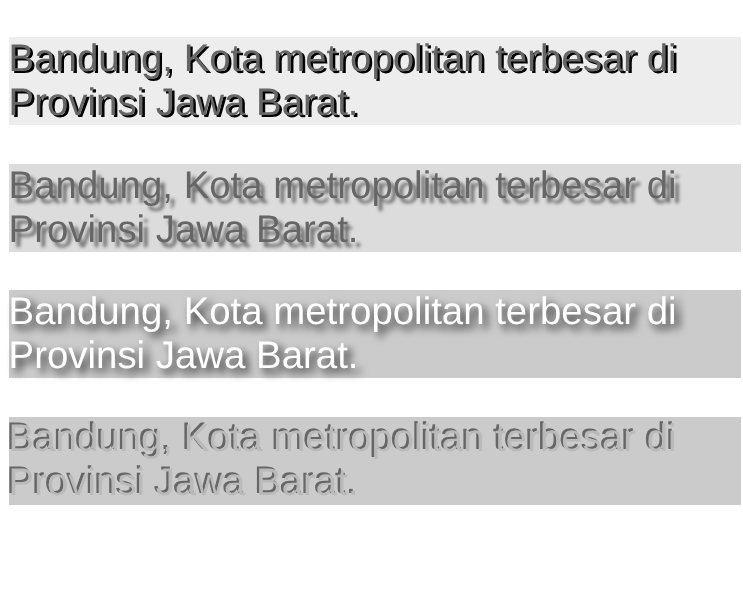

#programming 

### Line Height
Properti line-height digunakan untuk mengatur jarak minimal dari garis dasar ke garis dasar dalam menampilkannya teks pada halaman. Jika kita terbiasa dengan software dokumen editor seperti Microsoft Word, properti ini mirip dengan fungsi _line height_.


Pada penjelasan di atas disebutkan “minimal” karena jika terdapat sebuah karakter yang tinggi atau besar dalam sebuah baris, tinggi dari baris pun akan menyesuaikan agar jarak tetap mengakomodasinya.

### Text Indent

Dalam membuat sebuah dokumen tidak jarang kita membutuhkan jarak/lekuk di awal paragraf, hal tersebut dapat dilakukan pada website dengan menerapkan properti **text-indent**.  Kita dapat menentukan nilai properti ini melalui perhitungan panjang dalam **px**, **em**, dan **in** atau bisa menggunakan nilai persentase (%). Nilai persentase dihitung berdasarkan lebar dari induk elemen. Berikut contoh penggunaannya.

Pada contoh ketiga kita bisa melihat bahwa pada nilai properti ini dapat diberikan nilai negatif. Jika kita menggunakannya, baris pertama pada paragraf akan keluar dari batas elemen yang menampungnya (biasa disebut **hanging indent**).


properti ini hanya berpengaruh pada awal baris paragraf. Jika kita ingin menetapkannya untuk seluruh baris kita dapat gunakan margin atau padding

### Text Alignment

Kita bisa mengatur _text_ _alignment_ pada website seperti kita melakukannya pada aplikasi Microsoft Word dengan menggunakan properti text-align. Untuk standarnya, properti ini bernilai left atau biasa kita sebut rata kiri. Namun, standarnya bisa jadi menggunakan right atau rata kanan jika ada penerapan atribut language dengan nilai bahasa yang arah bacanya berlawanan. Contohnya Arab.

Berikut adalah nilai yang dapat digunakan pada properti text-align.

| **Nilai Properti**      | **Fungsi**                                                      |
| ----------------------- | --------------------------------------------------------------- |
| text-align: **left**    | Membuat perataan teks pada ujung kiri.                          |
| text-align: **right**   | Membuat perataan teks pada ujung kanan.                         |
| text-align: **center**  | Membuat perataan teks secara menengah.                          |
| text-align: **justify** | Membuat perataan teks yang setara pada ujung kiri dan kanannya. |

### Text Decoration

Properti ini paling populer digunakan ketika kita ingin membuat garis bawah atau _underline_ pada teks. Namun, tidak hanya itu, ada beberapa nilai lain yang dapat kita gunakan untuk properti ini, detailnya sebagai berikut.

| Nilai properti                    | Fungsi                                            |
| --------------------------------- | ------------------------------------------------- |
| text-decoration: **underline**    | Memberikan garis bawah (underline) pada teks.     |
| text-decoration: **overline**     | Memberikan garis atas (overline) pada teks.       |
| text-decoration: **line-through** | Memberikan efek tulisan dicoret (strikethrough).  |
| text-decoration: **none**         | Menghilangkan dekorasi teks yang ada pada elemen. |

Dengan menggunakan text-decoration, kita dapat menghilangkan efek underline pada link yang ditampilkan dengan memberikan nilai text-decoration: none pada elemen **`<a>`**

Silakan perhatikan contoh penerapannya berikut.
HTML:
```html
<!DOCTYPE html>
<html>
  <head>
    <meta charset="UTF-8" />
    <title>Judul Dokumen</title>
    
    <link rel="stylesheet" href="styles.css" />
  </head>
  <body>
    <main>
      <p>
        <a href="#">Teks pada elemen anchor biasa</a>
      </p>

      <p>
        <a href="#" class="decoration-none">
          Teks pada elemen anchor biasa yang menerapkan text-decoration: none
        </a>
      </p>
    </main>
  </body>
</html>
```
CSS:
```css
.decoration-none {
  text-decoration: none;
}
```


### Text Transform

Pasti kita pernah mencoba fitur pada _document editor_ yang dapat mengubah kapitalisasi pada teks, fitur ini sangat membantu kala kita ingin mengubah kapitalisasi tanpa harus menuliskan kembali teksnya. Pada CSS juga terdapat fitur serupa, yaitu dengan menggunakan properti **text-transform**. Ketika kita menerapkan properti **text-transform** pada elemen teks, kapitalisasi akan berubah ketika halaman di-render tanpa harus mengubahnya pada dokumen HTML. 

Properti ini dapat berisikan nilai sebagai berikut.

|Nilai Properti|Fungsi|
|---|---|
|text-transform: **none**|Teks yang ditampilkan sama seperti yang dituliskan.|
|text-transform: **capitalize**|Membuat huruf pertama besar pada tiap katanya.|
|text-transform: **lowercase**|Membuat seluruh teks menggunakan huruf kecil.|
|Text-transform: **uppercase**|Membuat seluruh teks menggunakan huruf besar.|

Berikut adalah contoh penerapan dari text-transform.
HTML:
```html
<!DOCTYPE html>
<html>
  <head>
    <meta charset="UTF-8" />
    <title>Judul Dokumen</title>
    
    <link rel="stylesheet" href="styles.css" />
  </head>
  <body>
    <main>
      <p class="transform-none">Text transform digunakan untuk mengatur kapitalisasi pada teks.</p>

      <p class="transform-capitalize">
        Text transform digunakan untuk mengatur kapitalisasi pada teks.
      </p>

      <p class="transform-lowercase">
        Text transform digunakan untuk mengatur kapitalisasi pada teks.
      </p>

      <p class="transform-uppercase">
        Text transform digunakan untuk mengatur kapitalisasi pada teks.
      </p>
    </main>
  </body>
</html>
```
CSS:
```css
main {
  font-family: sans-serif;
}

.transform-none {
  text-transform: none;
}

.transform-capitalize {
  text-transform: capitalize;
}

.transform-lowercase {
  text-transform: lowercase;
}

.transform-uppercase {
  text-transform: uppercase;
}
```
Hasil:



### Word and Letter Spacing

Properti selanjutnya yang bisa kita gunakan untuk memformat teks adalah **letter-spacing** dan **word-spacing**. Sebagaimana namanya, properti ini digunakan untuk mengatur spasi atau jarak pada teks. Properti letter-spacing digunakan untuk mengatur jarak antar huruf, sedangkan word-spacing digunakan untuk mengatur jarak antar kata.

Berikut adalah contohnya.
HTML:
```html
<!DOCTYPE html>
<html>
  <head>
    <meta charset="UTF-8" />
    <title>Judul Dokumen</title>
    
    <link rel="stylesheet" href="styles.css" />
  </head>
  <body>
    <main>
      <p class="letter-spacing">Bandung, Kota metropolitan terbesar di Provinsi Jawa Barat.</p>
      <p class="word-spacing">Bandung, Kota metropolitan terbesar di Provinsi Jawa Barat.</p>
    </main>
  </body>
</html>
```
CSS:
```css
main {
  font-family: sans-serif;
}

.letter-spacing {
  letter-spacing: 4px;
}

.word-spacing {
  word-spacing: 1.5em;
}
```
Hasilnya:



### Text Shadow

Memberikan bayangan pada teks telah menjadi hal yang umum digunakan meskipun tidak memiliki dukungan di semua browser. Pada CSS, kita dapat gunakan properti **text-shadow** untuk membuat bayangan pada teks (atau biasa disebut _drop shadow_).

Nilai dari properti ini cukup rumit karena membutuhkan tiga buah nilai dan satu buah nilai warna sehingga membutuhkan empat nilai dalam satu properti untuk menentukan bayangannya.

- Nilai pertama: menunjukkan seberapa jauh ke kiri atau kanan (horizontal) bayangan harus ditampakkan.
- Nilai kedua: menunjukkan jarak ke atas atau ke bawah (vertical) bayangan harus ditampakkan. 
- Nilai ketiga (opsional): menentukan tingkat keburaman yang harus diterapkan pada bayangan.
- Nilai keempat: menentukan warna yang digunakan pada bayangan.

Berikut adalah contoh penggunaan dari properti text shadow:
HTML:
```html
<!DOCTYPE html>
<html>
  <head>
    <meta charset="UTF-8" />
    <title>Judul Dokumen</title>
    
    <link rel="stylesheet" href="styles.css" />
  </head>
  <body>
    <main>
      <p class="one">Bandung, Kota metropolitan terbesar di Provinsi Jawa Barat.</p>

      <p class="two">Bandung, Kota metropolitan terbesar di Provinsi Jawa Barat.</p>

      <p class="three">Bandung, Kota metropolitan terbesar di Provinsi Jawa Barat.</p>

      <p class="four">Bandung, Kota metropolitan terbesar di Provinsi Jawa Barat.</p>
    </main>
  </body>
</html>
```
CSS:
```css
main {
  font-family: sans-serif;
}

p {
  font-size: 2rem;
}

.one {
  text-shadow: 2px 2px 0px #000000;
  background-color: #eeeeee;
  color: #666666;
}

.two {
  text-shadow: 4px 4px 3px #666666;
  background-color: #dddddd;
  color: #666666;
}

.three {
  text-shadow: 4px 4px 7px #111111;
  background-color: #cccccc;
  color: #ffffff;
}

.four {
  text-shadow: -2px -2px #666666;
  background-color: #cccccc;
  color: #bbbbbb;
}
```
Hasilnya:
