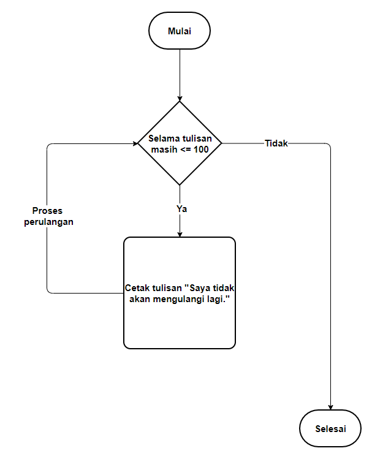

#programming 
Logika perulangan adalah proses pengulangan instruksi yang dilakukan dalam kondisi yang telah ditentukan. Dalam pemrograman, kita harus menghindari menulis kode yang sama berulang kali. Hal tersebut dilakukan supaya proses menulis kode lebih efektif dan efisien. Maka dari itu kita dapat menerapkan logika perulangan.

Contoh sederhana perulangan juga dapat kita temui di dunia nyata. Pernahkah sewaktu masa sekolah dulu Anda dihukum untuk menulis “Saya tidak akan mengulangi lagi” di papan tulis sebanyak 100 kali? Contoh tersebut jika ditulis dalam bahasa pemrograman sama seperti kita menulis statement print (“Saya tidak akan mengulangi lagi”) sebanyak 100 baris. Sangat melelahkan, bukan?

Anda dapat menggunakan logika perulangan untuk menyelesaikan permasalahan di atas. Bagian-bagian yang harus ada untuk melakukan perulangan adalah

Kondisi yang harus terpenuhi supaya proses perulangan bisa berjalan.
Instruksi yang harus dilakukan secara berulang.
Sebuah variabel yang menghitung posisi perulangan saat itu.
Nah, jika dimasukkan dengan contoh kasus menulis kalimat “Saya tidak akan mengulangi lagi” selama 100 kali, maka Anda dapat membuat kondisi perulangan sebagai berikut.

“Selama tulisan yang ada kurang dari atau sama dengan 100, maka lakukan perulangan untuk mencetak instruksi “Saya tidak akan mengulangi lagi”. Setiap kali tulisan tercetak akan dihitung oleh sebuah variabel khusus, misalnya variabel counter.

Ketika variabel counter yang menyimpan posisi perulangan sudah mencapai seratus, kondisi perulangan akan berhenti.

