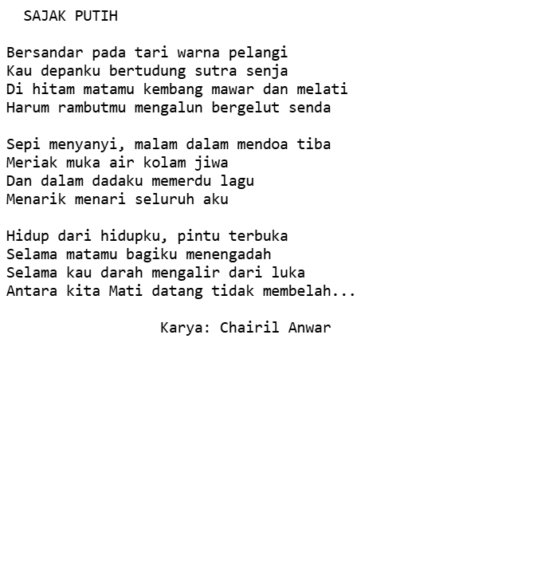

#programming 
Sejauh ini, kita sudah mengenal paragraf, heading, dan juga list pada HTML. Tapi masih ada beberapa lagi yang merupakan spesial teks format yang dapat kita gunakan yaitu `<blockquote>`, `<pre>`, dan `<figure>`.

### Long Quotations

Jika pada konten kita memiliki sebuah kutipan ataupun sebuah testimonial, kita dapat gunakan format _long quotations_ dengan menggunakan tags `<blockquote>`. Konten dalam elemen `<blockquote>` dapat berupa sebuah paragraf, heading, ataupun list.
```html
<blockquote>
  <p>
    Situs web (bahasa Inggris: website) adalah sekumpulan halaman web yang saling berhubungan yang
    umumnya berada pada peladen yang sama berisikan kumpulan informasi yang disediakan secara
    perorangan, kelompok, atau organisasi.
  </p>
</blockquote>
```

Pada elemen ini, kita dapat menggunakan atribut `cite` untuk menentukan sumber URL dari sebuah kutipan (jika kutipan tersebut bersumber dari sebuah situs website). Namun, tidak ada tampilan yang berbeda pada browser secara kasat mata.

```html
<blockquote cite="https://id.wikipedia.org/wiki/Situs_web">
  <p>
    Situs web (bahasa Inggris: website) adalah sekumpulan halaman web yang saling berhubungan yang
    umumnya berada pada peladen yang sama berisikan kumpulan informasi yang disediakan secara
    perorangan, kelompok, atau organisasi.
  </p>
</blockquote>
```

### Preformatted Text
Pada modul sebelumnya, kita sudah mengetahui bahwa HTML akan mengabaikan spasi yang dituliskan secara berulang dan juga _line breaks_ (garis baru). Namun, pada beberapa tipe konten, seperti contoh kode atau puisi hal tersebut sangat berarti.

Dengan begitu, terdapat sebuah elemen yang dapat kita gunakan untuk menampilkan konten sesuai yang kita tulis pada text editor. Untuk menggunakannya, kita gunakan elemen `<pre>` sebagai pembungkus kontennya. Perhatikan contoh berikut:

```html
<pre>
  SAJAK PUTIH

Bersandar pada tari warna pelangi
Kau depanku bertudung sutra senja
Di hitam matamu kembang mawar dan melati
Harum rambutmu mengalun bergelut senda

Sepi menyanyi, malam dalam mendoa tiba
Meriak muka air kolam jiwa
Dan dalam dadaku memerdu lagu
Menarik menari seluruh aku

Hidup dari hidupku, pintu terbuka
Selama matamu bagiku menengadah
Selama kau darah mengalir dari luka
Antara kita Mati datang tidak membelah...

                  Karya: Chairil Anwar
</pre>
```

dengan begini, code akan mengabaikan berapa banyak spasi, dan tab


### Figure

Elemen `<figure>` digunakan untuk mempresentasikan konten tersendiri (_self-contained content_), seperti ilustrasi, diagram, foto, atau bisa juga sebuah baris kode. Banyak hal yang dapat digunakan dalam elemen ini. 

Elemen ini digunakan untuk mengelompokkan blok konten yang dapat dipindahkan posisinya dari blok utama sebuah dokumen tanpa mempengaruhi arti dari induk dokumen.

Dalam elemen `<figure>`, kita dapat menuliskan elemen `<figcaption>` sebagai sebuah caption (judul) untuk konten tersebut. Berikut adalah contoh penggunaan figure pada sebuah konten gambar.

```html
<p>
  Dicoding adalah sebuah perusahaan startup yang bertujuan mengembangkan ekosistem developer di
  Indonesia. Berdiri sejak 5 Januari 2015, Dicoding memiliki platform pembelajaran elektronik di
  laman Dicoding.com.
</p>

<figure>
  
  <figcaption>Dicoding</figcaption>
</figure>

<p>
  Materi perdana yang menjadi magnet dari awal berdirinya Dicoding hingga kini adalah kelas Menjadi
  Android Developer Expert. Kelas ini dikembangkan oleh Google Developer Expert in Android, Sidiq
  Permana dan Head of Dicoding Academy, Ahmad Imaduddin. Seperti halnya kelas Picodiploma lain,
  modul online-nya juga hadir dalam bentuk buku berjudul sama yang telah mendapatkan ijin dan ISBN.
</p>
```


elemen figure dapat kita gunakan untuk me-_markup_ sebuah konten puisi, dengan cara digabungkan dengan tag pre sebelumnya.
```html
<figure>
  <pre>
          SAJAK PUTIH

      Bersandar pada tari warna pelangi
      Kau depanku bertudung sutra senja
      Di hitam matamu kembang mawar dan melati
      Harum rambutmu mengalun bergelut senda

      Sepi menyanyi, malam dalam mendoa tiba
      Meriak muka air kolam jiwa
      Dan dalam dadaku memerdu lagu
      Menarik menari seluruh aku

      Hidup dari hidupku, pintu terbuka
      Selama matamu bagiku menengadah
      Selama kau darah mengalir dari luka
      Antara kita Mati datang tidak membelah...
  </pre>
  <figcaption>Sajak Putih oleh Charil Anwar</figcaption>
</figure>
```


