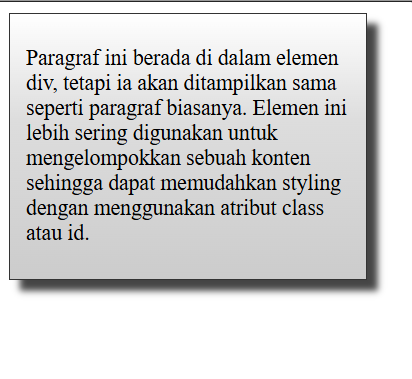
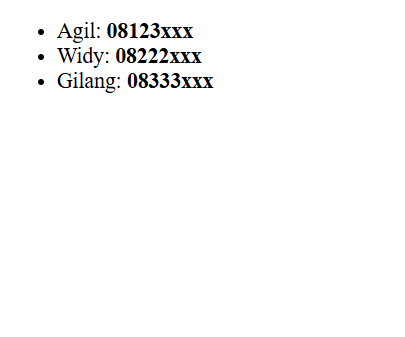
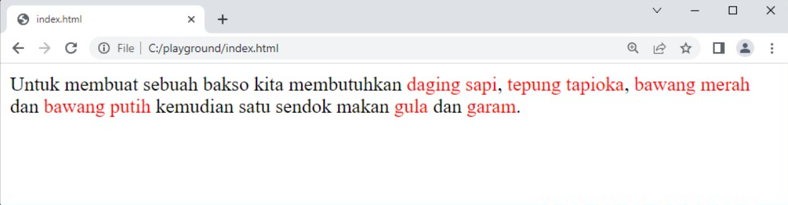

#programming 
Dalam dunia nyata, jenis informasi sangat beragam dan mungkin tidak semua semantik elemen yang kita ketahui dapat menggambarkan jenis informasinya. Untungnya, HTML menyediakan dua tipe elemen umum (_generic element_) yang bisa kita kustomisasi untuk menggambarkan konten kita dengan tepat. 
Ada dua generic element yang dapat kita manfaatkan:

### Div

Pertama, elemen `<div>`, elemen ini merupakan sebuah wadah (_container_) yang bersifat umum untuk menampung beberapa konten. Elemen ini tidak akan memberikan efek apa pun pada konten atau layout sebelum menerapkan sebuah style menggunakan CSS.
```html
<!DOCTYPE html>
<html>
  <head>
    <title>Div Element</title>
  </head>
  <body>
    <div>
      <p>
        Paragraf ini berada di dalam elemen div, namun akan ditampilkan sama seperti paragraf
        biasanya.
      </p>
    </div>
  </body>
</html>
```
Elemen `<div>` tidak merepresentasikan apa pun sebagai sebuah wadah yang murni. Elemen ini lebih sering digunakan untuk mengelompokkan sebuah konten sehingga dapat memudahkan _styling_ dengan menggunakan atribut **class** atau **id**. seperti ini:
```html
<!DOCTYPE html>
<html>
  <head>
    <title>Div Element</title>
    <link rel="stylesheet" href="styles.css">
  </head>
  <body>
    <div class="shadowbox">
      <p>
        Paragraf ini berada di dalam elemen div, tetapi ia akan ditampilkan sama seperti paragraf
        biasanya. Elemen ini lebih sering digunakan untuk mengelompokkan sebuah konten sehingga
        dapat memudahkan styling dengan menggunakan atribut class atau id.
      </p>
    </div>
  </body>
</html>
```
```css
.shadowbox {
  width: 15em;
  border: 1px solid #333;
  box-shadow: 8px 8px 5px #444;
  padding: 8px 12px;
  background-image: linear-gradient(180deg, #fff, #ddd 40%, #ccc);
}
```
output:


### Span

Kedua, elemen `<span>`, elemen ini memberikan manfaat yang sama seperti `<div>`**,** bedanya elemen ini digunakan sebagai _phrase elements_ dan tidak terdapat _line breaks_ ketika menggunakannya. Sederhananya, `<span>` merupakan sebuah `<div>` yang digunakan dalam sebuah baris teks yang dapat diwadahi oleh _paragraf_, _list_**,** _heading_, atau lainnya.

Mari kita ambil contoh. Tidak ada elemen pada _inline element_ yang memiliki arti untuk menampung sebuah informasi telepon. Oleh karena itu, tiap item pada nomor telepon bisa ditampung dalam elemen `<span>` dan diklasifikasikan (menggunakan atribut class) dengan nilai “phone”.
```html
<ul>
  <li>Agil: <span class="phone">08123xxx</span></li>
  <li>Widy: <span class="phone">08222xxx</span></li>
  <li>Gilang: <span class="phone">08333xxx</span></li>
</ul>
```
Dengan menggunakan elemen `<span>`, kita dapat menentukan sebuah styling pada teks tersebut.
```css
.phone {
    font-weight: bold;
  }
```
output:


Contoh lainnya, kita juga bisa gunakan elemen `<span>` dalam sebuah paragraf.
```html
<style>
  .bahan {
    color: red;
  }
</style>
 
<p>
  Untuk membuat sebuah bakso kita membutuhkan <span class="bahan">daging sapi</span>,
  <span class="bahan">tepung tapioka</span>, <span class="bahan">bawang merah</span> dan
  <span class="bahan">bawang putih</span> kemudian satu sendok makan
  <span class="bahan">gula</span> dan <span class="bahan">garam</span>.
</p>
```
hasilnya:



Jadi secara garis besar:
Div = untuk konten
Span = Di khususkan untuk teks