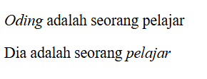

#programming 
Kita sudah belajar mengidentifikasi penggunaan elemen pada konten yang mayor (besar) dengan menerapkan _semantic HTML_ untuk mengorganisasi kontennya. Sekarang, kita akan mengenal beberapa _formatting text_ yang digunakan dalam sebuah baris teks (inline teks). 

Sebelum menjelaskan elemen _inline_ untuk _formatting text_ yang dapat digunakan, sepertinya kita perlu membahas sekilas mengenai block dan inline.

Pada standarnya, elemen HTML memiliki dua sifat, yaitu **block** dan **inline**. Elemen yang bersifat block selalu membuat baris baru ketika di-render. Contohnya seperti elemen paragraf, list, heading, dan lainnya. Lawan dari elemen tersebut, yaitu elemen inline. Elemen ini tidak menambahkan baris baru ketika di-render. Apa saja elemen tersebut? Mari kita bahas satu persatu:

### Anchor

Apa itu _anchor_? Anchor (jangkar) merupakan elemen yang digunakan untuk membuat sebuah hyperlink ke halaman atau website lain, file, alamat email, atau URL lainnya. Untuk menggunakan elemen ini kita gunakan `<a>` sebagai tag pembuka dan `</a>` sebagai tag penutup. Selain itu, ada atribut wajib agar elemen ini berfungsi dengan baik, yaitu href untuk menetapkan sebuah target yang dituju.

```html
<p>Hubungi kami di</p>
<ul>
  <li><a href="https://example.com">Website</a></li>
  <li><a href="mailto:info@example.com">Email</a></li>
  <li><a href="tel:+62123456">Telepon</a></li>
  <li><a href="#address">Alamat</a></li>
</ul>
```

### Emphasized Text

Gunakan elemen `<em>` untuk menunjukkan bagian kata yang perlu kita tekankan. Elemen ini menunjukkan _stress emphasis_ atau konten/kata yang perlu mendapatkan penekanan atau perhatian khusus. Berikut contoh penggunaannya.
```html
<p><em>Oding</em> adalah seorang pelajar</p>
<p>Dia adalah seorang <em>pelajar</em></p>
```


### Important Text

Gunakan elemen `<strong>` untuk menunjukkan sebuah teks yang begitu penting (strong importance), serius ataupun mendesak. Artinya, teks tersebut harus dapat perhatian lebih dari teks biasa lainnya.
```html
<p>Kesehatan merupakan hal yang penting, jaga pola makan yang teratur dan <strong>jangan sampai makan tengah malam!</strong></p>
```
Standarnya, pada browser sebuah teks yang diberi _markup_ `<strong>` akan ditampilkan tebal. Lalu, ketika pengguna menggunakan pembaca layar (_screen reader_), suara yang terdengar akan berbeda. Ini mengartikan bahwa teks tersebut penting, tidak hanya sekadar tebal.

### Short Quotations

Gunakan elemen `<q>` untuk menandai sebuah kutipan dalam sebuah teks. Elemen ini berbeda dengan `<blockquote>`. Elemen ini digunakan untuk kutipan pendek yang terletak di dalam baris (_inline_).
```html
<p>Sebelum pulang kerja, ia berkata kepadaku: <q>Maaf saya tidak bisa hadir dalam pertemuan nanti</q></p>
```
output:
Sebelum pulang kerja, ia berkata kepadaku: "Maaf saya tidak bisa hadir dalam pertemuan nanti"

sebuah teks yang diberi markup `<q>` akan ditampilkan di dalam tanda kutip (_quotation marks_) pada browser.

Elemen quotation marks memiliki atribut cite untuk menentukan sumber URL dari sebuah kutipan (jika kutipan tersebut bersumber dari sebuah situs website). Namun, tidak ada perbedaan yang terlihat secara kasat mata jika dijalankan di browser.