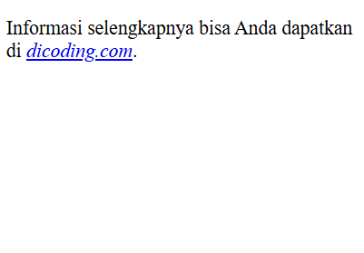
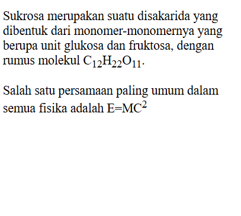
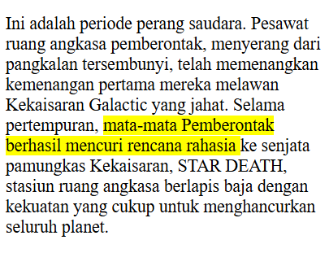

#programming 
### Citation

Selain sebuah atribut, `<cite>` juga merupakan sebuah elemen yang digunakan untuk sebuah rujukan pada sebuah dokumen, contohnya sebuah buku, majalah, artikel, dan lainnya.
```html
<p>Informasi selengkapnya bisa Anda dapatkan di <cite><a href="https://dicoding.com">dicoding.com</a></cite>.</p>
```

Standarnya, pada browser sebuah teks yang diberi markup `<cite>` akan ditampilkan dengan huruf miring (_italic_).

### Defining Terms
Elemen `<dfn>` digunakan ketika mendefinisikan sebuah istilah (_term_). Elemen ini harus terletak pada elemen lain yang menaunginya. Contohnya pada sebuah elemen `<p>` atau elemen `<section>`. Berikut contoh penggunaannya.
```html
<p><dfn>Website</dfn> merupakan halaman yang menampilkan informasi melalui teks atau gambar. Website dapat diakses melalui internet dengan menggunakan browser.</p>
```

Standar pada browser yakni sebuah teks yang diberi markup `<dfn>` akan ditampilkan dengan huruf miring (_italic_).

### Subscript dan Superscript
Subscript `<sub>` dan superscript `<sup>` adalah elemen yang dapat membuat teks yang ditampilkan tampak kecil, dengan posisi di bawah (sub) atau di atas (sup) dari teks biasanya. Elemen ini digunakan untuk menunjukkan sebuah rumus kimia ataupun matematika.
```html
<p>
  Sukrosa merupakan suatu disakarida yang dibentuk dari monomer-monomernya yang berupa unit glukosa dan fruktosa, dengan rumus molekul C<sub>12</sub>H<sub>22</sub>O<sub>11</sub>.
</p>

<p>Salah satu persamaan paling umum dalam semua fisika adalah E=MC<sup>2</sup></p>
```

  
### Highlighted Text

Untuk menandai atau menyorot sebuah teks kita bisa menggunakan elemen `<mark>`. Elemen ini digunakan ketika terdapat sebuah teks yang memiliki peran penting, biasanya teks tersebut merupakan bagian yang paling relevan atau penting dalam sebuah konteks kalimat.
```html
<p>
  Ini adalah periode perang saudara. Pesawat ruang angkasa pemberontak, menyerang dari pangkalan
  tersembunyi, telah memenangkan kemenangan pertama mereka melawan Kekaisaran Galactic yang jahat.
  Selama pertempuran,
  <mark>mata-mata Pemberontak berhasil mencuri rencana rahasia </mark>
  ke senjata pamungkas Kekaisaran, STAR DEATH, stasiun ruang angkasa berlapis baja dengan kekuatan
  yang cukup untuk menghancurkan seluruh planet.
</p>
```

Standarnya, pada browser teks yang diberi markup `<mark>` akan ditampilkan dengan background kuning dan teks hitam.
### Line Break

Terkadang, kita mungkin perlu menambahkan sebuah baris baru pada sebuah baris teks (termasuk dalam paragraf), tetapi kita mengetahui bahwa browser akan mengabaikan sebuah penulisan spasi ganda ataupun baris baru. Jadi, kita memerlukan sebuah tanda yang dapat digunakan untuk memberitahu browser untuk “Tambahkan baris baru di sini!”.
```html
<p>
   Dicoding Space,<br>
   Jln. Batik Kumeli No. 50.<br>
   Bandung.<br>
   40123
</p>
```

_Inline line break element_ (`<br>`) dapat digunakan untuk memberitahu browser untuk memberikan sebuah garis baru pada baris teks. Sama seperti gambar, elemen ini merupakan elemen kosong sehingga kita tidak membutuhkan sebuah tag penutup.
