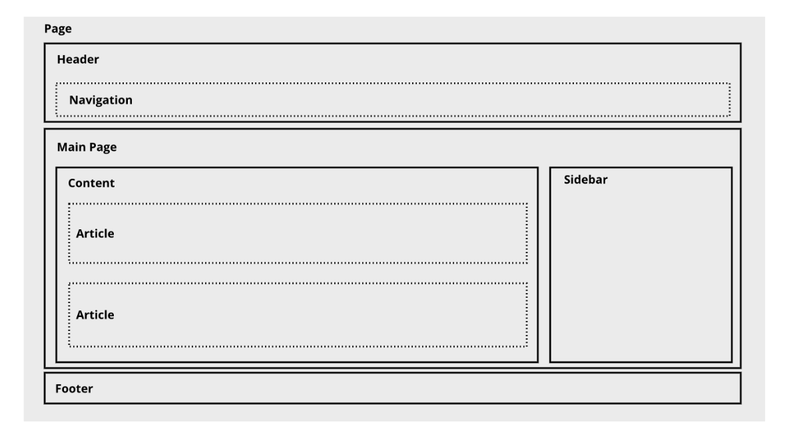
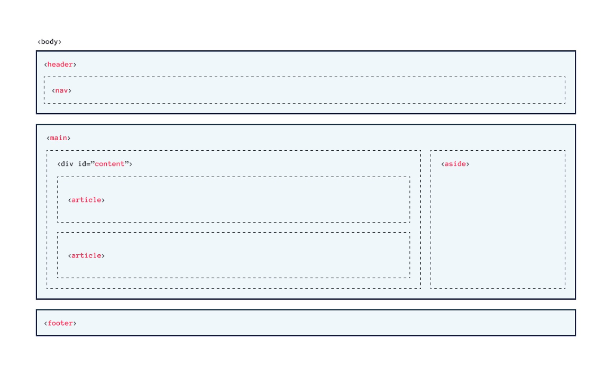

#programming 
sebuah website memiliki hierarki konten yang sama seperti dokumen sehari-hari yang kita baca, majalah, dan koran contohnya. Jadi, hierarki pada sebuah website merupakan hal yang penting. Tentu elemen yang terdapat pada HTML perlu kita kelompokkan menjadi beberapa bagian.


Dalam HTML5, kita dikenalkan pada beberapa elemen yang dapat digunakan untuk mengelompokkan sebuah elemen dengan lebih jelas dan memiliki arti (_semantic meaning_). Elemen-elemen ini memiliki nama sesuai dengan fungsi atau peran dari elemen tersebut.

Kedua contoh gambar di atas menunjukkan struktur halaman yang sama. Pada contoh pertama banyak elemen `<div>` yang dapat diubah dengan layout elemen HTML5.

### Header dan Footer

Sebuah _header_ dan _footer_ utama yang muncul pada awal dan akhir di sebuah halaman (`<body>`).
- Header: pengantar atau pembuka konten dalam sebuah elemen `<article>` atau `<section>`. 
- Footer: catatan kaki pada sebuah elemen `<article>` atau `<section>`.

Pada contoh di bawah ini, elemen `<header>` digunakan untuk menampilkan nama situs dan navigasi utama.
```html
<header>
  <h1>Bandung</h1>
  <p>
    Kota metropolitan terbesar di Provinsi Jawa Barat, sekaligus menjadi ibu kota provinsi tersebut.
  </p>
  <nav>
    <ul>
      <li><a href="#sejarah">Sejarah</a></li>
      <li><a href="#geografis">Geografis</a></li>
      <li><a href="#wisata">Wisata</a></li>
    </ul>
  </nav>
</header>
```

Selain itu, elemen `<footer>` digunakan sebagai informasi hak cipta.

```html
<footer>
  &copy; 2019, Dicoding Academy
</footer>
```

Perlu kita ketahui bahwa elemen `<header>` dan `<footer>` tidak boleh ditulis di dalam elemen `<header>` dan `<footer>` lainnya (bertumpuk/nested).

### Main
Element `<main>` digunakan untuk menampung/mewadahi konten utama (dominan) dalam `<body>`. Main content (konten utama) dapat terdiri dari banyak section, artikel, atau konten apa pun di dalam elemen `<main>`, selama ia termasuk konten utama yang dimiliki oleh website.

```html
<body>
  <header>
    <!-- Konten header website -->
  </header>
  <main>
    <!-- Konten utama website -->
  </main>
  <footer>
    <!-- Konten footer website -->
  </footer>
</body>
```
Catatan:
<!-- --> merupakan tag komentar pada HTML, teks yang terdapat di antara tag tersebut, tidak akan ditampilkan pada website. Fungsinya untuk memberikan komentar saja/catatan.
Karena berisi main content pada website, jangan gunakan elemen `<main>` lebih dari satu pada berkas HTML. 

### Nav
Elemen `<nav>` digunakan untuk menampung sebuah navigasi yang sifatnya penting (mayor), contohnya navigasi utama pada sebuah website.

Namun, tidak menjamin pada sebuah website hanya ada satu navigasi. Contohnya, sebuah akhir artikel pada blog terdapat tautan navigasi menuju artikel yang dianggap relevan dengan artikel yang telah kita baca. Navigasi tersebut tidak dianggap sebagai navigasi yang penting sehingga kita tidak perlu menggunakan elemen `<nav>` untuk menampilkannya.

Pada pembahasan header dan footer, kita sudah melihat contoh penggunaan dari elemen `<nav> `yang diletakkan pada elemen `<header>`.

```html
<nav>
  <ul>
    <li><a href="#sejarah">Sejarah</a></li>
    <li><a href="#geografis">Geografis</a></li>
    <li><a href="#wisata">Wisata</a></li>
  </ul>
</nav>
```
Sebuah navigation pada dasarnya sangat berguna untuk aksesibilitas website kita. Contohnya ketika pengguna website kita menggunakan screen reader dalam mengunjungi website, pengguna akan mudah mencari bagian yang dia inginkan tanpa harus menelusuri seluruh konten website.

### Articles
Elemen `<article>` bertindak sebagai container untuk independent content pada sebuah halaman, artinya konten utuh yang tidak terkait dengan konten lain, bisa saja sebuah artikel blog, komentar, forum post dan konten lainnya.

Jika dalam sebuah halaman terdapat beberapa artikel, tiap artikel tersebut seharusnya berada pada elemen `<article>`-nya masing-masing.

```html
<article>
  <h2>Sejarah</h2>
  
  <p>Kata Bandung berasal dari kata bendung atau bendungan karena terbendungnya sungai Citarum oleh lava Gunung Tangkuban Parahu yang lalu membentuk telaga...</p>
</article>
 
<article>
  <h2>Geografis</h2>
  
  <p>Kota Bandung dikelilingi oleh pegunungan, sehingga bentuk morfologi wilayahnya bagaikan sebuah mangkok raksasa,[9] secara geografis kota ini terletak di tengah-tengah provinsi Jawa Barat..</p>
</article>
 
<article>
  <h2>Wisata</h2>
  
  <p>Sejak dibukanya Jalan Tol Cipularang, kota Bandung telah menjadi tujuan utama dalam menikmati liburan akhir pekan terutama dari masyarakat yang berasal dari Jakarta sekitarnya...</p>
</article>
```
Elemen `<article>` dapat berada pada elemen `<article>` lainnya (nested) selama artikel tersebut berkaitan dengan induk elemen `<article>` yang menampungnya.

### Aside
Elemen `<aside>` memiliki dua tujuan, tergantung kita menempatkannya di dalam sebuah elemen `<article>` atau tidak.

Ketika elemen ini ditempatkan di dalam elemen `<article>`, elemen ini dapat berisi informasi yang berhubungan dengan artikel tersebut, tetapi bukan bagian dari konten artikelnya itu sendiri (dipisahkan dari konten utama). 

Ketika ditempatkan di luar elemen `<article>`, elemen ini dapat berisi informasi yang berhubungan pada keseluruhan halaman.

Elemen `<aside>` biasanya terletak di samping dari sebuah elemen yang menampungnya. 

```html
<main>
  <article>
    <!-- ...... -->
  </article>
 
  <aside>
    <article>
      <header>
        <h2>Kota Bandung</h2>
        <p>Kota Kembang Paris van Java</p>
        <figure>
          
          <figcaption>Lambang</figcaption>
        </figure>
      </header>
    </article>
  </aside>
</main>
```

### Section
Sebuah elemen yang memiliki kesamaan konten dan sebuah heading di dalamnya dapat dikelompokkan dengan menggunakan elemen `<section>.` Dengan begitu elemen ini dapat digunakan pada sebuah elemen `<article>` yang memiliki konten panjang dan berpotensi untuk dikelompokkan.

Dalam sebuah `<section>` sebaiknya terdapat elemen heading (h1-h6), yang menjadi elemen pertama yang dituliskan pada sebuah section untuk menunjukkan judul atau tema dari bagian konten yang dikelompokkan.

```html
<article>
  <section>
    <h2>Wisata</h2>
    <p>
      Sejak dibukanya Jalan Tol Cipularang, kota Bandung telah menjadi tujuan utama dalam menikmati
      liburan akhir pekan terutama dari masyarakat yang berasal dari Jakarta sekitarnya. Selain
      menjadi kota wisata belanja, kota Bandung juga dikenal dengan sejumlah besar bangunan lama
      berarsitektur peninggalan Belanda.
    </p>
  </section>
  <section>
    <h3>Farm House Lembang</h3>
    
    <p>
      Kota Bandung dikelilingi oleh pegunungan, sehingga bentuk morfologi wilayahnya bagaikan sebuah
```