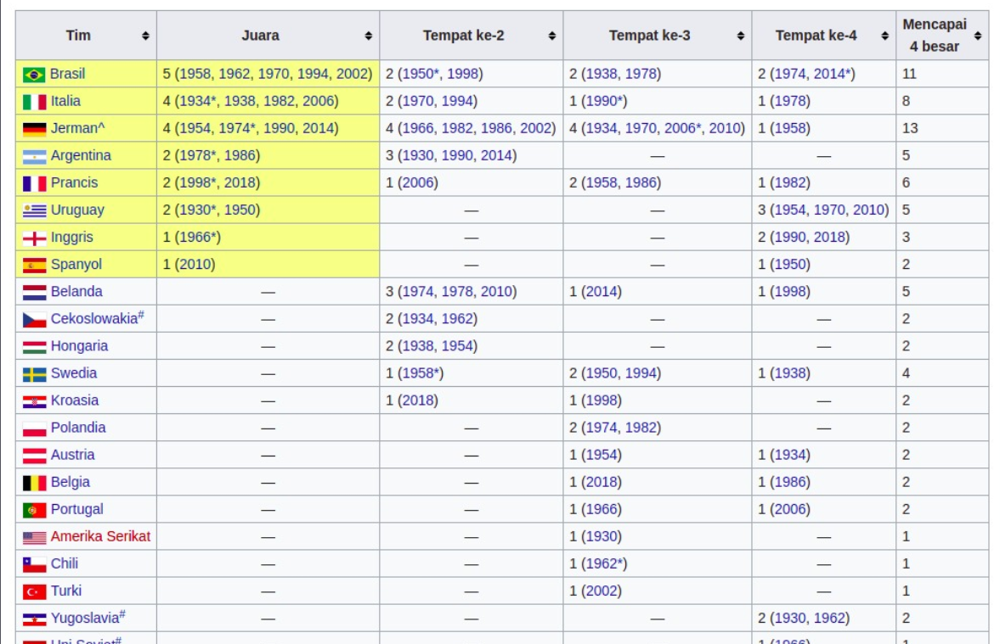
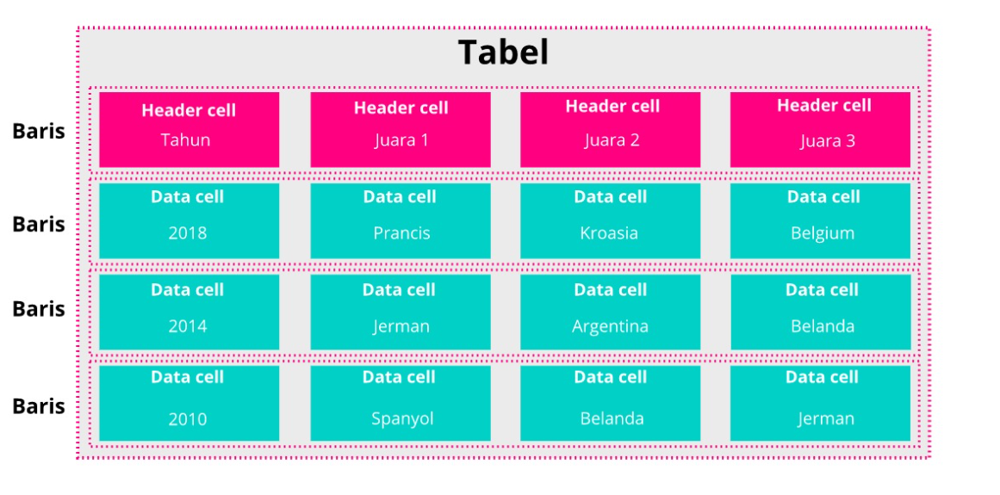
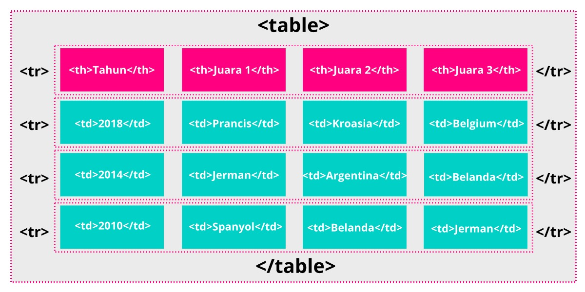
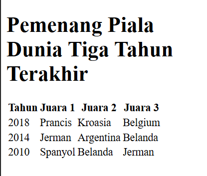
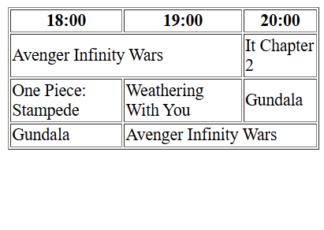
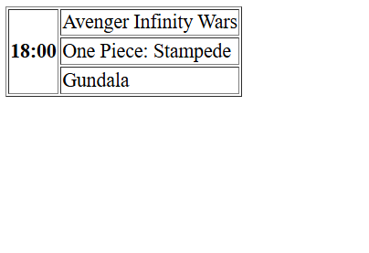

#programming 
Ketika kita membuat sebuah tabel, pastinya kita akan banyak bermain dengan baris dan kolom. Pada materi ini, kita akan belajar cara membuat dan mengorganisasi sebuah tabel pada HTML.

Namun, sebelum itu, apa _sih_ sebenarnya tabel dalam HTML itu? Elemen `<table>` pada HTML merepresentasikan data tabular, yaitu informasi yang disajikan dalam sebuah tabel. Tabel sendiri disajikan dalam dua dimensi terdiri dari _baris_ dan _kolom_ (_cell_) yang berisikan sebuah data. Berikut adalah contoh data sepak bola yang disajikan dalam bentuk tabel.


### Struktur Dasar Table
Tabel pada HTML disusun dari tiga buah elemen, yaitu `<table>`,`<tr>` dan `<td>` atau `<th>`. Elemen `<table>` digunakan untuk menandakan dimulainya dan diakhirinya sebuah konten tabel dan juga sebagai wadah untuk tabel itu sendiri. Kemudian elemen `<tr>` digunakan untuk membuat sebuah baris baru yang di dalamnya terdapat elemen `<td>` atau `<th>` sehingga menghasilkan sebuah sel.   
  
Elemen `<td>` berarti “table data”. Selain membuat sel, elemen ini juga merupakan tempat menampung data pada tabel, dan elemen `<th>` atau “table header” digunakan untuk menentukan sebuah header pada kolom datanya. Untuk lebih jelasnya, perhatikan ilustrasi berikut.


Cukup mudah, kan? Sekarang mari kita ubah menjadi penerapan elemen HTML.


Berdasarkan ilustrasi di atas, kita dapat menuliskan sebuah struktur dasar tabel pada HTML seperti berikut.
```html
<h1>Pemenang Piala Dunia Tiga Tahun Terakhir</h1>

<table>
  <tr>
    <th>Tahun</th>
    <th>Juara 1</th>
    <th>Juara 2</th>
    <th>Juara 3</th>
  </tr>
  <tr>
    <td>2018</td>
    <td>Prancis</td>
    <td>Kroasia</td>
    <td>Belgium</td>
  </tr>
  <tr>
    <td>2014</td>
    <td>Jerman</td>
    <td>Argentina</td>
    <td>Belanda</td>
  </tr>
  <tr>
    <td>2010</td>
    <td>Spanyol</td>
    <td>Belanda</td>
    <td>Jerman</td>
  </tr>
</table>
```
output:


Seluruh konten atau data dituliskan pada elemen `<td>` ataupun `<th>`. Kita bisa memberikan konten apa saja di dalamnya, seperti teks, gambar, atau bahkan sebuah tabel lainnya.

## Spanning Cell

Terkadang kita membutuhkan sebuah sel untuk mencakup dua kolom ataupun dua baris sekaligus. Dalam aplikasi seperti Microsoft Excel, hal ini biasa kita kenal sebagai _merging cell_ atau menggabungkan sebuah sel. Ini memang menjadi sebuah fitur dasar dalam membuat sebuah tabel sehingga pada HTML pun kita dapat melakukan hal tersebut.

Pada HTML hal ini lebih dikenal sebagai _spanning cell_, yang artinya menjangkau atau merentangkan sebuah ukuran sel lebih dari ukuran yang biasanya. Dengan _spanning cell_, kita dapat membuat sebuah tabel yang lebih kompleks, tetapi akan membuat markup yang kita tulis menjadi sedikit sulit dibaca.

### Column Spans
Untuk merentangkan sebuah kolom (_column spanning_) kita bisa menggunakan atribut colspan pada elemen `<td>` atau `<th>`**.** Berikut adalah contoh untuk penggunaan colspan sehingga sebuah _header_ mencakup dua kolom.
```html
<table border=1>
  <tr>
    <th>18:00</th>
    <th>19:00</th>
    <th>20:00</th>
  </tr>
  <tr>
    <td colspan="2">Avenger Infinity Wars</td>
    <td>It Chapter 2</td>
  </tr>
  <tr>
    <td>One Piece: Stampede</td>
    <td>Weathering With You</td>
    <td>Gundala</td>
  </tr>
  <tr>
    <td>Gundala</td>
    <td colspan="2">Avenger Infinity Wars</td>
  </tr>
</table>
```

Sebuah elemen yang menggunakan atribut `colspan` akan mencakup ruang kolom sesuai nilai dari atribut itu sendiri. Untuk lebih jelasnya, kita bisa menambahkan atribut `border` pada elemen `<table>` agar terdapat garis pada tepi selnya.

### Row Spans
Untuk merentangkan sebuah baris (_row spanning_) kita dapat menggunakan atribut rowspan. Mirip seperti _column spanning_, tetapi atribut ini akan merentangkan sebuah sel ke bawah. Berikut contohnya:
```html
<table border="1">
  <tr>
    <th rowspan="3">18:00</th>
    <td>Avenger Infinity Wars</td>
  </tr>
  <tr>
    <td>One Piece: Stampede</td>
  </tr>
  <tr>
    <td>Gundala</td>
  </tr>
</table>
```

elemen `<th>` yang memiliki atribut `rowspan`. Elemen tersebut berada pada baris pertama dan akan menempati sebanyak tiga baris tabel ke bawah. Jadi, pada baris tersebut membutuhkan dua buah elemen (`<th>`dan `<td>`) dan pada baris selanjutnya (baris dua dan tiga) memerlukan sebuah elemen `<td>` saja.

### Elemen dan Atribut pada Tabel

<table>
  <tr>
    <th>Elemen dan Atribut</th>
    <th>Deskripsi</th>
  </tr>

  <tr>
    <td>table</td>
    <td>Menetapkan elemen tabel.</td>
  </tr>

  <tr>
    <td>td</td>
    <td>Menetapkan sebuah sel dalam baris tabel.</td>
  </tr>

  <tr>
    <td>colspan="number"</td>
    <td>Jumlah kolom yang dicakup oleh sel.</td>
  </tr>

  <tr>
    <td>rowspan="number"</td>
    <td>Jumlah baris yang dicakup oleh sel.</td>
  </tr>

  <tr>
    <td>headers="nama header"</td>
    <td>Mengasosiasikan data sel dengan header.</td>
  </tr>

  <tr>
    <td>th</td>
    <td>Menetapkan header yang terkait dengan baris atau kolom.</td>
  </tr>

  <tr>
    <td>colspan="number"</td>
    <td>Jumlah kolom dicakup oleh header.</td>
  </tr>

  <tr>
    <td>rowspan="number"</td>
    <td>Jumlah row yang dicakup oleh header.</td>
  </tr>

  <tr>
    <td>headers="nama header"</td>
    <td>Mengasosiasikan header dengan header lain.</td>
  </tr>

  <tr>
    <td>scope="row | col | rowgroup | colgroup"</td>
    <td>Mengasosiasikan header dengan baris, kelompok baris, kolom, atau kelompok kolom.</td>
  </tr>

  <tr>
    <td>tr</td>
    <td>Menetapkan sebuah baris pada tabel.</td>
  </tr>

  <tr>
    <td>caption</td>
    <td>Memberikan judul pada sebuah tabel.</td>
  </tr>

  <tr>
    <td>col</td>
    <td>Menetapkan sebuah kolom.</td>
  </tr>

  <tr>
    <td>colgroup</td>
    <td>Menetapkan sebuah kelompok kolom.</td>
  </tr>

  <tr>
    <td>tbody</td>
    <td>Mengidentifikasi sebuah body dalam tabel.</td>
  </tr>

  <tr>
    <td>tfoot</td>
    <td>Mengidentifikasi sebuah footer dalam tabel.</td>
  </tr>

  <tr>
    <td>thead</td>
    <td>Mengidentifikasi sebuah header dalam tabel.</td>
  </tr>
</table>
