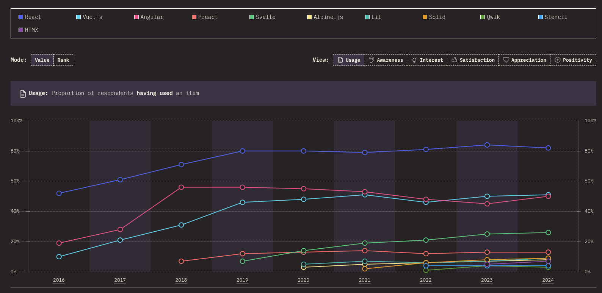

#programming 
Perlukah kami menjelaskan mengapa memilih React? Konsep yang ada di dalam React sendiri sudah menjelaskan mengapa kami menyukai React. Kami suka React karena ia dapat memangkas banyak kode yang berulang dan juga sifat reaktif yang ia miliki. Selain itu, karena konsep bawaan React sebenarnya cukup sedikit dan banyak mengandalkan konsep JavaScript pada umumnya, maka dengan mendalami React, sekali dayung dua tiga pulau terlampaui. Sekali belajar konsep React, dua tiga konsep JavaScript mau tidak mau harus kita pahami. Ditambah lagi dengan portabilitas ilmu React yang bisa dibawa ke platform aplikasi mobile melalui [React Native](https://reactnative.dev/) yang terkenal dengan jargonnya, _learn once, write anywhere_. Seharusnya alasan tersebut cukup mengapa kami memilih React.

Baik. Mari kita lihat dari sudut pandang lain. Mungkin alasan yang kami berikan terlalu teknikal untuk seorang yang baru mulai belajar React. Bagaimana dengan popularitasnya? Apakah banyak perusahaan yang membutuhkan skill React? Perusahaan mana yang sudah pakai React? Bagaimana dengan komunitasnya? Oke. Mari kita cari tahu satu per satu.

### Popularitas React
Pertama, kita bahas tentang popularitasnya. React melejit bak roket bahkan sejak setahun setelah pertama dirilis. Sampai saat ini, percayalah, React masih juara dalam hal popularitas di kategori UI Library atau Front-End Framework. Survei terbaru yang dilakukan oleh [stateofjs](https://stateofjs.com/), mengungkap bahwa penggunaan React masih menjadi peringkat pertama sejak 6 tahun ke belakang. Angular dan Vue (framework dengan tujuan serupa) menyusul di belakangnya.

Repositori GitHub React pun memiliki statistik yang luar biasa. Saat artikel ini ditulis, React disukai (ditandai star) oleh 184 ribu developer dan menjadi dependencies terhadap 9 juta lebih repository terbuka di GitHub. Luar biasa!

Belum lagi bila kita lihat statistik unduh di NPM repository. React tercatat diunduh sebanyak 15 juta kali setiap minggunya. React juga masuk ke dalam 10 besar package yang dibutuhkan berdasarkan peringkat NPM. Angka yang sangat fantastis, bukan? 

Popularitas yang baik menjadi salah satu alasan kami memilih React.

### Pengguna React
Selain alasan popularitas, React juga banyak digunakan oleh industri besar, unicorn, ataupun perusahaan rintisan. Karena React bertuan Meta, sudah mesti ia digunakan pada platform web social media Facebook, Instagram, dan WhatsApp. Selain platform social media Meta, ternyata Twitter, Netflix, Discord, dan banyak platform sukses lainnya mempercayai dan menggunakan React.

Di Indonesia sendiri bagaimana? Sama saja. Perusahaan dalam negeri pun sudah banyak yang menggunakan React. Contohnya Tokopedia, Traveloka, Tiket.com, Telkomsel, dan masih banyak perusahaan lainnya.