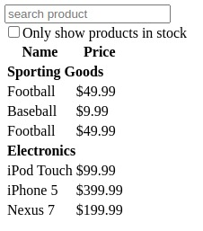
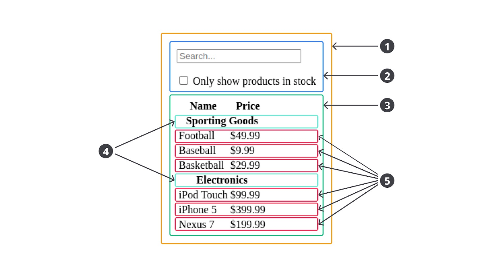

#programming 
Component di React dapat menampung dan menghasilkan UI yang kompleks ataupun sederhana. Biasanya, React component yang kompleks dibangun dari beberapa component lain yang lebih kecil. Konsep ini dinamakan composition dan menjadi konsep inti seperti yang sudah Anda pelajari di modul Konsep Dasar React.

Semakin kecil kita membuat sebuah component, semakin reusable UI yang kita bangun dan React mendorong kita untuk membangun aplikasi dengan pendekatan composition daripada inheritance untuk menghasilkan UI yang lebih kompleks. 

Mari kita ambil contoh UI di bawah ini.


Oke. Menurut Anda bagaimana cara terbaik untuk membangun UI tersebut? Apakah dengan membuat satu component besar bernama FilterableProductTable seperti berikut?
```jsx
function FilterableProductTable() {
  return (
    <div className="container">
      <div className="search-bar__container">
        <input type="text" placeholder="Search..." />
        <div className="search-bar__in_stock_checkbox">
          <input type="checkbox" />
          <label>Only show products in stock</label>
        </div>
      </div>
      <div className="product-table__container">
        <table>
          <tr>
            <th>Name</th>
            <th>Price</th>
          </tr>
          <tr>
            <td colSpan="2">
              <strong>Sporting Goods</strong>
            </td>
          </tr>
          <tr>
            <td>Football</td>
            <td>$49.99</td>
          </tr>
          <tr>
            <td>Baseball</td>
            <td>$9.99</td>
          </tr>
          <tr>
            <td>Basketball</td>
            <td>$29.99</td>
          </tr>
          <tr>
            <td colSpan="2">
              <strong>Electronics</strong>
            </td>
          </tr>
          <tr>
            <td>iPod Touch</td>
            <td>$99.99</td>
          </tr>
          <tr>
            <td>iPhone 5</td>
            <td>$399.99</td>
          </tr>
          <tr>
            <td>Nexus 7</td>
            <td>$199.99</td>
          </tr>
        </table>
      </div>
    </div>
  );
}
```

Tentu tidak ya! Jika Anda menghadapi kasus seperti ini, pecahlah component besar menjadi beberapa component yang lebih kecil. Mungkin Anda bertanya-tanya, bagaimana caranya kita mengetahui kapan harus membuat component secara terpisah?

Jawabannya adalah gunakan intuisi Anda untuk memutuskan apakah membutuhkan fungsi baru atau tidak. Namun, jangan lupa selalu benamkan dalam pemikiran Anda bahwa setiap fungsi haruslah memiliki satu tanggung jawab saja ([single-responsibility principle](https://en.wikipedia.org/wiki/Single-responsibility_principle)). Nah, component pun sama. Idealnya, ia hanya melakukan satu hal saja. Jika memang component haruslah kompleks, ia akan memiliki beberapa component kecil lainnya.

Agar lebih mudah lagi dalam menentukannya, sketsakan pemecahan UI-nya seperti ini.

Sketsa di atas menunjukkan UI dapat dipecah menjadi 5 bagian component. Berikut nama dan tugas dari component tersebut.

1. **FilterableProductTable** (kuning): Sebagai container atau penampung seluruh UI yang perlu ditampilkan.
2. **SearchBar** (biru): Menerima input dari pengguna.
3. **ProductTable** (hijau): Sebagai tabel yang menampilkan data hasil dari input pengguna.
4. **ProductCategoryRow** (biru muda): Menampilkan heading untuk setiap kategori produk.
5. **ProductRow** (merah): Menampilkan item produk.

> **Catatan**: Jika Anda perhatikan pada component _ProductTable_, terdapat header--bertuliskan **name** dan **price**--yang tidak kami jadikan sebagai component tersendiri. Hal ini sebenarnya preferensi masing-masing apakah mau dibuatkan component terpisah atau tidak. Kami tidak memisahkan heading karena ia hanyalah teks statis dan masih bagian dari tanggung jawab ProductTable dalam menampilkan tabel. Namun, jika Anda ingin menambahkan fungsi sorting pada heading tersebut, pecahlah heading menjadi ProductTableHeader component.

Setelah mengidentifikasi pemecahan component, mari kita _refactor_ kode dalam membuat FilterableProductTable component menjadi seperti ini.
```jsx
function SearchBar() {
  return (
    <div className="search-bar__container">
      <input type="text" placeholder="Search..." />
      <div className="search-bar__in_stock_checkbox">
        <input type="checkbox" />
        <label>Only show products in stock</label>
      </div>
    </div>
  );
}
 
function ProductCategoryRow({ name }) {
  return (
    <tr>
      <td colSpan="2">
        <strong>{name}</strong>
      </td>
    </tr>
  );
}
 
function ProductRow({ name, price }) {
  return (
    <tr>
      <td>{name}</td>
      <td>{price}</td>
    </tr>
  );
}
 
function ProductTable() {
  return (
    <div className="product-table__container">
      <table>
        <tr>
          <th>Name</th>
          <th>Price</th>
        </tr>
        <ProductCategoryRow name="Sporting Goods" />
        <ProductRow name="Football" price="$49.99" />
        <ProductRow name="Baseball" price="$9.99" />
        <ProductRow name="Baseketball" price="$49.99" />
        <ProductCategoryRow name="Electronics" />
        <ProductRow name="iPod Touch" price="$99.99" />
        <ProductRow name="iPhone 5" price="$399.99" />
        <ProductRow name="Nexus 7" price="$199.99" />
      </table>
    </div>
  );
}
 
function FilterableProductTable() {
  return (
    <div className="container">
      <SearchBar />
      <ProductTable />
    </div>
  );
}
```

Berikut adalah hirarki dari component di atas.

- FilterableProductTable
    - SearchBar
    - ProductTable
        - ProductCategoryRow
        - ProductRow