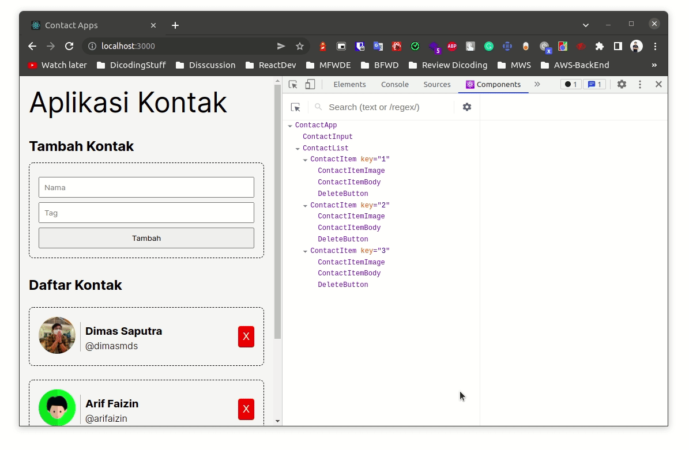
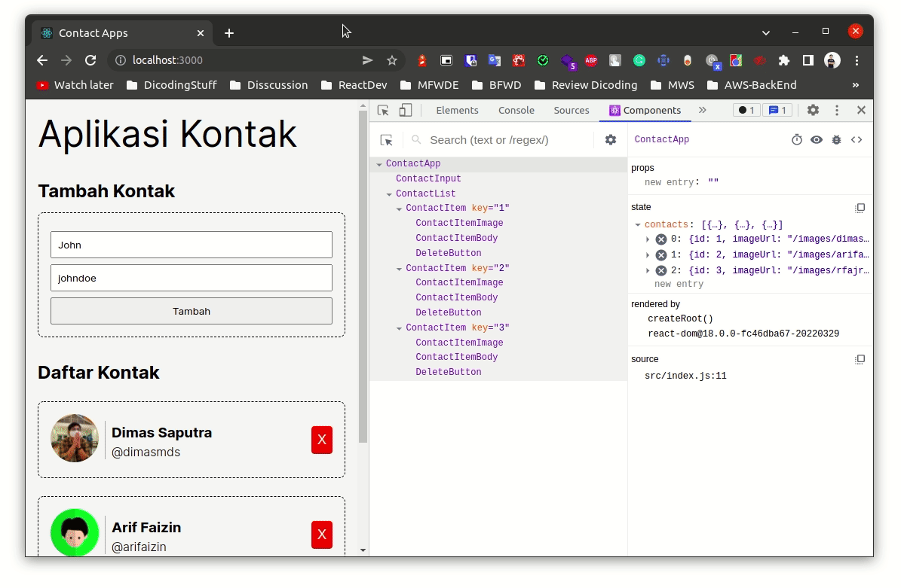
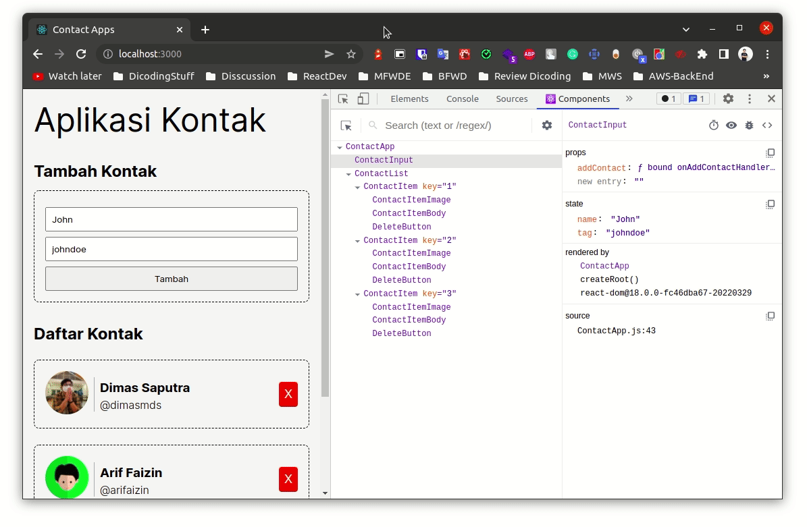

#programming 
Ketika membangun aplikasi React, terkadang sulit untuk melihat apa yang sebenarnya terjadi di dalam component. Terutama bila kita banyak melakukan props drilling, membuat component yang nested, atau menyimpan data pada state yang sering berubah-ubah. Debugging menjadi tantangan besar ketika membangun aplikasi dengan React.

Debugging aplikasi web biasa dilakukan menggunakan Browser Developer Tools, sebagai web developer tentu tak asing lagi ketika menggunakannya. Namun, sayangnya tools tersebut tidak bisa menginspeksi seperti apa React component menyimpan data. Oleh karena itu, React Developer Tools hadir untuk memudahkan Anda ketika ingin menginspeksi hierarki component lengkap dengan nilai props dan state yang ada di dalamnya. Kami sangat menyarankan Anda untuk memasang React Developer Tools sebagai alat tambahan ketika debugging aplikasi React.

React Developer Tools tersedia dalam bentuk ekstensi atau add-ons web browser Chrome dan Firefox. Anda bisa memasangnya melalui tautan berikut.

- [React Developer Tools untuk Chrome](https://chrome.google.com/webstore/detail/react-developer-tools/fmkadmapgofadopljbjfkapdkoienihi)
- [React Developer Tools untuk Firefox](https://addons.mozilla.org/id/firefox/addon/react-devtools/)

Setelah Anda memasang ekstensi tersebut maka setiap kali Anda membuka aplikasi React (dalam tahap development) akan muncul opsi/menu baru Components dan Profiler pada Browser Developer Tools.

Jika menu Components dipilih, Anda bisa menginspeksi React component dengan lebih mudah.

Anda juga bisa melihat nilai props dan state yang berada di dalam Component secara live.

Bahkan, Anda juga bisa mengubah nilai _props_ dan _state_ secara langsung.

Dengan React Developer Tools, diharapkan Anda dapat men-_debug_ aplikasi React lebih baik lagi. Untuk penjelasan dan penggunaan lebih detail dari React Developer Tools, Anda bisa kunjungi [dokumentasi resmi](https://github.com/facebook/react/tree/main/packages/react-devtools-extensions).

