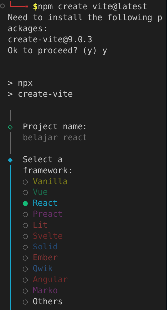
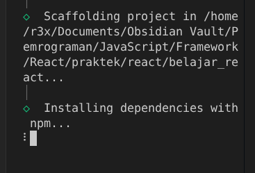
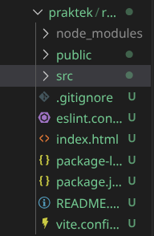

#programming 
seperti yang sudah di jelaskan sebelumnya kalo untuk menginstall React js pada penyimpanan lokal di laptop atau komputer masing masing akan menggunakan Vite. 

aplikasi yang dibutuhkan adalah:
1. Code editor, disini saya memakai Visual studio code.
2. Browser, seperti google chrome.
3. Dan sudah menginstall node.js disini https://nodejs.org/en/download.
kalo ingin mengetahui apakah node js sudah terinstall di komputer dengan cara mengetikan perintah `node -v` di terminal, dan `npm -v` untuk mengecek npm (node packet manager)-nya.

untuk menginstalasinya ikuti cara berikut:
1. pertama buat folder baru di dalam project maupun folder latihan reactnya.
2. buka terminal dan masuk ke dalam folder yang sudah dibuat itu.
```
cd Pemrograman/JavaScript/Framework/React/praktek/react/
```
3. sebelum menginstall reactnya, pastikan sudah menginstall vite-nya terlebih dahulu.
dengan cara mengetikan perintah ini pada terminal:
```
npm create vite@latest
```

4. nanti akan muncul tampilan seperti ini:

tentunya saya akan memilih React.

5. selanjutnya nanti akan ada pertanyaan "Select a variant:", pilihlah "JavaScript"

ini adalah tampilan jika masih dalam prosess peginstallan.


nanti di folder yang sudah dibuat tadi akan ada muncul beberapa file dan folder seperti ini:


6. ketik "npm run dev", untuk menjalankan server localhot untuk reactnya,
dan nanti akan banyak muncul pilihan shortcut untuk konfigurasi reactnya, pilihannya itu adalah:
```
  Shortcuts
  press r + enter to restart the server
  press u + enter to show server url
  press o + enter to open in browser
  press c + enter to clear console
  press q + enter to quit
```
r untuk restart server localhostnya.
u untuk menampilkan link localhost, contoh output ` ➜  Local:   http://localhost:5173/`
o untuk membuka browser secara otomatis dan akan menampilkan web react localhost.
c untuk membersihkan layar seperti perintah "cls"
dan terakhir q untuk keluar atau menyetopkan server localhostnya.