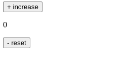
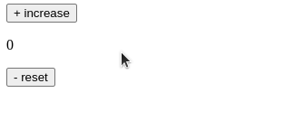

#programming 
Di latihan kali ini, kita akan merealisasikan aplikasi counter dengan menuliskan kode secara langsung menggunakan React. Sebelum mulai, ketahuilah tujuan dari latihan yang akan kita lakukan di bawah ini.

Mengetahui cara menyimpan data di dalam state.
Mengetahui cara mengubah data di dalam state.
Memanfaatkan data di dalam state untuk menampilkan UI.
Mengetahui cara event handling pada component.
Kita akan membangun aplikasi counter dengan improvisasi agar lebih menantang. Kami sebut aplikasi ini dengan nama “FizzBuzz Counter”. Kurang lebih fungsi dan tampilannya tampak seperti ini.


FizzBuzz Counter ini sama seperti counter pada umumnya, tetapi ada sedikit perbedaan yaitu:

bila angka termasuk kelipatan 5, aplikasi akan menampilkan Fizz,
bila angka termasuk kelipatan 7, aplikasi akan menampilkan Buzz, dan
bila angka termasuk kelipatan 5 dan 7, aplikasi akan menampilkan FizzBuzz.
Aplikasi di atas juga terdapat tombol increase untuk menambahkan nilai dan reset untuk mengatur ulang nilai.

Yuk kita mulai latihannya!
1. Buka tautan [dicoding-react-starter](https://codesandbox.io/s/dicoding-react-starter-x6579v) atau Anda juga boleh membuat proyek react baru secara lokal menggunakan Vite.
2. Selanjutnya, buat komponen placeholder CounterApp menggunakan class component dan render komponennya pada DOM.
```jsx
import React from 'react';
import { createRoot } from 'react-dom/client';
 
class CounterApp extends React.Component {
  render() {
    return (
      <div>
        <p>TODO: selesaikan component-nya!</p>
      </div>
    );
  }
}
 
const root = createRoot(document.getElementById('root'));
root.render(<CounterApp />);
```
3. Lakukan inisialisasi state di dalam component **CounterApp**, lalu simpan nilai count di dalam `this.state` dengan menuliskan kode pada **constructor** seperti berikut.
```jsx
 constructor(props) {
    super(props);
 
    // inisialisasi nilai count di dalam state
    this.state = {
      count: 0
    };
  }
```
4. Kemudian, buat dua method (event handler), yaitu onIncreaseEventHandler dan onResetEventHandler yang berfungsi untuk menaikkan dan mereset nilai dari count.
```jsx
 onIncreaseEventHandler() {
    this.setState((previousState) => {
      return {
        count: previousState.count + 1
      };
    });
  }
  
  onResetEventHandler() {
    this.setState(() => {
      return {
        count: 0
      };
    });
  }
```
Masih ingatkah Anda dengan aturan pengelolaan data? Karena CounterApp menampung data, komponen ini yang berhak mengubah datanya. Oleh karena itu, kita perlu mendefinisikan fungsi event handler di sini.

5. Selanjutnya, kita akan membuat component untuk menampilkan data **count**. Masih di berkas yang sama, silakan buat component baru dengan nama `CounterDisplay`.
```jsx
function CounterDisplay({ count }) {
 return <p>{count}</p>;
}
```
Pembuatan component ini cukup dengan functional component karena kita tidak memanfaatkan state. Data count yang ditampilkan pada component ini akan diberikan melalui props oleh CounterApp.

6. Sekarang, buat component baru bernama **IncreaseButton** yang digunakan sebagai tombol untuk meningkatkan nilai **count** setiap kali diklik.
```jsx
function IncreaseButton({ increase }) {
  return (
    <div>
      <button onClick={increase}>+ increase</button>
    </div>
  );
}
```
Komponen IncreaseButton menerima satu props dengan nama `increase`. Props increase merupakan event handler yang nantinya akan dipanggil setiap terjadi event `onClick`.

7. Buat lagi component baru --serupa dengan IncreaseButton-- _bernama `ResetButton` untuk mereset nilai dari **count**.
```jsx
function ResetButton({ reset }) {
  return (
    <div>
      <button onClick={reset}>- reset</button>
    </div>
  );
}
```

8. Setelah seluruh komponen terbuat, kini saatnya untuk menggunakan component `CounterDisplay`, `IncreaseButton`, dan `ResetButton` di dalam `CounterApp`. Ubahlah kode di dalam fungsi `render` pada component `CounterApp`menjadi seperti ini.
```jsx
class CounterApp extends React.Component {
 // kode lain disembunyikan
 
  render() {
    return (
      <div>
        <IncreaseButton increase={this.onIncreaseEventHandler} />
        <CounterDisplay count={this.state.count} />
        <ResetButton reset={this.onResetEventHandler} />
      </div>
    );
  }
}
```
Simpan perubahan dan sekarang browser akan menampilkan UI seperti ini.

Sayangnya aplikasi belum bisa berfungsi karena ketika Anda coba menekan tombol increase atau reset akan menghasilkan eror.

9. Eror tersebut disebabkan oleh nilai `this` pada fungsi `onIncreaseEventHandler` bukan bernilai instance dari komponen `CounterApp` melainkan _window_. Kok bisa? Kami coba jelaskan sedikit ya.  
  
Di JavaScript, nilai `this` yang digunakan pada fungsi belum tentu bernilai instance atau objek (termasuk component) dari pemilik fungsi tersebut. Melainkan, this bernilai instance/objek di mana fungsi tersebut dipanggil.  
  
Oke, saat ini memang fungsi handler yang dibuat berada di dalam component `CounterApp`, tetapi fungsi dipanggil oleh `IncreaseButton`. Sehingga, nilai `this` ketika fungsi tersebut dipanggil bukan `CounterApp` melainkan _window_ (`IncreaseButton` tidak memiliki `this`-nya sendiri karena functional component, sehingga nilai this adalah _window_).  
  
Untuk menyelesaikan eror ini, kita perlu mengikat konteks dari nilai `this` pada fungsi handler agar tetap `CounterApp`. Caranya, kita lakukan [binding](https://developer.mozilla.org/en-US/docs/Web/JavaScript/Reference/Global_objects/Function/bind) nilai this pada fungsi event handler tersebut. Silakan tambahkan kode berikut pada _constructor_ component `CounterApp`.
```jsx
class CounterApp extends React.Component {
  constructor(props) {
    super(props);
 
    // inisialisasi nilai count di dalam state
    this.state = {
      count: 0
    };
 
    // binding event handler
    this.onIncreaseEventHandler = this.onIncreaseEventHandler.bind(this);
    this.onResetEventHandler = this.onResetEventHandler.bind(this);
  }
 
  // kode lain disembunyikan ...
}
```

Melalui binding fungsi event handler dengan nilai `this` pada `constructor`, kini nilai this di dalam fungsi event handler akan selalu bernilai CounterApp terlepas di mana pun fungsi tersebut dipanggil.  
  
Simpan perubahan kode di atas dan klik kembali tombol yang tampak pada browser. Seharusnya aplikasi sudah berfungsi dengan baik saat ini.


10. Terakhir, kita tinggal menerapkan aturan FizzBuzz ketika menampilkan datanya. Kita perlu menulis logika FizzBuzz di dalam component CounterDisplay karena component itulah yang bertugas menampilkan data.

Fokus pada component CounterDisplay, silakan ubah kode di dalam component menjadi seperti ini.
```jsx
function CounterDisplay({ count }) {
  if (count === 0) {
    return <p>{count}</p>;
  }
 
  if (count % 5 === 0 && count % 7 === 0) {
    return <p>FizzBuzz</p>;
  }
 
  if (count % 5 === 0) {
    return <p>Fizz</p>;
  }
 
  if (count % 7 === 0) {
    return <p>Buzz</p>;
  }
 
  return <p>{count}</p>;
}
```
**Catatan:** Kode di atas menunjukkan _conditional rendering_ di React dapat dilakukan dengan sintaksis `if` dan `else` standar karena sejatinya React hanyalah JavaScript.  
  
Simpan perubahan kode pada component CounterDisplay dan kini aplikasi counter sudah berjalan sesuai harapan.