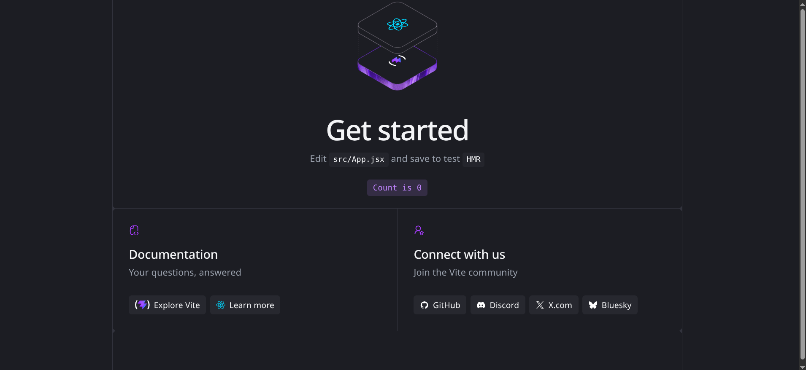
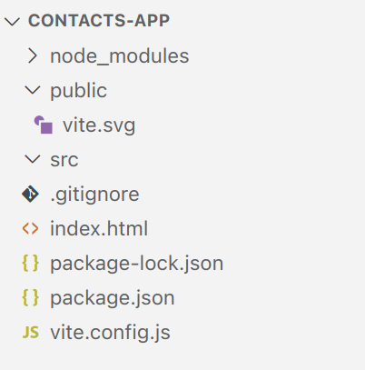

#programming 
1. saat sudah menginstall reactnya seperti tutorial sebelumnya di [Instalasi React](Instalasi%20React.md), silahkan buka file `src` dan `public` di dalamnya sudah banyak file yang tersedia.

Jangan pusing ketika Anda melihat berkas-berkas yang ada di sana karena nantinya kita akan membuat berkas di dalam folder src dari nol, ya!

Di proyek yang dibangun dengan Vite, folder src digunakan untuk menampung source code JavaScript (termasuk JSX) dan assets yang diimpor langsung pada JavaScript.

Sedangkan folder public digunakan untuk menampung assets yang ingin diakses melalui public URL aplikasi. Selama fase pengembangan, biasanya URL beralamat di localhost.

2. Sekarang, coba buka berkas package.json. Di sana Anda bisa melihat runner scripts untuk menjalankan proyek dan mem-build proyek.
Untuk menjalankannya, cukup tuliskan perintah berikut pada Terminal proyek.
`npm run dev`

Kemudian Vite akan menjalankan aplikasi web (React) di alamat http://localhost:5173/. Anda bisa akses alamat tersebut untuk membuka aplikasi.


3. Secara default, tampilan aplikasi yang dibangun menggunakan Vite akan menampilkan component App. Component tersebut berlokasi di src/App.jsx. Anda bisa mengubah konten yang ditampilkan pada component tersebut dan seketika Browser akan memuat ulang secara otomatis untuk menampilkan konten terbaru.

4. Satu hal yang perlu Anda ketahui ketika membuat proyek web dengan Vite, yakni berkas index.html merupakan entry point dari aplikasi. Jadi, pastikan untuk tidak menghapus berkas _index.html_ yang berada di folder proyek. Jika Anda ingin tahu lebih detail mengenai ini, kunjungi dokumentasi Vite tentang [index.html dan Project Root](https://vitejs.dev/guide/#index-html-and-project-root).

5. Selain menjalankan proyek, Anda juga bisa mem-build proyek ke dalam berkas HTML, CSS, dan JS secara statis. Hal ini wajib Anda lakukan ketika hendak men-deploy website ke tahap production.

Untuk build proyek React, Anda bisa gunakan perintah berikut.
`npm run build`

Kemudian, akan tercipta folder baru bernama “dist” yang di dalamnya terdapat berkas HTML, CSS, JS, dan berkas lain (seluruh berkas yang berada di folder public) yang dibutuhkan oleh aplikasi agar dapat berjalan dengan baik.

6. Sebelum kita mulai menyiapkan berkas-berkas sesuai dengan proyek hendak dibuat, inilah waktu yang tepat jika Anda ingin bereksplorasi terlebih dulu dengan proyek yang disediakan Vite secara default. Jika Anda sudah paham struktur proyeknya, yuk kita melangkah ke tahap selanjutnya.

7. Untuk meminimalisir distraksi oleh berkas-berkas yang sebenarnya belum kita butuhkan, kami sangat menyarankan Anda untuk menghapus seluruh berkas yang ada di dalam folder src. Kita akan membuat berkas yang dibutuhkan satu per satu sehingga lebih mudah untuk memahaminya karena sebenarnya hanya segelintir berkas saja yang kita butuhkan saat ini.

Silakan kosongkan folder src. Anda juga bisa menghapus folder dist (karena belum dibutuhkan) seperti gambar di bawah ini.


8. Kita mulai dengan membuat berkas JavaScript bernama _index.jsx_ di dalam folder _src_
Di dalamnya, kita tuliskan saja kode “Hello, World” dari penggunaan React sebagai placeholder. Seharusnya Anda sudah paham ‘kan seperti apa?
```jsx
import React from 'react';
import { createRoot } from 'react-dom/client';
 
const element = <h1>Hello, world!</h1>;
 
const root = createRoot(document.getElementById('root'));
root.render(element);
```

`createRoot` pada React (mulai versi 18) berfungsi untuk membuat _root_ (akar) React tingkat atas yang mengelola kontainer DOM, memungkinkan perenderan komponen React ke dalam elemen HTML. Ini adalah titik masuk utama untuk mengaktifkan fitur render konkuren, meningkatkan kinerja, dan mengelola pembaruan DOM secara efisien. 

Berikut adalah detail fungsi dan penggunaan `createRoot`:
- **Inisialisasi Aplikasi:** Menentukan elemen DOM (biasanya `div` dengan id `'root'`) sebagai titik awal aplikasi React Anda.
- **Penggantian `render` Lama:** Menggantikan metode `ReactDOM.render` lama, memberikan kontrol yang lebih baik atas _root_ aplikasi.
- **Mengembalikan Objek Root:** `createRoot` menghasilkan objek yang memiliki metode `.render()` untuk menampilkan komponen, dan `.unmount()` untuk menghapus komponen.
- **Pembaruan Efisien:** Memanfaatkan algoritma _DOM diffing_ untuk memperbarui bagian layar yang berubah saja, bukan merender ulang seluruh konten kontainer.

Sebab kita menggunakan nama berkas JavaScript yang berbeda dari yang disediakan oleh Vite sebelumnya, kita perlu mengubah nama berkas JavaScript yang digunakan pada index.html dari main.jsx menjadi index.jsx.

Bukalah berkas index.html dan ubah kode yang dicoret seperti ini.
```html
<!DOCTYPE html>
<html lang="en">
 <head>
   <meta charset="UTF-8" />
   <link rel="icon" type="image/svg+xml" href="/vite.svg" />
   <meta name="viewport" content="width=device-width, initial-scale=1.0" />
   <title>Vite + React</title>
 </head>
 <body>
   <div id="root"></div>
   %% <script type="module" src="/src/main.jsx"></script> %%
   <script type="module" src="/src/index.jsx"></script>
 </body>
</html>
```

Simpan seluruh perubahan dan jalankan kembali proyek React dengan perintah npm run dev. Kini Browser akan menampilkan tulisan yang kita buat pada index.jsx yaitu `Hello World`.