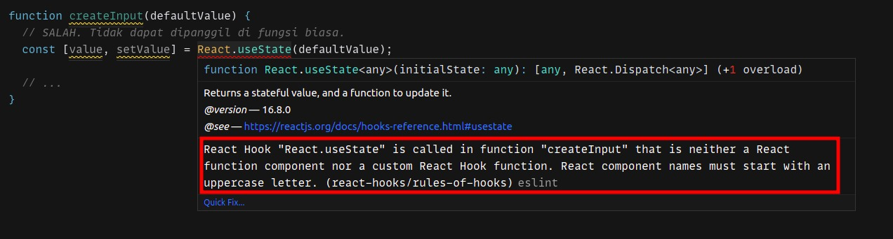

#programming 
Hooks sejatinya hanyalah fungsi JavaScript. Ketika menggunakan hooks, Anda perlu mengikuti dua aturan yang ditetapkan oleh React.

### Aturan 1: Hooks Hanya dapat dipanggil di Top-Level Function.

Anda tidak dapat memanggil fungsi hooks selain di level atas sebuah fungsi. Itu artinya, fungsi hooks tidak bisa dipanggil di dalam sebuah _kondisional_, _perulangan_, atau _nested function_.

Berikut contoh yang benar dan salah dalam menggunakan hooks.
```jsx
function Counter() {
  // BENAR. Dipanggil pada top-level function.
  const [count, setCount] = React.useState(0);
 
  if (count % 2 === 0) {
    // SALAH. Tidak dipanggil pada top-level function.
    React.useEffect(() => {});
  }
 
  const handlerIncrement = () => {
    setCount((prevCount) => prevCount + 1);
 
    // SALAH. Tidak dipanggil pada top-level function.
    React.useEffect(() => {});
  };
 
  // ...
}
```

### Aturan 2: Hooks hanya dapat dipanggil di functional component atau custom hooks.

Aturan yang kedua adalah fungsi hooks hanya dapat dipanggil di dalam functional component atau custom hooks. Artinya, fungsi hooks tidak dapat dipanggil di dalam class component atau fungsi JavaScript biasa.

Berikut contoh yang benar dalam menggunakan hooks.
```jsx
function Counter() {
  // BENAR. Dipanggil pada functional component.
  const [count, setCount] = React.useState(0);
 
  return (
    <>
      {/* JSX */}
      {/* JSX */}
    </>
  );
}
 
function useInput(defaultValue) {
  // BENAR. Dipanggil pada custom hooks.
  const [value, setValue] = React.useState(defaultValue);
 
  // ...
}
```

Berikut adalah contoh yang salah dalam menggunakan hooks.
```jsx
class Counter extends React.Component {
  render() {
    // SALAH. Tidak dapat dipanggil di dalam class component.
    const [counter, setCounter] = React.useState(0);
 
    return (
      <>
        {/* JSX */}
        {/* JSX */}
      </>
    );
  }
}
 
function createInput(defaultValue) {
  // SALAH. Tidak dapat dipanggil di fungsi biasa.
  const [value, setValue] = React.useState(defaultValue);
 
  // ...
}
```

Agar Developer mengikuti aturan yang ditetapkan, React menyediakan linter yang dapat membantu Developer lebih sadar jika ada aturan yang dilanggar. Contohnya, pada CodeSandbox, jika menggunakan React Hooks di luar dari aturan, Anda akan mendapatkan pesan error sekaligus penjelasannya.

Informasi terkait linter seperti penggunaan dan cara pemasangannya, bisa Anda temukan pada dokumentasi React tentang [Rule of hooks - ESLint Plugin](https://reactjs.org/docs/hooks-rules.html#eslint-plugin).
