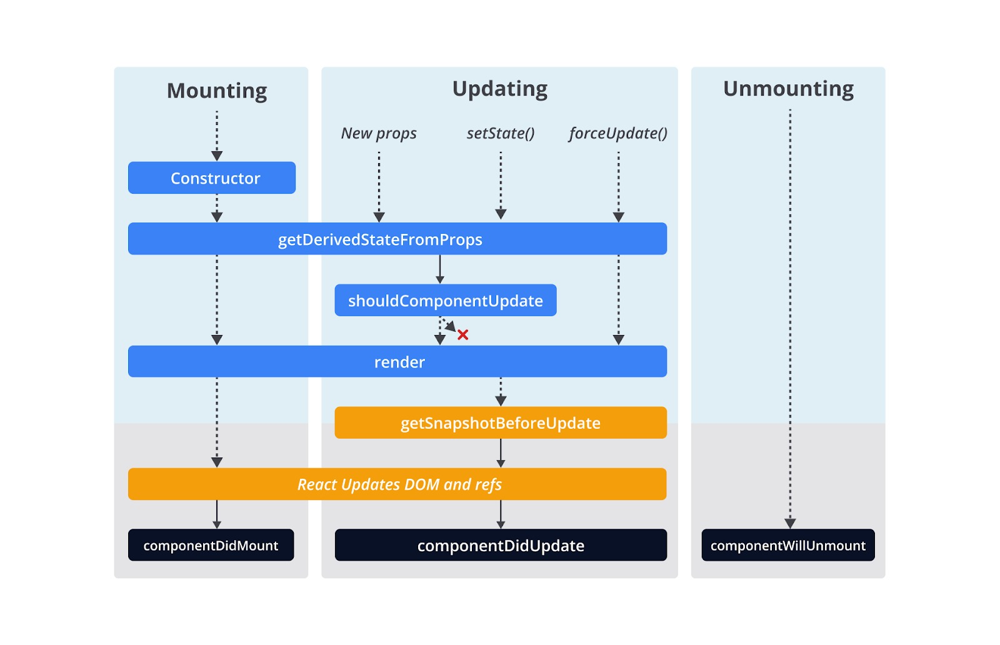

#programming 
Sejauh ini, mungkin Anda merasa nyaman dengan mengelola lokal state di dalam komponen. Namun, ada hal yang belum kami sampaikan yaitu, bagaimana cara mengelola data (_state_) yang nilainya berasal dari luar, contohnya internet melalui RESTful API?

Saat ini, mungkin intuisi Anda mengarahkan untuk memanggil **fetch()** request di dalam fungsi **render()**, kemudian mengubah state dengan nilai yang didapat dari **fetch()** seperti ini.
```jsx
import React from 'react';
 
class User extends React.Component {
  async render() {
    const user = await fetchUserFromNetwork();
    this.setState(() => {
      return {
        user: user
      };
    });
 
    return (
      <div>
        <p>Name: {this.state.user.name}</p>
        <p>Age: {this.state.user.age}</p>
      </div>
    );
  }
}
```
Sayangnya, itu ide yang buruk karena fungsi **render()** tidak boleh mengubah nilai **state**. Selain itu,kita tidak boleh melakukan operasi _asynchronous_ di dalam fungsi, salah satunya memanggil **fetch().** Catat, ya! Fungsi **render()** hanya digunakan untuk menampilkan UI saja, meski Anda bisa memanfaatkan nilai **props** atau **state**, tetapi tidak boleh mengubah nilainya.

Lalu, bila kita tidak boleh memanggil **fetch()** di dalam **render()**, di mana lokasi yang tepat untuk memanggilnya? Inilah saatnya kami mengenalkan konsep Lifecycle di komponen React.

Component Lifecycle merupakan berbagai event yang dilalui oleh komponen mulai dari proses pembentukkan (_instantiation_) dan menambahkan pada DOM, pembaruan state atau properti, hingga penghapusan komponen dari DOM. Jika ingin membuat komponen dengan class, kita bisa “menyelam” untuk menuliskan kode pada setiap event-nya. Fungsi **render()** yang biasa Anda gunakan adalah salah satu method yang dipanggil ketika event lifecycle terjadi.

  

### Fase Component Lifecycle

Setiap kali aplikasi React berjalan, seluruh komponen di dalamnya melewati lifecycle. Secara umum, lifecycle dibagi dalam 3 fase.

1. Saat komponen ditambahkan ke DOM (_mounting_).
2. Saat komponen memperbarui state atau menerima data baru via props (_updating_).
3. Saat komponen dihapus dari DOM (_unmounting_).

Pada setiap fase, komponen akan mengeksekusi method yang berbeda-beda. Berikut adalah method yang dieksekusi komponen berdasarkan 3 fase tersebut.
### Fase Mounting

Fase yang pertama adalah mounting. Di fase ini komponen akan dibentuk dan ditambahkan ke DOM. Beberapa hal yang dapat Anda lakukan selama fase ini antara lain

- menginisialisasi nilai **state**;
- me-**_render_** DOM node;
- membuat Asynchronous JavaScript Request (Fetch); dan
- menyiapkan listener, contoh real time listener WebSocket atau Firebase.

Simak langkah-langkah berikut untuk mengetahui proses yang ada di fase mounting.

#### Menginisialisasi nilai state
Cara menginisialisasi nilai state komponen dilakukan di dalam **constructor**. Kami percaya, Anda sudah terbiasa melakukan ini sebelum mempelajari lifecycle.

Constructor merupakan lifecycle method pertama yang dipanggil.
```jsx
class MyComponent extends React.Component {
  constructor(props) {
    super(props);
 
    // inisialisasi state
    this.state = {
      name: 'Dicoding'
    };
  }
 
  render() {
    return (
      <div>
        <p>Hello, {this.state.name}. </p>
      </div>
    );
  }
}
```
Namun, ketahuilah bahwa **constructor** sendiri merupakan spesifikasi class ES6, bukan spesifikasi dari React.

#### Me-_render_ DOM Node
Setelah menginisialisasi nilai state menggunakan **constructor**, method lifecycle yang dipanggil selanjutnya adalah **render()**. Method ini dipanggil ketika komponen akan di-render di dalam DOM Node. Meskipun proses “render” bukan Anda yang melakukannya, tetapi di dalam method ini Anda yang mendeskripsikan (dengan JSX) bagaimana struktur DOM Node yang ingin di-render.

Kami ingatkan kembali, bahwa sangat penting untuk membuat **render()** sebagai _pure function_. Fungsi render tidak boleh mengubah nilai apa pun yang dimiliki komponen, selain hanya menggunakannya untuk kebutuhan render.
```jsx
class Profile extends React.Component {
  render() {
    return (
      <div>
        
        <p>Nama: {this.props.name}</p>
      </div>
    );
  }
}
```


#### Membuat Asynchronous JavaScript Request
Jika **constructor** digunakan untuk menginisialisasi state, **render** digunakan untuk mendeskripsikan DOM Node. Lalu, di mana kita bisa memanggil Asynchronous JavaScript Request (Ajax) seperti **fetch()**? Inilah saatnya kita berkenalan dengan method lifecycle selanjutnya, yaitu **componentDidMount**.

Method **componentDidMount** akan terpanggil ketika komponen pertama kali ditambahkan ke dalam DOM. Di sinilah tempat yang tepat untuk memanggil fungsi asynchronous seperti **fetch()**.
```jsx
class User extends React.Component {
  constructor(props) {
    super(props);
 
    this.state = {
      user: null
    };
  }
 
  async componentDidMount() {
    const user = await fetchUserFromNetwork();
    this.setState(() => {
      return {
        user: user
      };
    });
  }
 
  render() {
    if (this.state.user === null) {
      return <p>Loading ...</p>;
    }
 
    return (
      <div>
        <p>Name: {this.state.user.name}</p>
        <p>Age: {this.state.user.age}</p>
      </div>
    );
  }
}
```
Berikut alur life cycle dari komponen tersebut.

1. Komponen memanggil method **constructor()** dan menginisialisasi state **user** dengan nilai **null**.
2. Selanjutnya, komponen akan memanggil fungsi **render()** guna me-render DOM Nodes untuk yang pertama kalinya. Perhatikan juga bahwa di tahap ini nilai `this.state.user` bernilai **null** sehingga komponen akan menampilkan paragraf dengan teks _“Loading …”_.
3. Setelah komponen tampak pada DOM (pertama kali), komponen akan memanggil method **componentDidMount()**. Di sini proses asynchronous request terjadi untuk mendapatkan data user dari network, setelah mendapatkan nilai user yang dari fungsi **fetchUserFromNetwork()**, komponen mengubah state user dengan nilai yang didapat.
4. Karena state berubah, method **render()** akan dipanggil lagi. Namun, sekarang nilai `this.state.user` tidak null sehingga data user akan ditampilkan.

#### Menyiapkan Listener
Sama halnya dengan Ajax, untuk menyiapkan listener seperti WebSocket listener atau apa pun itu, dilakukan setelah komponen ditampilkan pada DOM, yakni di method componentDidMount.

Sejauh ini Anda sudah tahu fungsi dari method constructor, render, dan componentDidMount. Selanjutnya, kita akan mengenal fase updating.


### Fase Updating

Fase kedua adalah updating. Fase ini terjadi bila ada perubahan nilai **state** atau **props** (yang diberikan _parent_). Beberapa hal yang bisa Anda lakukan dalam fase ini meliputi

- me-render ulang UI dengan nilai state atau props terbaru;
- melakukan operasi Ajax (lagi) bila ada data yang perlu diubah; atau
- mengatur ulang listener WebSocket, Firebase, dan sebagainya.


#### Re-fetching data
Sebelumnya Anda sudah tahu bahwa method **componentDidMount** adalah tempat yang cocok untuk mulai melakukan Ajax. Namun, method tersebut hanya dipanggil sekali tepat setelah pertama kali komponen di-render pada DOM. Banyak kasus di mana kita perlu memuat ulang data tanpa perlu memasang ulang komponen pada DOM. Pada kasus inilah kita perlu menuliskan kode di dalam method **componentDidUpdate**.

Komponen akan memanggil method _componentDidUpdate_ jika terjadi perubahan state atau menerima nilai props baru. Method ini memiliki dua argumen, yaitu nilai **props** dan **state** sebelum diperbarui. Dengan argumen tersebut, kita dapat membandingkan perubahan yang terjadi dan memutuskan apakah perlu tindakan re-fetching data atau tidak.

Contohnya, anggaplah Anda memiliki komponen yang menampilkan public repositories dari [GitHub API](https://docs.github.com/rest) dengan bahasa sesuai dengan nilai `this.props.language`. Kemudian Anda menginisialisasi nilai awal repositories di dalam _componentDidMount_. Setiap kali komponen menerima nilai `props.language` baru, Anda ingin mengubah repositories yang ditampilkan berdasarkan nilai **language** terbaru. Kasus ini dapat dilakukan dengan memanfaatkan method _componentDidUpdate_.
```jsx
class RepositoriesList extends React.Component {
  constructor(props) {
    super(props);
 
    this.state = {
      repositories: null
    };
  }
 
  async componentDidMount() {
    const repositories = await fetchReposWithLanguage(this.props.language);
 
    this.setState(() => {
      return {
        repositories
      };
    });
  }
 
  async componentDidUpdate(prevProp, prevState) {
    if (prevProp.language !== this.props.language) {
      const repositories = await fetchReposWithLanguage(this.props.language);
      this.setState(() => {
        return { repositories };
      });
    }
  }
 
  render() {
    if (this.state.repositories === null) {
      return <p>Loading ... </p>;
    }
 
    return (
      <div>
        {this.state.repositories.map((repository) => (
          <p key={`${repository.owner}/${repository.name}`}>
            {repository.name} by {repository.owner}
          </p>
        ))}
      </div>
    );
  }
}
```

#### Mengatur Ulang Listener
Sama halnya dengan re-fetching data, untuk mengatur ulang listener seperti WebSocket listener atau apa pun itu, dilakukan di dalam method **componentDidUpdate**.

Anda sudah mengetahui bagaimana memanfaatkan **componentDidUpdate** untuk melakukan tugas yang perlu dilakukan ketika ada pembaruan nilai props atau state. Sekarang, kita bahas fase terakhir di dalam component lifecycle, yaitu _unmounting_.


### Fase Unmounting
Fase yang terakhir adalah unmounting. Fase ini terjadi ketika komponen “hendak” dihapus dari DOM. Bisakah Anda tebak apa yang bisa dilakukan ketika komponen hendak dihapus dari DOM? Tidak banyak. Satu-satunya aktivitas yang bisa Anda lakukan adalah “bersih-bersih”.

Contoh, bila Anda menetapkan sebuah listener pada **componentDidMount** atau **componentDidUpdate**, kemudian ingin memastikan listener tersebut benar-benar telah disingkirkan dari DOM, Anda bisa menghapus listener tersebut di fase ini. Dengan begitu, Anda akan terbebas dari momok kebocoran memori atau _memory leaks_.

Ketika komponen hendak dihapus dari DOM, ia akan memanggil method lifecycle **componentWillUnmount**. Di dalam method ini, Anda bisa menghapus listener aktif agar tidak terus hidup di dalam DOM.
```jsx
class RepositoriesList extends React.Component {
  constructor(props) {
    super(props);
 
    this.state = {
      repositories: null
    };
  }
 
  async componentDidMount() {
    this.removeListener = listenToRepos(this.props.language, (repositories) => {
      this.setState({ repositories });
    });
  }
  componentWillUnmount() {
    this.removeListener();
  }
 
  render() {
    if (this.state.repositories === null) {
      return <p>Loading ... </p>;
    }
 
    return (
      <div>
        {this.state.repositories.map((repository) => (
          <p key={`${repository.owner}/${repository.name}`}>
            {repository.name} by {repository.owner}
          </p>
        ))}
      </div>
    );
  }
}
```


Berikut adalah rekap dari method lifecycle yang sudah kita ketahui sejauh ini.
```jsx
class App extends React.Component {
  constructor(props) {
    // Cocok untuk menginisialisasi nilai state
    super(props)
    this.state = {}
  }
  componentDidMount(){
    // Dipanggil sekali ketika komponen ditambahkan ke DOM.
    // Cocok untuk membuat AJAX request.
  }
  componentDidUpdate(){
    // Dipanggil seketika setelah terdapat pembaruan nilai props atau state.
    // Cocok untuk melakukan AJAX requests yang didasari oleh perubahan nilai props atau state.
  }
  componentWillUnmount(){
    // Dipanggil tepat sebelum komponen dihapus dari DOM.
    // Cocok untuk perihal bersih-bersih (cleanup).
  }
  render() {
    return ...
  }
}
```
Sebenarnya terdapat beberapa method lifecycle lain yang dapat Anda manfaatkan, tetapi kami tidak membahasnya karena kasus penggunaannya sangat jarang. Namun, jika Anda penasaran, masih ada method [getDerivedStateFromProps](https://reactjs.org/docs/react-component.html#static-getderivedstatefromprops), [shouldComponentUpdate](https://reactjs.org/docs/react-component.html#shouldcomponentupdate), dan [getSnapshotBeforeUpdate](https://reactjs.org/docs/react-component.html#getsnapshotbeforeupdate) yang dapat Anda eksplorasi melalui dokumentasi React.

Berikut bagan lengkap dari method lifecycle yang ada di dalam React component.

