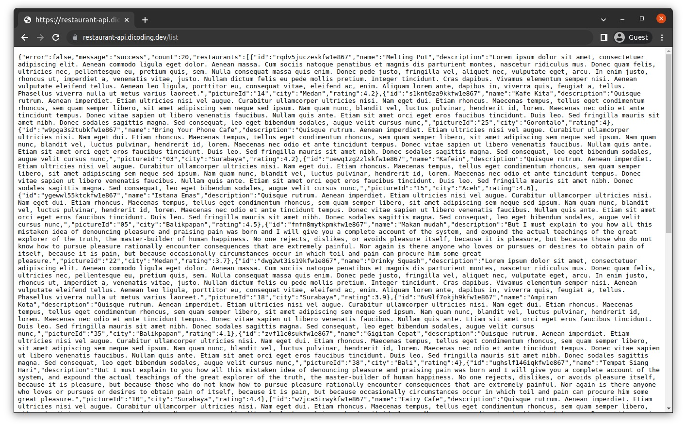
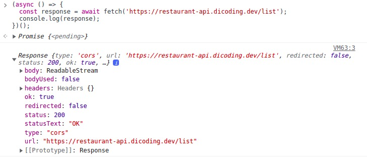
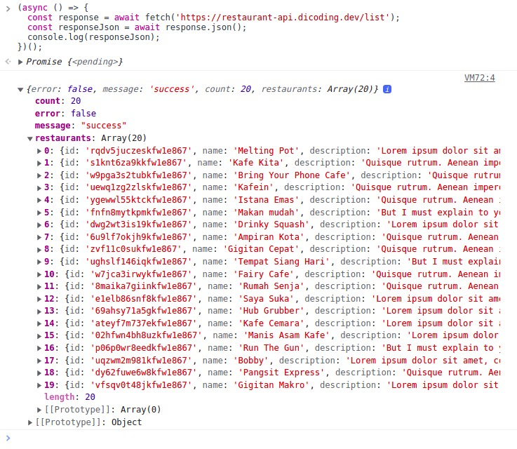
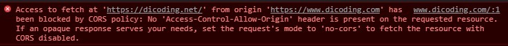

#programming 
Dalam membuat aplikasi front-end, sering kali kita perlu menampilkan data dinamis yang bersumber dari server database. Dalam implementasi nyata, ada “aplikasi lain” yang berperan sebagai perantara antara front-end dan database agar aplikasi front-end dapat bertransaksi dengan database, aplikasi tersebut bernama REST API.


### Sekilas tentang RESTful API

REST API atau RESTful API merupakan aplikasi yang hidup di sisi server (_back-end_) yang berfungsi sebagai perantara transaksi data antara aplikasi front-end dengan sumber data (bisa database atau storage). REST API memanfaatkan protokol (jalur) HTTP dalam bertransaksi data sehingga untuk mendapatkan data dari REST API, aplikasi front-end perlu mengirimkan sebuah HTTP request.[](http://restaurant-api.dicoding.dev/)

[Dummy Restaurant API](http://restaurant-api.dicoding.dev/) adalah salah satu contoh REST API yang dibuat Dicoding untuk menampilkan data restoran secara dumi. Biasanya, cara penggunaan RESTful API dapat Anda pelajari pada halaman dokumentasi yang disediakan. Contohnya pada Restaurant API, untuk mendapatkan data daftar restoran, Anda perlu membuat permintaan HTTP ke alamat GET [https://restaurant-api.dicoding.dev/list](https://restaurant-api.dicoding.dev/list). 

Catatan: Anda bisa melakukannya dengan membuka alamat URL tersebut di browser, menggunakan _tools_ bernama [Postman](https://www.postman.com/), atau menggunakan perintah cURL berikut di Terminal/CMD.

|   |
|---|
|curl -X GET https://restaurant-api.dicoding.dev/list|
Hasilnya, RESTful API akan merespons dengan membawa data daftar restoran dalam bentuk JSON.

Beberapa RESTful API merespons dengan JSON yang sudah diminimalkan ukurannya guna mengoptimalkan pengiriman data. Salah satu optimasi yang dilakukan ialah menghapus seluruh spasi yang “tidak diperlukan”. Dengan begitu, struktur data menjadi sulit dibaca karena tidak ada spasi sama sekali. Jika Anda menggunakan Browser seperti Google Chrome, kami sarankan untuk memasang ekstensi seperti [JSON Formatter](https://chrome.google.com/webstore/detail/json-formatter/bcjindcccaagfpapjjmafapmmgkkhgoa?hl=en) agar lebih mudah dalam membaca respons JSON.

Selain mendapatkan data, aplikasi front-end juga dapat mengirim data melalui RESTful API. Secara standar, RESTful API memanfaatkan HTTP verb atau method dalam menentukan sebuah aksi, seperti

- **GET** untuk mendapatkan data;
- **POST** untuk mengirim data;
- **PUT** untuk memperbarui data; dan
- **DELETE** untuk menghapus data.

Tata cara penggunaan atau implementasi dari API dapat berbeda setiap penyedia. Di RESTful API, perbedaannya bisa dari struktur respons, status code, alamat endpoint (URL), atau bahkan penggunaan HTTP verb. Oleh karena itu, setiap API (termasuk RESTful API) menyediakan dokumentasi terkait cara penggunaannya.

Lalu pertanyaannya, apakah kita bisa mengonsumsi RESTful API dan mendapatkan data tersebut di aplikasi web menggunakan JavaScript? Jawabannya bisa, yakni menggunakan fungsi global **fetch()**.

### Sekilas tentang Fetch

Fetch merupakan salah satu fungsi di JavaScript (yang disediakan oleh Browser) untuk membuat sebuah network request, seperti HTTP request. Network request yang dilakukan dengan fungsi fetch() berjalan secara _asynchronous_ dan memanfaatkan Promise sehingga Anda bisa memanfaatkan sintaksis _async/await_.

Berikut ini adalah cara paling dasar dalam penggunaan **fetch()**.
```jsx
(async () => {
  const response = await fetch('https://restaurant-api.dicoding.dev/list');
  console.log(response);
})();
```
Jalankan kode tersebut di console browser maka akan tampil objek (_instance_) dari [Response](https://developer.mozilla.org/en-US/docs/Web/API/Response)


Anda bisa melihat bahwa objek response memiliki beberapa properti, ada **status** yang berisi _status code_, **headers** yang berisi informasi HTTP headers response, dan body berisi data restoran dalam bentuk ReadableStream.

Mengubah data dari _ReadableStream_ menjadi JSON dapat dilakukan menggunakan fungsi `response.json()` seperti ini.
```jsx
(async () => {
  const response = await fetch('https://restaurant-api.dicoding.dev/list');
  const responseJson = await response.json();
  console.log(responseJson);
})();
```

**Catatan:** Dalam mengubah ReadableStream menjadi JSON, fungsi `json()` bekerja secara asynchronous. Oleh karena itu, kita perlu menggunakan sintaksis `await` untuk mendapatkan nilainya.

Jalankan kembali kode di atas pada console browser maka akan tampil data restoran dalam bentuk objek JavaScript (JSON).


Fungsi `fetch()` menerima 2 parameter, yaitu **resource** (bisa objek [Request](https://developer.mozilla.org/en-US/docs/Web/API/Request) atau URL string) dan objek **init** (bersifat opsional) [6].
```jsx
fetch('https://restaurant-api.dicoding.dev/list', {
  // fetch options
});
```
Di dalam objek **init**, Anda dapat mendefinisikan konfigurasi request secara khusus seperti mengubah nilai **method**, menambahkan properti di dalam **headers**, atau mengirim data pada **body**.
```jsx
fetch('https://example-api.com', {
  method: 'POST', // also can be GET (default), PUT, DELETE, etc.
  headers: {
    Authorization: 'Bearer xxx', // applied Authorization headers
    'Content-Type': 'application/json' // applied 'application/json' as Content-Type of body request
  },
  body: JSON.stringify({ // sending data as JSON string
    data: 'some data that will send to server/API'
  }),
});
```

###   Same-Origin Policy
Aplikasi front-end dapat bertransaksi data menggunakan fungsi fetch() ke berbagai resource di internet, bahkan lintas _origin_ (alamat). Misalnya, Anda memiliki aplikasi front-end (React) yang beralamat di [https://dicoding.com](http://example.com/), lalu menggunakan fungsi fetch() untuk mengambil data dari alamat [https://api.dicoding.net](https://api.example.net/). 

Namun, apakah transaksi data tersebut akan berhasil? Secara _default_ tidak. 

Setiap transaksi data menggunakan fetch, harus tunduk terhadap peraturan _same-origin policy_. Dengan adanya peraturan tersebut, kita tidak dapat bertransaksi data di luar dari _origin_-nya.

Ketahuilah bahwa origin dari sebuah website terdiri dari tiga hal, yakni _protokol_, _host_, dan _port_. Jika nilai ketiganya berbeda, website tidak dapat bertukar data.


Web yang berlokasi di origin http://dicoding.com tidak berhak mengakses _resource_ yang berlokasi di luar originnya (_cross-origin_), misal https://api.dicoding.net. Jika web mencoba mengakses resource yang berada di luar dari origin-nya, ia akan menghasilkan error.



Lalu, bagaimana jika aplikasi web memang perlu mengakses _resource_ di luar origin-nya, misalnya berinteraksi dengan RESTful API untuk mendapatkan data? Apakah RESTful API harus selalu memiliki origin yang sama seperti aplikasi web? Dalam kasus ini, kita bisa menerapkan mekanisme CORS untuk mengizinkan user agent (browser) mengakses resource di luar origin-nya.

CORS merupakan kependekan dari _Cross-Origin Resource Sharing_. Meskipun browser secara standar menolak transaksi dari luar origin, tetapi dengan adanya CORS, kita dapat melakukannya. Hal tersebut karena mekanisme CORS dapat memastikan transaksi cross-origin dilakukan secara aman.

Konfigurasi CORS ditetapkan oleh pemilik resource (RESTful API) dengan memberikan properti ‘Access-Control-Allow-Origin’ pada response header dengan nilai origin yang diperbolehkan. Misal, bila [https://api.dicoding.net](https://api.dicoding.net/) ingin memberikan akses ke pada [https://dicoding.com](https://dicoding.com/), ia harus menyisipkan properti dan nilai berikut ketika merespons sebuah permintaan.

```
'Access-Control-Allow-Origin', 'https://dicoding.com'
```

Dengan begitu, respons dari [https://api.dicoding.net](https://api.dicoding.net/) dapat dikonsumsi oleh origin [https://dicoding.com](https://dicoding.com/).

Beberapa API publik seperti [TheMovieDB](https://www.themoviedb.org/?language=id-ID) membuka _resource_-nya supaya dapat diakses oleh seluruh domain. Jadi, selain dapat menetapkan allowed origin secara spesifik, pemilik data juga bisa memberikan akses kepada seluruh origin dengan menetapkan Access-Control-Allow-Origin headers dengan nilai asterisk (*) seperti ini.

```
'Access-Control-Allow-Origin', '*'
```

Di materi selanjutnya, kita akan berlatih cara menggunakan fetch untuk mendapatkan data dari RESTful API. Kelas ini akan lebih fokus ke implementasi React, kami tidak menuntut Anda untuk mendalami implementasi **fetch**. Namun, bila ada waktu senggang, kami sangat menyarankan untuk mempelajari RESTful API, fetch, dan same-origin policy lebih lanjut pada tautan berikut.

- [What is RESTful API?](https://restfulapi.net/)
- [Roy Fielding Dissertation - REST](https://www.ics.uci.edu/~fielding/pubs/dissertation/rest_arch_style.htm)
- [Fetch API](https://developer.mozilla.org/en-US/docs/Web/API/Fetch_API)
- [Using the Fetch API](https://developer.mozilla.org/en-US/docs/Web/API/Fetch_API/Using_Fetch)
- [Same-origin policy](https://developer.mozilla.org/en-US/docs/Web/Security/Same-origin_policy)
- [Cross-Origin Resource Sharing (CORS)](https://developer.mozilla.org/en-US/docs/Web/HTTP/CORS)