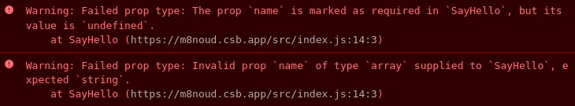

#programming 
“[PropTypes](https://reactjs.org/docs/typechecking-with-proptypes.html) merupakan package yang membantu kita mendefinisikan tipe data yang diharapkan ketika memberikan nilai pada component property atau sejenisnya [1].”

Selama proses development, ketika Anda memberikan properti dengan nilai yang tidak diharapkan, PropTypes akan memberikan pesan _warning_ sebagai sinyal bahwa penggunaan component tidak sesuai. Hal ini tentu meningkatkan kesadaran developer terhadap potensi bug yang terjadi.

Untuk menggunakan PropTypes, Anda perlu memasang package prop-types menggunakan npm dengan perintah ini.

|   |
|---|
|npm install prop-types|

Jika Anda menggunakan yarn, gunakan perintah ini.

|   |
|---|
|yarn add prop-types|

Lantas bagaimana cara menggunakannya? Berikut contoh yang paling sederhana.
```jsx
import React from 'react';
import PropTypes from 'prop-types';
 
function SayHello({ name }) {
  return <p>Hello, {name}</p>;
}
 
SayHello.propTypes = {
  name: PropTypes.string.isRequired
};
```

|   |
|---|
|**Catatan**  <br>`React.propTypes` hanya tersedia di React versi 18 ke bawah, jika Anda menggunakan React versi 19 ke atas, properti validation dapat dilakukan dengan tools seperti TypeScript, Flow, Zod, ataupun Joi. Untuk versi v19, akan kita jelaskan nanti, ya.|
Setiap kali Anda membuat component yang menerima properti, tambahkan properti static `propTypes` pada component. Properti _propTypes_ merupakan objek yang kuncinya (keys) merepresentasikan nama props yang diterima oleh component, lalu nilainya (values) merepresentasikan tipe data untuk props tersebut.

Dengan menetapkan propTypes seperti di atas, jika kita menggunakan component SayHello tanpa atau dengan memberikan nilai selain string, pesan warning akan tampak pada console untuk memberitahu developer bahwa penggunaan component-nya salah. Contoh.
```jsx
<SayHello />;
<SayHello name={[]} />;
```

Hasil pada console.


Lalu, bagaimana cara menetapkan PropTypes pada class component? Sintaksisnya masih sama, Anda bisa menambahkan properti static **propTypes** setelah pembuatan class component seperti ini.
```jsx
import React from 'react';
import PropTypes from 'prop-types';
 
class SayHello extends React.Component {
  render() {
    const { name } = this.props;
 
    return <p>Hello, {name}</p>;
  }
}
 
SayHello.propTypes = {
  name: PropTypes.string.isRequired
};
```

Ada satu hal yang perlu Anda perhatikan dari kode di atas, yaitu _naming conventions_ atau standar penamaan. **PropTypes** (menggunakan P kapital) merupakan objek yang kita impor dari package prop-types, sedangkan propTypes (menggunakan p kecil) merupakan nama dari static properti yang kita tambahkan ke component. Jadi jangan sampai tertukar, ya!

Objek PropTypes mengandung banyak sekali properti yang merepresentasikan tipe data karena objek ini digunakan untuk menetapkan aturan ketika memberikan nilai props. Kode di atas menunjukkan bahwa props **name** memiliki tipe data **string** dan wajib (**isRequired**) untuk diberikan nilai.

**Catatan:** Secara default, setiap props bersifat opsional untuk diberikan nilai. Agar dibuat wajib, tambahkan **.isRequired** setelah menentukan tipe data.

Sekarang Anda sudah tahu bagaimana cara memberikan aturan untuk tipe data string yang wajib diisi, tetapi JavaScript tak hanya string, ada banyak tipe data yang harus Anda ketahui. Karena itu, kita akan berkenalan dengan beberapa API di dalam PropTypes untuk membuat aturan dari berbagai tipe data.


### PropTypes.number
```jsx
import React from 'react';
import PropTypes from 'prop-types';
 
function CounterDisplay({ count }) {
  return <p>Antrean ke-{count}</p>;
}
 
CounterDisplay.propTypes = {
  count: PropTypes.number
};
 
<CounterDisplay count={1} />; // Antrean ke-1
<CounterDisplay count={true} />; // Warning: Failed prop type: Invalid prop `count` of type `boolean` supplied to `CounterDisplay`, expected `number`.
<CounterDisplay count="1" />; // Warning: Failed prop type: Invalid prop `count` of type `string` supplied to `CounterDisplay`, expected `number`.
```


### PropTypes.bool
```jsx
import React from 'react';
import PropTypes from 'prop-types';
 
function Lamp({ isDark }) {
  if (isDark) {
    return <p>Lamp is on</p>;
  }
 
  return <p>Lamp is off</p>;
}
 
Lamp.propTypes = {
  isDark: PropTypes.bool
};
 
<Lamp isDark={true} />; // Lamp is on
<Lamp isDark={false} />; // Lamp is off
<Lamp isDark={1 === 1} />; // Lamp is on
<Lamp isDark="true" />; // Warning: Failed prop type: Invalid prop `isDark` of type `string` supplied to `Lamp`, expected `boolean`
```


### PropTypes.array
```jsx
import React from 'react';
import PropTypes from 'prop-types';
 
function List({ data }) {
  return (
    <ul>
      {data.map((item) => (
        <li key={item}>{item}</li>
      ))}
    </ul>
  );
}
 
List.propTypes = {
  data: PropTypes.array
};
 
<List data={['Strawberi', 'Mangga', 'Apel']} />; // Works!
<List data={['Strawberi', 1, true]} />; // Works!
```


### PropTypes.arrayOf
Nilai props yang diberikan pada component harus bertipe array yang mengandung tipe data spesifik. Contohnya jika ingin properti yang dibuat hanya menerima array yang seluruh itemnya string, Anda bisa menggunakan `PropTypes.arrayOf(PropTypes.string)`.

```jsx
import React from 'react';
import PropTypes from 'prop-types';
 
function List({ data }) {
  return (
    <ul>
      {data.map((item) => (
        <li key={item}>{item}</li>
      ))}
    </ul>
  );
}
 
List.propTypes = {
  data: PropTypes.arrayOf(PropTypes.string)
};
 
<List data={['Strawberi', 'Mangga', 'Apel']} />; // Works!
<List data={['Strawberi', 1, true]} />; // Warning: Failed prop type: Invalid prop `data[1]` of type `number` supplied to `List`, expected `string`.
```

### PropTypes.object
```jsx
import React from 'react';
import PropTypes from 'prop-types';
 
function Company({ data }) {
  const { name, city, since } = data;
  return (
    <div>
      <p>Nama: {name}</p>
      <p>Kota: {city}</p>
      <p>Sejak: {since}</p>
    </div>
  );
}
 
Company.propTypes = {
  data: PropTypes.object
};
 
<Company data={{
  name: 'Dicoding',
  city: 'Bandung',
  since: 2005,
}} />; // Works!
```


### PropTypes.objectOf
Nilai props yang diberikan pada component harus bertipe object yang seluruh nilai propertinya memiliki satu tipe data yang sama. Contohnya.
```jsx
function List({ score }) {
  // ...
}
 
List.propTypes = {
  score: PropTypes.objectOf(PropTypes.number)
};
 
<List
  score={{
    John: 90,
    Jane: 80,
    Tom: 75
  }}
/>; // Works!
```


### PropTypes.func
Nilai props yang diberikan pada component harus bertipe **function**. PropTypes ini biasa digunakan ketika mengirim fungsi handler melalui component props. Contohnya.
```jsx
import React from 'react';
import PropTypes from 'prop-types';
 
function AddFriendButton({ onAdd }) {
  // ...
}
 
AddFriendButton.propTypes = {
  onAdd: PropTypes.func
};
 
<AddFriendButton onAdd={() => alert('Friend added')} />; // Works!
```


### PropTypes.instanceOf
Nilai props yang diberikan pada component harus berupa _instance_ dari class tertentu. Contohnya.
```jsx
import React from 'react';
import PropTypes from 'prop-types';
 
class User {
  constructor(name) {
    this.name = name;
  }
  // ...
}
 
function NavigationHeader({ user }) {
  // ...
}
 
NavigationHeader.propTypes = {
  user: PropTypes.instanceOf(User)
};
 
<NavigationHeader user={new User('Dicoding')} />; // Works!
<NavigationHeader user={{ name: 'Dicoding' }} />; // Warning: Failed prop type: Invalid prop `user` of type `Object` supplied to `NavigationHeader`, expected instance of `User`. at NavigationHeader
```


### PropTypes.oneOf
Nilai props yang diberikan pada component harus salah satu nilai sesuai yang didefinisikan pada `PropTypes.oneOf`. Contohnya.
```jsx
import React from 'react';
import PropTypes from 'prop-types';
 
function Screen({ mode }) {
  // ...
}
 
Screen.propTypes = {
  mode: PropTypes.oneOf(['light', 'dark'])
};
 
<Screen mode="light" />; // Works!
<Screen mode="dark" />; // Works!
<Screen mode="default" />; // Warning: Failed prop type: Invalid prop `mode` of value `default` supplied to `Screen`, expected one of ["light","dark"]. at Screen
```


Sebenarnya masih banyak lagi tipe data yang bisa Anda definisikan menggunakan PropTypes. Anda dapat melihatnya pada [dokumentasi yang disediakan](https://reactjs.org/docs/typechecking-with-proptypes.html). Namun, Anda tidak perlu mengingat keseluruhan API yang ada. Karena pada kenyataannya, jarang ada developer yang membaca keseluruhan dokumentasi dan mengingatnya dalam satu waktu sekaligus. Sehingga, kami sarankan Anda untuk membaca dokumentasi terkait penggunaan lebih detil ketika memang sudah membutuhkannya.