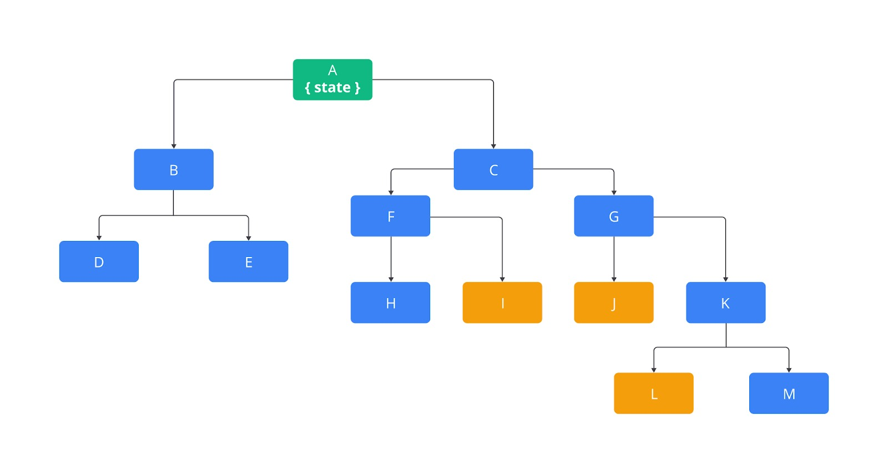
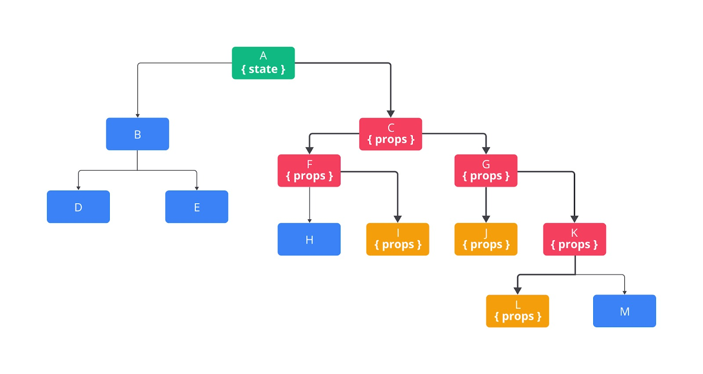
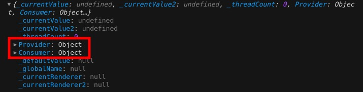

#programming 
Setiap kali membangun antarmuka pengguna dengan React, praktik dalam berbagi state antar komponen melalui props tidak terhindarkan. Jika struktur atau hierarki komponen masih sederhana, mengirim data ke level komponen yang berada di bawah tidak akan menjadi masalah. Namun, seiring berkembangnya aplikasi, hierarki komponen akan semakin dalam. Mengirimkan data melalui props secara _drilling_ ke tiap level komponen lama-lama menjadi isu yang mengerikan. Contohnya pada bagan di bawah ini.


Bagan di atas menunjukkan bahwa state berada di komponen paling atas (komponen A). Jika komponen berwarna kuning (I, J, dan L) butuh menampilkan nilai state, Anda harus _props drilling_ melewati seluruh hierarki hingga akhirnya sampai di komponen tersebut.



Praktik _props drilling_ sedalam ini memang menjengkelkan. Ada kalanya _props drilling_ yang terlalu dalam akan berimbas kepada kode yang sulit dikelola. Kita perlu mendefinisikan banyak props pada komponen yang sebenarnya tidak dibutuhkan, melainkan hanya sebatas medium atau perantara agar data dapat dikirim hingga ke komponen tujuannya.

Untuk menghindari ruwetnya _props drilling_, Anda bisa memindahkan state ke hierarki yang paling dekat, dalam kasus ini adalah komponen C. Namun, solusi ini bersifat sementara karena masalah akan kembali muncul seiring berkembangnya hierarki komponen.

Apakah hierarki komponen yang dalam adalah praktik yang salah? Tidak juga. Karena perkembangan aplikasi tidak terhindari, sangat wajar bila hierarkinya semakin rumit. Namun, kita perlu mencari solusi agar pengiriman data tidak ikut menjadi rumit. Karena ini adalah masalah yang serius, React hadir menawarkan solusi dengan memanfaatkan fitur Context.

_“Context provides a way to pass data through the component tree without having to pass props down manually at every level. [7]”_ - Dokumentasi React

React Context menawarkan cara untuk mengirim data antara komponen di dalam hierarki tanpa harus mengirim satu per satu atau _props drilling_ pada setiap level hirarkinya. Anda dapat memanfaatkan React context untuk menampung state yang sifatnya “global” atau perlu diakses di cakupan yang luas. Contoh data yang cocok disimpan di context seperti preferensi warna tema, bahasa, atau data pengguna yang terautentikasi. 

Mari kita ambil salah satu contoh kasus, yaitu preferensi bahasa. Anggaplah kita membuat aplikasi yang dapat mengubah dari bahasa Indonesia menjadi bahasa Inggris atau sebaliknya. Agar pengguna bisa mengubah bahasa, kita sediakan switch yang jika nilainya berubah, seluruh bahasa yang digunakan pada aplikasi akan berubah. Secara gambaran besar, Anda akan berpikir bahwa solusinya terdiri dari dua aspek.

1. Kita perlu mendeklarasikan data yang ingin diakses dalam cakupan hierarki komponen. Contohnya, data `locale` dengan nilai `id` atau `en`.
2. Kita perlu cara agar komponen di dalam hierarki secara mudah mendapatkan nilainya dan reaktif me-_render_ ulang bila terjadi perubahan nilai.

Ini adalah masalah yang cocok untuk diselesaikan dengan memanfaatkan React context. Untuk membuat Context baru, gunakanlah fungsi `React.createContext()`. Dari contoh kasus yang kita hadapi, kita bisa membuat Context dengan nama `LocaleContext`.
```jsx
import React from 'react';
 
const LocaleContext = React.createContext();
```
> **Catatan:** Biasanya Context dibuat untuk menampung bagian data spesifik atau unik yang dapat diakses oleh seluruh komponen di dalam hierarki. Contohnya, bila aplikasi memiliki dua data yang bersifat global, seperti “theme” dan “locale”, Anda bisa membuat dua Context yang berbeda.

Jika Anda coba telaah “apa” nilai yang ada di dalam `LocaleContext`, akan ada dua properti yang merupakan React components, yaitu `Provider` dan `Consumer`.
```jsx
import React from 'react';
 
const LocaleContext = React.createContext();
console.log(LocaleContext);
```
Hasilnya:

Berikut penjelasannya.
- `Provider` : Komponen yang memungkinkan kita untuk mendeklarasikan data apa yang hendak disimpan secara global dalam cakupan hierarki komponen.
- `Consumer` : Komponen yang memungkinkan kita untuk mendapatkan data yang disimpan pada Provider di dalam komponen mana pun selama berada di hierarki komponen.

### Komponen Provider
Cara penggunaan komponen `Provider` sama dengan komponen biasa. Komponen `Provider` menerima props `value` dengan nilai data global yang dapat diakses oleh komponen mana pun selama berada di dalam children komponen `Provider`.
```jsx
<MyContext.Provider value={data}>
  <WholeApp  />
</MyContext.Provider>
```

Dalam contoh kasus ini, kita ingin data `locale` dapat diakses di seluruh hierarki komponen. Selain itu, kita juga ingin perubahan datanya bersifat reaktif sehingga data tersebut bersumber dari komponen state.

LocaleContext.js
```js
import React from 'react';
 
const LocaleContext = React.createContext();
 
export default LocaleContext;
```

App.jsx
```jsx
import React from 'react';
import LocaleContext from './LocaleContext';
 
class App extends React.Component {
  constructor(props) {
    super(props);
 
    this.state = {
      locale: 'id'
    };
  }
 
  render() {
    return (
      <LocaleContext.Provider value={this.state.locale}>
        {/* a whole app */}
      </LocaleContext.Provider>
    )
  }
}
 
export default App;
```
Sekarang, komponen apa pun di dalam hierarki App dapat mengakses nilai state locale dengan memanfaatkan `LocaleContext.Consumer`.


### Komponen Consumer
Sekali lagi, komponen Consumer memungkinkan kita untuk mendapatkan data yang disimpan pada props `value` di komponen Context `Provider`. Untuk melakukan ini, komponen Consumer memanfaatkan teknik [render props](https://reactjs.org/docs/render-props.html).
```jsx
<MyContext.Consumer>
  {(data) => {
    return (
      <h1>The "value" prop passed to "Provider" was {data}</h1>
    );
  }}
</MyContext.Consumer>
```
> **Catatan:** Anda bisa mempelajari teknik render props melalui tautan yang kami berikan di atas.

Untuk contoh kasus saat ini, kita bisa mendapatkan nilai `locale` di dalam suatu komponen Blog seperti ini.

Blog.jsx
```jsx
import LocaleContext from "./LocaleContext";
import Post from "./Post";
 
function Blog() {
  return (
    <LocaleContext.Consumer>
      {
        (locale) => {
          return (
            <Post locale={locale} />
          )
        }
      }
    </LocaleContext.Consumer>
  )
}
 
export default Blog;
```

App.jsx
```jsx
import React from 'react';
import Blog from './Blog';
import LocaleContext from './LocaleContext';
 
class App extends React.Component {
  constructor(props) {
    super(props);
 
    this.state = {
      locale: 'id'
    };
  }
 
  render() {
    return (
      <LocaleContext.Provider value={this.state.locale}>
        <Blog />
      </LocaleContext.Provider>
    );
  }
}
 
export default App;
```
Pada contoh kode di atas, tidak ada praktik props drilling untuk mengirimkan state `locale` ke komponen `Blog`. Nilai `locale` dapat diakses langsung oleh komponen `Blog` dengan `LocaleContext.Consumer`.


### Memperbarui Context State
Di titik ini, kita tahu bahwa dalam memberikan nilai props `value` pada context provider dapat menggunakan `this.state.locale`. Setiap komponen di dalam hierarki `Provider` dapat mengakses nilainya dengan komponen `Consumer`. Namun, terkadang mendapatkan nilai saja belum cukup. Di sini, kita perlu mengubah state `locale` dari komponen mana saja, salah satunya adalah komponen `Switch`. Jadi, pada props `value` komponen `Provider`, alih-alih memberikan nilai state `locale` saja, kita juga bisa memberikan fungsi untuk mengubah nilai state `locale`.

Mungkin intuisi Anda akan mengarahkan untuk menuliskan kode seperti ini.
```jsx
import React from 'react';
import Blog from './Blog';
import LocaleContext from './LocaleContext';
 
class App extends React.Component {
  constructor(props) {
    super(props);
 
    this.state = {
      locale: 'id'
    };
  }
 
  render() {
    return (
      <LocaleContext.Provider
        value={{
          locale: this.state.locale,
          toggleLocale: () => {
            this.setState((prevState) => ({ locale: prevState.locale === 'id' ? 'en' : 'id' }));
          }
        }}
      >
        <Blog />
      </LocaleContext.Provider>
    );
  }
}
 
export default App;
```
Yang kami lakukan di sana adalah mengubah nilai yang diberikan pada props `value` menjadi objek. Kemudian, selain terdapat nilai state `locale`, kita juga menambahkan properti `toggleLocale` yang bernilai fungsi untuk mengubah state `locale`. Oleh karena itu, ketika menggunakan komponen `LocaleContext.Consumer`, kita bisa mendapatkan nilai `locale` ataupun `toggleLocale`.

Sayangnya, walaupun idenya benar, tetapi eksekusinya salah. Apakah Anda tahu dampak buruk dari pendekatan ini? Jawabannya adalah performa.

Sama halnya seperti komponen React yang akan me-render ulang bila terjadi perubahan pada props, setiap kali data pada props `value` di Provider berubah, React akan me-render ulang seluruh komponen yang memanfaatkan Consumer. Cara React mengetahui perubahan data dengan mengevaluasi “[reference identity](https://medium.com/@jvcjunior/reference-identity-in-javascript-react-performance-12a8354addad)”, di mana hasil evaluasi dari `{} === {}` adalah tidak sama.

Yang kita lakukan saat ini adalah memberikan nilai props value dengan nilai `value={{}}`. Dengan cara ini berarti kita selalu memberikan objek baru setiap kali komponen App me-render ulang. Padahal, belum tentu perubahannya disebabkan oleh nilai yang berada di dalam Context, tetapi hasil evaluasi React terhadap nilai context akan selalu “berbeda” dan itu akan memicu seluruh komponen yang menggunakan Consumer untuk di-render ulang meski tidak ada perubahan data.

Untuk memperbaiki masalah ini, alih-alih kita memberikan objek baru pada props value, berilah dengan nilai objek yang sudah “diketahui referensi memorinya”. Mungkin ini terlihat aneh, tetapi properti state adalah objek yang cocok untuk kasus yang kita hadapi.
```jsx
import React from 'react';
import Blog from './Blog';
import LocaleContext from './LocaleContext';
 
class App extends React.Component {
  constructor(props) {
    super(props);
 
    this.state = {
      locale: 'id',
      toggleLocale: () => {
        this.setState((prevState) => ({ locale: prevState.locale === 'id' ? 'en' : 'id' }));
      }
    };
  }
 
  render() {
    return (
      <LocaleContext.Provider value={this.state}>
        <Blog />
      </LocaleContext.Provider>
    );
  }
}
 
export default App;
```

Sekarang, di komponen mana pun selama di dalam hierarki `LocaleContext`, dapat mengakses nilai `locale` atau mengubah nilainya melalui fungsi `toggleLocale`.

```jsx
import React from 'react';
import LocaleContext from './LocaleContext';
import Post from './Post';
import Header from './Header';
 
function Blog() {
  return (
    <LocaleContext.Consumer>
      {({ locale, toggleLocale }) => {
        return (
          <>
            <Header changeLocale={toggleLocale} />
            <Post locale={locale} />
          </>
        );
      }}
    </LocaleContext.Consumer>
  );
}
 
export default Blog;
```

### Nilai Default Context
Setiap kali mendapatkan nilai context dari komponen `Consumer`, nilai yang kita peroleh adalah nilai yang didefinisikan di props `value` pada parent komponen `Provider` terdekat. Namun, bagaimana jika tidak ada _parent_ komponen `Provider` yang didefinisikan pada cakupan hierarki? Nah, dalam kasus seperti ini kita akan mendapatkan nilai argumen yang diberikan pada fungsi `createContext` ketika membuat Context.
```jsx
const MyContext = React.createContext("defaultValue");
```
Nilai default dari Context bisa bertipe apa pun. Selain string, Anda bisa memberikan number, objek, array, atau bahkan fungsi.

### Mendapatkan Nilai Context melalui Class.contextType
Pada class component, kita dapat memberikan nilai pada properti static `contextType` dengan nilai Context yang dihasilkan oleh fungsi `React.createContext`. Dengan cara ini, Anda bisa mengakses nilai Context terdekat (dari hierarki Context) melalui this.context. Dengan demikian, Anda bisa memanfaatkan nilai Context tak hanya pada fungsi `render()` menggunakan JSX saja, melainkan pada seluruh method lifecycle di class component.
```jsx
class MyComponent extends React.Component {
  componentDidMount() {
    let value = this.context;
    /* perform a side-effect at mount using the value of MyContext */
  }
  componentDidUpdate() {
    let value = this.context;
    /* ... */
  }
  componentWillUnmount() {
    let value = this.context;
    /* ... */
  }
  render() {
    let value = this.context;
    /* render something based on the value of MyContext */
  }
}
 
MyComponent.contextType = MyContext; // menghubungkan MyComponent dengan MyContext
```
>**Catatan:** Dengan cara ini, class component hanya dapat terhubung dengan satu Context saja.


## Context Bukan Solusi Untuk Segalanya
_“Jika Anda hanya memiliki palu, apa pun masalah yang ada akan terlihat seperti paku.”_ - Mark Twain.

Kutipan tersebut cocok untuk Anda yang baru belajar Context karena setelah mempelajari Context jangan sampai Anda berpikir bahwa Context menjadi solusi atas segala masalah yang terjadi di React.

Ingat, tidak ada salahnya mengirimkan data pada props melalui beberapa level komponen karena itulah sifat React secara alami. Dokumentasi React sendiri menyebutkan hanya segelintir kasus yang bisa diselesaikan dengan Context [7]. Sebenarnya kami sendiri tidak memiliki aturan khusus dari penggunaan Context, tetapi pastikan untuk tidak menggunakan Context secara berlebihan.