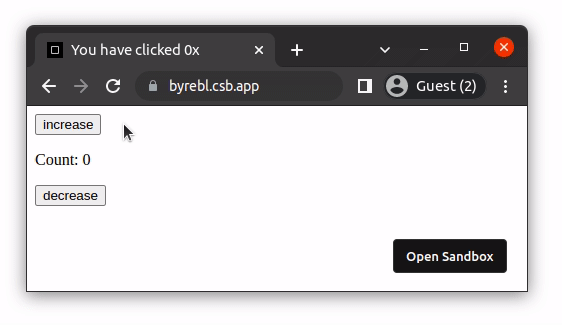
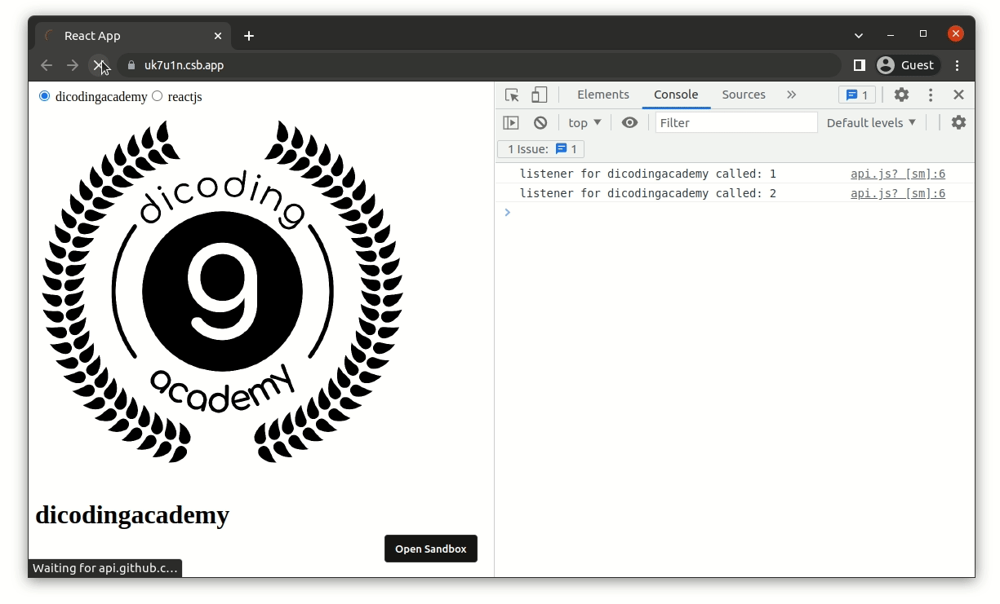

#programming 
Agar aplikasi dapat terbebas dari bugs, kita harus bisa memprediksi cara kerja aplikasi termasuk efek yang berjalan setelah terjadi perubahan data. Memprediksi efek bukanlah hal yang sederhana, terutama bila kode yang Anda tulis tidak terkelola dengan baik.

Dalam pengembangan aplikasi, efek sering digunakan untuk melakukan sinkronisasi data dengan sumber yang berasal dari luar lingkup aplikasi, seperti membuat _network request_, berinteraksi dengan DOM, dan aksi lain yang bersentuhan dengan “dunia luar”.
```jsx
// contoh sinkronisasi data dengan dunia luar
 
// memperbarui Github Profile berdasarkan perubahan 'username'
async function getGitHubProfile(username) {
  const response = await fetch(`https://api.github.com/users/${username}`);
  return response.json();
}
 
// memperbarui judul web berdasarkan perubahan 'title'
function updateDocumentTitle(title) {
  document.title = title;
}
```

Di React, efek merupakan hal yang krusial. Implementasi efek biasanya dilakukan pada method lifecycle `componentDidMount` atau `componentDidUpdate`. Namun, seperti yang Anda ketahui, penggunaan method lifecycle menimbulkan banyak duplikasi logika yang menyebabkan kode di dalam komponen menjadi gemuk dan sulit dikelola. 

Karena efek merupakan hal yang krusial, React menghadirkan fungsi hooks bernama `useEffect()` untuk mengenkapsulasi logika efek dengan cara yang lebih baik. Ada tiga aspek penting yang perlu Anda pahami terkait penggunaan `useEffect()`, yaitu

1. memberikan efek yang dijalankan di setiap render;
2. memberikan efek yang dijalankan satu kali atau berdasarkan perubahan data; dan
3. membersihkan efek.

Ayo, kita cari tahu lebih detail tentang 3 aspek tersebut.

### Memberikan efek yang dijalankan setiap render

Untuk membuat efek pada React component, panggilah fungsi `React.useEffect()` dan berikan efek (dalam bentuk fungsi) sebagai argumen dari fungsi tersebut.
```jsx
React.useEffect(() => {
  document.title = 'Judul baru';
});
```

Secara _default_, React akan memanggil efek **setiap kali setelah komponen di-render**. Kita bisa lihat cara kerjanya melalui contoh kode sederhana di bawah ini.
```jsx
function Counter() {
  const [count, setCount] = React.useState(0);
 
  // menggantikan componentDidMount dan componentDidUpdate
  React.useEffect(() => {
    console.count('di dalam useEffect');
    document.title = `You have clicked ${count}x`;
  });
 
  const increase = () => setCount((prevCount) => prevCount + 1);
  const decrease = () => setCount((prevCount) => prevCount - 1);
 
  console.count('rendering');
 
  return (
    <>
      <button onClick={increase}>increase</button>
      <p>Count: {count}</p>
      <button onClick={decrease}>decrease</button>
    </>
  );
}
```

Penggunaan `useEffect()` pada kode tersebut bertujuan untuk menyinkronkan judul website dengan nilai state `count`. Hasilnya seperti berikut ini.

Anda bisa mencoba kode tersebut pada tautan: [contoh-react-usestate-1](https://codesandbox.io/s/8-contoh-react-usestate-1-byrebl).

Jika Anda mencoba kode di atas dan melihat apa yang ditampilkan pada console, teks “rendering” akan tampak lebih dulu sebelum teks “di dalam useEffect” karena efek di dalam `useEffect()` akan berjalan tepat setelah komponen di-render.

> **Catatan:** Efek di dalam `useEffect()` tidak akan berjalan hingga UI ditampilkan pada DOM. Hal ini agar efek tidak menghambat browser dalam menampilkan UI karena jika sampai menghambat, tentu akan memperburuk performa website.

Sekarang Anda sudah tahu cara menambahkan efek dan mengetahui bahwa efek dijalankan setiap kali komponen selesai di-render. Dari pengetahuan yang Anda dapatkan saat ini, apakah bisa diterapkan untuk kasus mengambil data dari internet? Mari kita cari tahu dengan mengenal aspek kedua.

### Memberikan efek yang dijalankan satu kali atau berdasarkan perubahan data
Lifecycle method `componentDidMount()` menjadi tempat yang cocok untuk menginisialisasi nilai state yang diambil dari network request. Pasalnya, method tersebut hanya dipanggil sekali setelah komponen pertama kali di-render sehingga tidak akan menyebabkan _infinite loop_.
```jsx
async function getGitHubProfile(username) {
  const response = await fetch(`https://api.github.com/users/${username}`);
  return response.json();
}
 
class GitHubProfile extends React.Component {
  constructor(props) {
    super(props);
 
    this.state = {
      profile: null
    };
  }
 
  async componentDidMount() {
    const profile = await getGitHubProfile('dicodingacademy');
    this.setState(() => {
      return {
        profile
      };
    });
  }
 
  render() {
    if (this.state.profile === null) {
      return <p>loading ...</p>;
    }
 
    const { login, bio } = this.state.profile;
 
    return (
      <>
        <h1>{login}</h1>
        <p>{bio}</p>
      </>
    );
  }
}
```

Lalu, bagaimana caranya agar kebutuhan yang sama dapat terpenuhi dengan `useEffect()`? Jika Anda mengikuti cara sebelumnya, mungkin Anda akan melakukannya dengan seperti ini.
```jsx
async function getGitHubProfile(username) {
  const response = await fetch(`https://api.github.com/users/${username}`);
  return response.json();
}
 
function GitHubProfile() {
  const [profile, setProfile] = React.useState(null);
  React.useEffect(() => {
    getGitHubProfile('dicodingacademy').then(setProfile);
  });
 
  if (profile === null) {
    return <p>loading ...</p>;
  }
 
  const { login, bio } = profile;
 
  return (
    <>
      <h1>{login}</h1>
      <p>{bio}</p>
    </>
  );
}
```

Jika dilihat dari kode di atas, sepertinya tidak ada masalah. Namun, kode di atas sebenarnya menyebabkan _infinite loop_ dan akan membombardir network request. Lantas, bisakah Anda temukan letak kesalahannya? Agar lebih mudah, mari kita telaah alur perubahan data secara perlahan.
```jsx
Initial Render
  profile: null
  Effect (berjalan setelah render):
    () => getGithubProfile('dicodingacademy').then(setProfile)
  Render UI: Loading...
  Memanggil Effect:
    () => getGithubProfile('dicodingacademy').then(setProfile)
 
setProfile terpanggil
  React memperbarui state "profile", menyebabkan re-render
 
Next Render
  State profile: {login: 'dicodingacademy', name: 'Dicoding Academy', ...}
  Effect (berjalan setelah render):
    () => getGithubProfile('dicodingacademy').then(setProfile)
  Render UI: <h1>dicodingacademy</h1> ...
  Memanggil Effect:
    () => getGithubProfile('dicodingacademy').then(setProfile)
 
setProfile terpanggil
  React memperbarui state "profile", menyebabkan re-render
 
Mengulang proses render sebelumnya
 
setProfile terpanggil
  React memperbarui state "profile", menyebabkan re-render
 
Mengulang proses render sebelumnya
 
setProfile terpanggil
  React memperbarui state "profile", menyebabkan re-render
 
~Infinite loop~
```
Apakah Anda sudah paham letak kesalahannya? Dari tahapan di atas, kita bisa melihat bahwa setelah komponen pertama kali di-render, ia akan memanggil efek, kemudian mengubah state profile yang akan memicu proses render ulang. Lalu, efek tersebut dipanggil lagi, state akan berubah lagi, di-render lagi, begitu seterusnya.

Setelah itu, solusi apa yang perlu kita terapkan agar `useEffect()` tidak dijalankan pada setiap render? Pada kasus yang kita hadapi, efek digunakan untuk mengubah nilai state `profile` dengan network request yang mengambil profil GitHub 'dicodingacademy'. Oleh karena itu, kita ingin `useEffect()` hanya dijalankan satu kali tepat setelah komponen pertama kali di-render. Untunglah React memberikan solusi yang sangat mudah, yakni dengan memanfaatkan argumen kedua pada fungsi `useEffect()`.

Ketahuilah bahwa `useEffect()` menerima dua argumen, yakni fungsi efek dan array berisi nilai yang menjadi patokan kapan efek harus dijalankan. Lebih jelasnya, bila salah satu nilai yang didefinisikan pada array tersebut berubah, efek akan dijalankan.

Karena argumen kedua ini bersifat opsional, `useEffect()` biasanya dibagi menjadi 3 skenario penggunaan.

1. Tanpa memberikan argumen kedua.
2. Memberikan argumen kedua dengan array yang berisi nilai dari luar.
3. Memberikan argumen kedua dengan array kosong.

Agar lebih jelas, simak kode berikut.
```jsx
React.useEffect(() => {
  // Akan dijalankan pada render awal
  // dan akan dijalankan pada render selanjutnya.
});
 
React.useEffect(() => {
  // Akan dijalankan pada render awal
  // dan ketika "username" atau "locale" berubah.
}, [username, locale]);
 
React.useEffect(() => {
  // Akan dijalankan pada render awal
}, []);
```

Sekarang sudah tahu ‘kan bagaimana cara agar `useEffect()` dapat dijalankan satu kali saja? Jawabannya adalah memberikan nilai array kosong. Dengan begitu, komponen `GitHubProfile` akan terbebas dari _infinite loop_.
```jsx
async function getGitHubProfile(username) {
  const response = await fetch(`https://api.github.com/users/${username}`);
  return response.json();
}
 
function GitHubProfile() {
  const [profile, setProfile] = React.useState(null);
 
  React.useEffect(() => {
    getGitHubProfile('dicodingacademy').then(setProfile);
  }, []);
 
  if (profile === null) {
    return <p>loading ...</p>;
  }
 
  const { login, bio } = profile;
 
  return (
    <>
      <h1>{login}</h1>
      <p>{bio}</p>
    </>
  );
}
```

Kode di dalam komponen `GitHubProfile` sudah tepat, tetapi dengan asumsi hanya mendapatkan profil dicodingacademy saja. Sebab, nilai dari username yang diberikan pada fungsi `getGitHubProfile()` adalah _hardcoded_.

Alih-alih menetapkan nilai secara _hardcoded_, bagaimana jika kita manfaatkan props agar dapat menampilkan profil GitHub dengan username yang dinamis?
```jsx
function GitHubProfile({ username }) {}
```

Dengan begitu, pemanggilan efek pun akan menjadi seperti ini.
```jsx
function GitHubProfile({ username }) {
  const [profile, setProfile] = React.useState(null);
 
  React.useEffect(() => {
    getGitHubProfile(username).then(setProfile);
  }, []);
 
  if (profile === null) {
    return <p>loading ...</p>;
  }
 
  const { login, bio } = profile;
 
  return (
    <>
      <h1>{login}</h1>
      <p>{bio}</p>
    </>
  );
}
```

Menambahkan `username` di dalam fungsi efek, akan membuatnya memiliki ketergantungan (depends) terhadap nilai yang berasal dari luar. Itu artinya, kita tidak bisa lagi menggunakan array kosong pada argumen kedua [9]. Opsinya adalah menghapus argumen array (akan menyebabkan _infinite loop_ kembali) atau mengubah array kosong menjadi array yang berisi nilai dependencies (username). Sebenarnya, ini bukan pilihan yang sulit karena kita juga bisa dengan mudah memilih opsi kedua.
```jsx
function GitHubProfile({ username }) {
  const [profile, setProfile] = React.useState(null);
 
  React.useEffect(() => {
    getGitHubProfile(username).then(setProfile);
  }, [username]);
 
  if (profile === null) {
    return <p>loading ...</p>;
  }
 
  const { login, bio } = profile;
 
  return (
    <>
      <h1>{login}</h1>
      <p>{bio}</p>
    </>
  );
}
```

Sekarang, setiap nilai props `username` berubah, efek akan dipanggil. Dengan begitu, state `profile` akan selalu sinkron dengan perubahan nilai `username`. Ini hal yang bagus, bukan? Tanpa Anda sadari, implementasi di atas menghapus banyak sekali kode _boilerplate_ bila kita mengimplementasikannya dengan class component.
```jsx
class GitHubProfile extends React.Component {
  constructor(props) {
    super(props);
 
    this.state = {
      profile: null
    };
  }
 
  async componentDidMount() {
    const profile = await getGitHubProfile(this.props.username);
 
    this.setState(() => {
      return {
        profile
      };
    });
  }
 
  async componentDidUpdate(prevProps) {
    if (prevProps.username !== this.props.username) {
      const profile = await getGitHubProfile(this.props.username);
 
      this.setState(() => {
        return {
          profile
        };
      });
    }
  }
 
  render() {
    if (this.state.profile === null) {
      return <p>loading ...</p>;
    }
 
    const { login, bio } = this.state.profile;
 
    return (
      <>
        <h1>{login}</h1>
        <p>{bio}</p>
      </>
    );
  }
}
```

Sampai di sini Anda sudah belajar cara menggunakan fungsi hooks `useEffect()` untuk memberikan efek pada React component. Anda juga sudah mengetahui cara untuk menggunakan argumen kedua `useEffect()` agar bisa melewati pemanggilan efek pada tiap render terjadi. Selain itu, Anda juga sudah bisa memanggil efek berdasarkan perubahan nilai luar. 
Aspek terakhir yang akan kita pelajari adalah efek yang membutuhkan fase “bersih-bersih” agar terhindar dari _memory leak_, seperti websocket atau DOM listener.


### Membersihkan efek
Mari kita asumsikan bahwa GitHub API saat ini menggunakan websocket dalam transaksi datanya. Alih-alih membuat permintaan tunggal, websocket menggunakan pola listener untuk memperbarui data secara _real-time_. Pada skenario ini, selain mengatur listener di dalam fungsi efek, kita juga harus memikirkan bagaimana cara menghapusnya. Kita ingin memastikan bahwa listener sudah dihapus ketika component sudah tidak ditampilkan di DOM. Apabila listener terus hidup, akan menimbulkan masalah _memory leak_.

Skenario ini membawa kita untuk berkenalan dengan kemampuan terakhir dari `useEffect()`, yakni _clean-up function_. Secara opsional, fungsi efek boleh mengembalikan fungsi lain yang merupakan clean-up function. React akan memastikan bahwa clean-up function dijalankan **di fase re-render** tepat sebelum efek baru dijalankan dan ketika komponen hendak dihapus dari DOM.
```jsx
React.useEffect(() => {
  return () => {
    // dipanggil tepat sebelum memanggil efek baru di fase re-render
    // dipanggil tepat sebelum komponen dihapus dari DOM
  };
});
```

Berikut adalah contoh kode penggunaan `useEffect()` di dalam komponen `GitHubProfile` bila menerapkan pola listener dengan websocket.
```jsx
function GitHubProfile({ username }) {
  const [profile, setProfile] = React.useState(null);
 
  React.useEffect(() => {
    const unsubscribe = subscribeGitHubProfile(username, (profile) => {
      setProfile(profile);
    });
    return () => {
      unsubscribe();
      setProfile(null);
    };
  }, [username]);
 
  if (profile === null) {
    return <p>loading ...</p>;
  }
 
  const { login, bio } = profile;
 
  return (
    <>
      <h1>{login}</h1>
      <p>{bio}</p>
    </>
  );
}
```

Pada contoh kode di atas, ada dua skenario di mana fungsi clean-up akan dipanggil. Kondisi pertama terjadi ketika nilai `username` berubah, lebih tepatnya sebelum efek baru dijalankan dengan men-_subscribe_ nilai username terbaru. Kondisi kedua terjadi tepat sebelum komponen `GitHubProfile` dihapus dari DOM. Dari kedua skenario tersebut, kita dapat memastikan tidak ada subscription kedaluwarsa yang aktif melalui pemanggilan fungsi `unsubscribe()` di dalam clean-up. Kita juga bisa melihat ketika setiap kali clean-up dijalankan, nilai state `profile` akan diubah menjadi `null` dan UI akan menampilkan _loading_.

Agar lebih jelas, kami sangat merekomendasikan Anda untuk mencoba kodenya secara langsung melalui tautan [useeffect-clean-up-sample](https://codesandbox.io/s/09-useeffect-clean-up-sample-uk7u1n). Perhatikan teks yang ditampilkan pada console browser untuk memahami alur subscribe dan unsubscribe dengan clean-up function.
