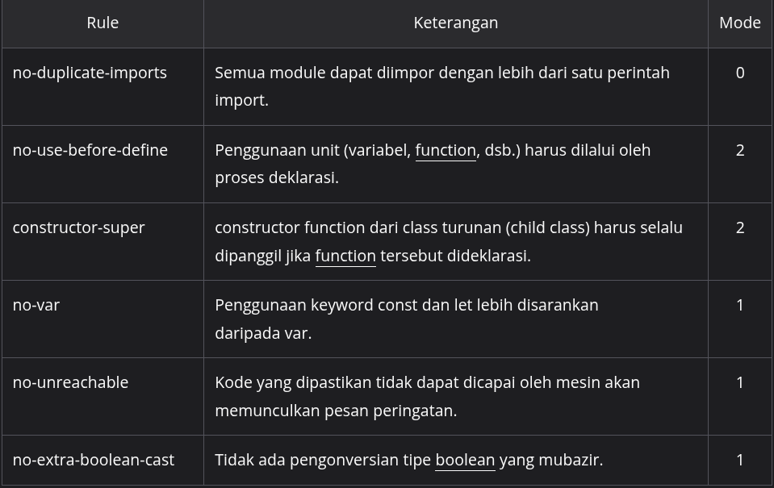

#programming 
Kita sudah belajar mengenai _code style guide_ untuk meningkatkan kualitas penulisan kode JavaScript. Cara manual juga telah dipelajari sebagai langkah antisipasi awal terjadinya inkonsistensi penulisan kode. Nah, metode berikutnya ini lebih kami rekomendasikan karena dilakukan dengan bantuan library. Ini bisa kita anggap sebagai code reviewer dalam aspek style guide.

Ada beberapa library yang dapat menunjang kualitas kode kita, yaitu ESLint, StandardJS, dan JSHint. Para linter ini akan memberikan _feedback_ setelah berhasil menganalisis kode Anda jika terdeteksi inkonsistensi pada penulisannya. Tentunya, _feedback_ dihasilkan melalui Terminal/CMD. Kami akan memilih ESLint karena kepopulerannya. Sejak materi ini ditulis, ESLint telah mencapai angka 35,6 juta pengunduhan setiap minggunya. Keren!


ESLint tidak hanya luar biasa hebat dari kepopulerannya. Ia memiliki banyak fitur yang dapat memenuhi kebutuhan kita terkait style guide. ESLint dapat memperbaiki kode JavaScript secara otomatis melalui perintah terminal dan kode kita akan berubah menjadi sesuai dengan aturan yang diberlakukan. _Powerful!_

ESLint menyediakan konfigurasi yang berkaitan dengan aturan penulisan atau disebut rule. Ada tiga kategori yang tersedia pada setiap rule-nya berdasarkan tingkat keparahan.

- **“off” atau 0**: aturan tersebut tidak dipermasalahkan atau dimatikan.
- **“warn” atau 1**: aturan ditetapkan sebagai peringatan saja saat dilanggar.
- **“error” atau 2**: aturan wajib dipatuhi dan program dapat mengalami error.

Rule yang ditetapkan dengan nilai “error” dapat memaksa developer agar mematuhinya. Ini sangat bermanfaat karena para developer benar-benar wajib mengikuti aturan yang berlaku. Sebuah program pun tidak akan bisa diluncurkan ke publik jika rule tersebut sampai dicederai.

Lalu, bagaimana bentuk penulisan aturan di ESLint? Berikut contohnya.
```js
{
  rules: {
    "no-duplicate-imports": "off",
    "no-use-before-define": "error",
    "constructor-super": "error",
    "no-var": "warn",
    "no-unreachable": "warn",
    "no-extra-boolean-cast": "warn"
  }
}
```

Setiap rule memiliki nama unik dan maksudnya masing-masing. Berikut penjelasannya.


Secara lebih rinci, enam aturan di atas dapat Anda pelajari secara mandiri pada halaman [Rules Reference](https://eslint.org/docs/latest/rules/). Anda dapat bereksplorasi juga pada halaman tersebut jika ingin menemukan aturan-aturan secara lengkap.

Mungkin ada yang penasaran pada bentuk pesan error yang dikembalikan oleh ESLint. Berikut contoh umpan baliknya.


Umpan balik di atas dihasilkan setelah menjalankan perintah berikut.
`npx eslint src/main.js`

Menakjubkan sekali, bukan? Nah, jika keadaannya seperti di atas, kode kita belum tentu akan langsung diperbaiki, ya. Lagi pula, kita diperintahkan untuk menambahkan argument --fix ke dalam perintah eslint jika ingin langsung diperbaiki.

`npx eslint src/main.js --fix`

