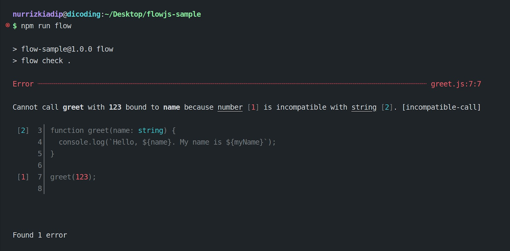

#programming 
Kita sudah melihat keuntungan menggunakan JSDoc. Sangat membantu untuk terhindar dari bugs, ya. Ada tools lain yang dapat mengantisipasi dynamic type dari JavaScript. Tools ini berbeda dengan JSDoc karena implementasinya bukan dalam bentuk komentar, melainkan langsung mengubah kode JavaScript kita.


Flow adalah sebuah library (terjemahan dalam bahasa Indonesia: pustaka) yang dapat menambahkan pemeriksaan type untuk kode JavaScript. Library ini seakan-akan dapat menambahkan type check layer (lapisan pemeriksaan tipe) sebelum dieksekusi mesin. Justru ini membuat kita semakin produktif serta menulis kode semakin cepat, cerdas, penuh percaya diri, dan mudah untuk diperluas. Begitu dokumentasi resmi Flow menyebutnya.

Lalu, bagaimana penggunaan Flow dalam kode JavaScript? Kita hanya perlu menambahkan sedikit upaya agar JavaScript mendukung static type.

```js
const myName: string = 'Flow';
 
function greet(name: string) {
  console.log(`Hello, ${name}. My name is ${myName}`);
}
 
greet(123);
```

_Waw_, kita bisa menentukan tipe nilai dalam variabel dan parameter function. Mirip sekali dengan beberapa bahasa pemrograman lain. Cukup tambahkan titik dua (:) dan diikuti dengan tipe nilainya (type). Dalam Flow, ini dinamakan **static type annotations**. Dengan demikian, kita dapat meminta Flow untuk membaca dan menganalisis kode di atas agar terbebas dari bugs.

### Flow Type Checker

Ekspektasi kita adalah terjadi kesalahan karena function greet diberi nilai number, padahal yang diminta adalah string. Berikut adalah umpan balik dari hasil analisis Flow.


Catatan:
Flow membutuhkan Terminal/CMD agar fungsinya dapat berjalan dengan baik. Oleh karena itu, gambar di atas adalah hasil analisisnya yang kami lakukan melalui Terminal Linux.

Perhatikan! Flow mengembalikan pesan error pada kita bahwa ada ketidakcocokan tipe nilai. Anda tahu apa yang perlu dilakukan, bukan? Mari kita perbaiki pemanggilan `greet` dengan nilai yang sesuai.

```js
greet(123); // --> hapus: number menyebabkan error
greet('JavaScript');
```
Perbaikan ini akan mengosongkan jumlah error yang ditemukan Flow. Lanjut, kita bisa menjalankan kodenya dalam JavaScript runtime.


### Flow Compiler
Tidak perlu kaget jika kita menemukan error saat menjalankan kode di atas dengan binary node. Ini bukan kode JavaScript yang standar tentunya. Kita perlu menghilangkan static type annotations sebelum dapat dijalankan oleh node. Hadirlah library bernama **f****low-remove-types** dari Flow.

Kira-kira hasil penghapusannya seperti berikut.
```js
const myName = 'Flow';
 
function greet(name) {
  console.log(`Hello, ${name}. My name is ${myName}`);
}
 
greet('JavaScript');

```

Sip! Kini, kita bisa jalankan kodenya dan berikut output-nya.
`Hello, JavaScript. My name is Flow`

