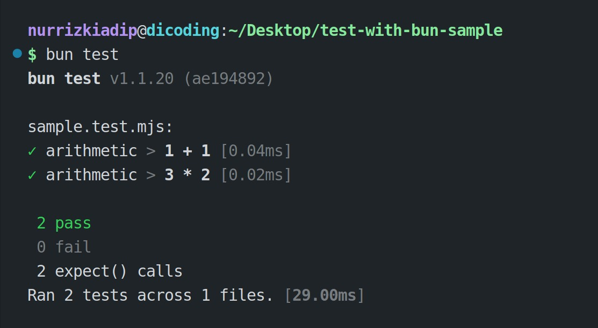

#programming 
Pada materinya, kita sudah belajar bermain pengujian otomatis dengan Node.js. Bun sebagai runtime alternatif dari Node.js juga memiliki built-in module untuk menangani kode pengujian, tetapi dengan sedikit perbedaan. Mari kita pelajari.

Mendefinisikan testing dengan Bun mirip rasanya seperti menggunakan [Jest](https://jestjs.io/). Bagi yang belum kenal, Jest adalah testing framework yang menawarkan lebih banyak kebutuhan perihal pengujian otomatis yang tidak ditawarkan oleh native API, seperti dari Node.js atau Bun. Bun memang ingin menyesuaikan gaya penulisan testing dengan framework terkenal itu agar para developer yang terbiasa dengannya tidak perlu pusing mempelajari sintaks baru. Ini keputusan yang baik, kan?

Module test dari Bun terletak pada bun:test. Seluruh kebutuhan terkait testing ada di sana, baik test runner maupun test assertion. Contoh implementasinya seperti berikut.
```js
import { it, describe, expect } from 'bun:test';
 
describe('arithmetic', () => {
  it('1 + 1', () => {
    expect(2 + 2).toBe(4);
  });
 
  it('3 * 2', () => {
    expect(3 * 2).toBe(6);
  });
});
```

`bun:test` sedikit berbeda dengan `node:test`. Jika Node.js menggunakan assert untuk menguji nilai, Bun menggunakan `expect` dan matcher. `expect` menerima satu parameter yang menjadi actual value dan kita membutuhkan `.toBe` sebagai matcher untuk mengujinya dengan expected value. Bagaimana dengan `describe` dan `it`? Mereka mirip dengan Node.js, kok.

Penasaran dengan tampak hasil pengujiannya? Cukup jalankan perintah bun test di terminal dan hasil akan terlihat seperti ini.



