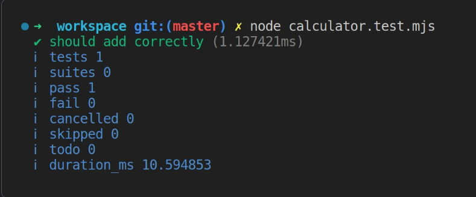

#programming 
Pengujian pada Node.js membutuhkan dua buah module, yaitu node:test dan node:assert. node:test berperan sebagai test runner yang menawarkan API untuk menuliskan skenario pengujian. Adapun node:assert berperan sebagai test assertion yang menyediakan objek untuk memvalidasi nilai antara actual (nilai sesungguhnya) dan expected (nilai yang diharapkan).

### Susun Pengaman dengan Testing
Mari kita contohkan langsung dengan kasus sederhana. Kita memiliki satu function yang perlu diuji ketepatan dan kekuatannya. Function itu adalah add. Ia adalah salah satu fungsi kalkulator dan membutuhkan dua parameter yang akan diproses dengan operasi penjumlahan. Perhatikan kode berikut.

```js
export function add(numA, numB) {
  return numA + numB;
}
```

Kami kira ini sudah cukup untuk bahan latihan kita. Sebelum menguji, ada baiknya kita tentukan dahulu skenario-skenario pengujian bersifat positif dan negatif. Berikut daftarnya.

1. Function add dapat mengoperasikan penjumlahan aritmetika dengan baik.
2. Function add membangkitkan error jika nilai argumen dari `numA` tidak bertipe number.
3. Function add membangkitkan error jika nilai argumen dari `numB` tidak bertipe number.

Apa maksud dari skenario positif dan negatif? Skenario positif berarti kasus pengujian yang mengharapkan keberhasilan output dari program. Misalnya, kita berharap `add(1, 2)` dapat menghasilkan 3. Berbeda dengan skenario negatif, ia akan memvalidasi kemungkinan error yang dapat terjadi dalam program. Misalnya, kemunculan error ketika parameter function tidak bertipe yang sesuai.

Dengan menuliskan daftar skenarionya, kita akan lebih mudah menguji fungsionalitas aplikasi. Mari kita coba tuangkan kasus pengujian pertama.

Calculator.mjs
```js
export function add(numA, numB) {
  return numA + numB;
}
```

test.mjs
```js
import { test } from 'node:test';
import assert from 'node:assert';
import { add } from './calculator.mjs';

test('should add correctly', () => {
  // Arrange
  const operandA = 1;
  const operandB = 1;

  // Action
  const actualValue = add(operandA, operandB);

  // Assert
  const expectedValue = 2;
  assert.equal(actualValue, expectedValue);
});
```

Pengujian dilakukan menggunakan function test yang diimpor dari node:test. Setiap kali ada kasus pengujian dan akan diuji, kita perlu mendefinisikannya dengan function tersebut. Function test menerima dua parameter, yaitu string sebagai nama pengujian dan callback function yang berisi kode pengujian. Lalu, untuk melakukan validasi nilai dari function, kita gunakan assertion dari module node:assert.

Jika kode di atas dieksekusi, berikut adalah tampak hasil testing dari Terminal.


Satu kasus pengujian dinyatakan lolos oleh Node.js.

1. ~~Function add dapat mengoperasikan penjumlahan aritmetika dengan baik.~~
2. Function add membangkitkan error jika nilai argumen dari numA tidak bertipe number.
3. Function add membangkitkan error jika nilai argumen dari numB tidak bertipe number.

