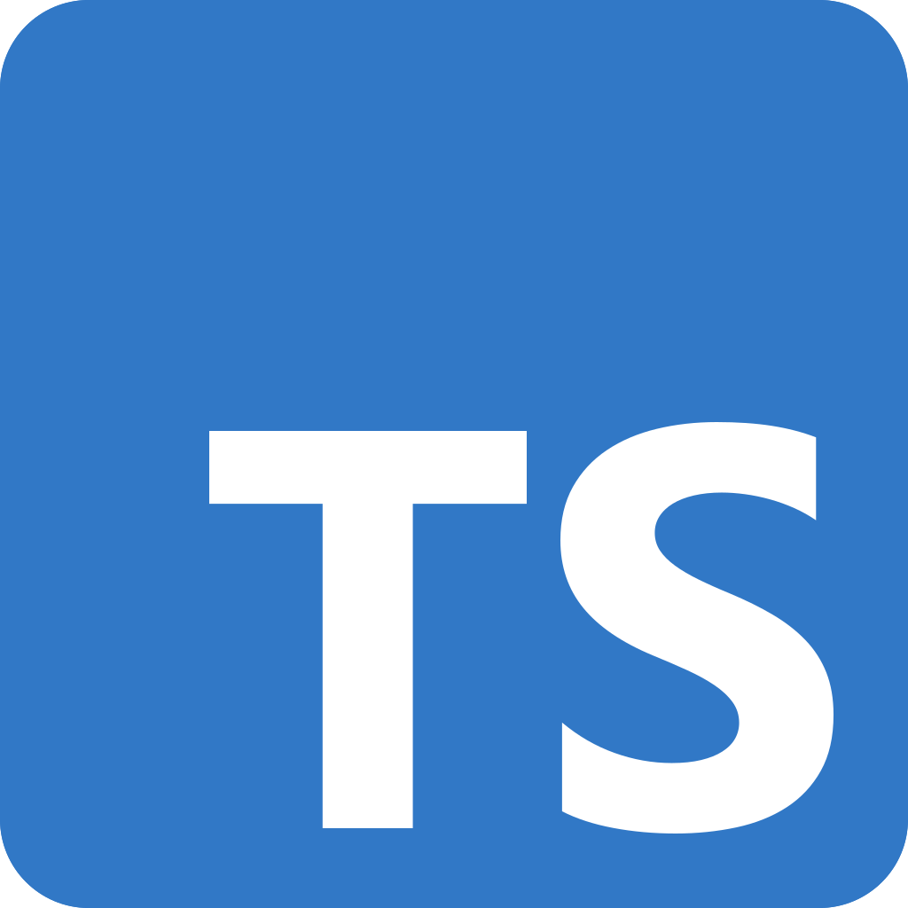

#programming 
Materi terakhir dalam type system untuk JavaScript adalah TypeScript. Apakah Anda bisa menebak apa TypeScript itu? Dia adalah bahasa pemrograman di atas JavaScript! Mari bereksplorasi.

JavaScript pada awalnya dibangun demi fleksibilitas dan tingkat kemudahan yang tinggi. Oleh karena itu, JavaScript sangat cocok untuk dipelajari sebagai langkah awal para developer. Namun, ini menjadi tidak ideal jika kita membangun aplikasi berskala besar dengan ribuan hingga jutaan baris kode. Ini yang sudah kita pahami sedari awal karena tidak ada type checker dalam interpreter JavaScript. Bahkan, JavaScript dikategorikan sebagai weakly-typed language karena saking fleksibelnya.



Microsoft membangun sebuah bahasa bernama TypeScript untuk memadukan fleksibilitas JavaScript dengan bahasa yang stricter (lebih ketat/kaku). TypeScript memiliki sistem yang dapat menambahkan fitur type pada kode JavaScript dan nantinya akan dianalisis oleh compiler milik TypeScript. Yup, ini mirip dengan Flow.

Jangan khawatir atas kompatibilitas TypeScript terhadap JavaScript. Seluruh fitur JavaScript tentunya ada dalam TypeScript, yakni arrow function, class, dan fitur-fitur terkini lainnya. Salah satu hal yang kami sukai dari TypeScript adalah ia menjadi bahasa paling digemari di dunia berdasarkan [Survey Stackoverflow 2023](https://survey.stackoverflow.co/2023/#technology-admired-and-desired) dan dipakai industri besar, seperti Google dan Amazon.

### Coding dengan TypeScript
Penulisan kode TypeScript membutuhkan .ts sebagai ekstensi berkasnya. Lalu, sintaks kodenya pun tidak berbeda dengan Flow. Berikut contohnya.
```js
const myName: string = 'TypeScript';
 
function greet(name: string) {
  console.log(`Hello, ${name}. My name is ${myName}`);
}
 
greet('JavaScript');
```

Sangat mudah, ya. Ini memang tidak terlihat berbeda dengan Flow. Tentu ini akan menghemat energi kita jika ingin beralih dari Flow ke TypeScript. 

Kode JavaScript yang dibangun dengan TypeScript juga perlu diproses agar menjadi kode yang standar. Namun, jika Flow membutuhkan langkah pemeriksaan dan penghapusan, TypeScript mempermudah kita dengan sekali langkah selesai melalui penggabungan dua langkah tersebut. 

TypeScript tetaplah membutuhkan compiler untuk memproses kodenya, yaitu **tsc**. Ia akan memeriksa sekaligus menghasilkan berkas .js yang siap eksekusi.


### TypeScript dengan Bun

Meskipun merupakan sebuah bahasa superset dari JavaScript, TypeScript tidak bisa dijalankan oleh Node.js (untuk versi terbaru Node.js sudah dapat menjalankan TypeScript). Oleh karena itu, pada bahasan sebelumnya, kita memerlukan tsc agar diubah menjadi kode JavaScript yang valid. Namun, hal ini berbeda dengan runtime Bun.

Bun mendukung eksekusi langsung berkas berekstensi .ts. Jadi, kita tidak perlu langkah tambahan saat membangun aplikasi dengan TypeScript.

Coba Anda jalankan kode berikut menggunakan Bun. Pastikan format berkasnya adalah typescript yang valid, ya.
```ts
function add(numA: number, numB: number): number {
  return numA + numB;
}
 
const result = add(2, 4);
console.log('Hasil:', result);
```
Tiga tools telah kita pelajari untuk memberikan pengalaman ngoding dengan static type pada JavaScript.