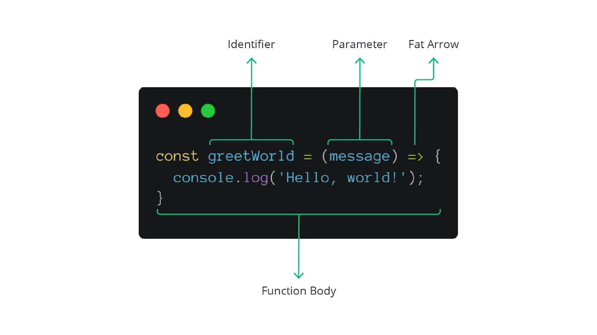

#programming 

Function expression benar-benar bisa mengubah cara kita membuat function. Namun, ada alternatif sintaksis lain dalam JavaScript yang bisa lebih mengubah cara kita membuat function. Sintaksis tersebut bernama arrow function. _Yap_, ini cara baru yang bisa kita manfaatkan dalam membuat function.

### Deklarasi
Pertanyaan utama yang perlu dipecahkan adalah bagaimana notasi arrow function? Untuk menjawabnya, mari kita langsung saja melihat perubahan function convertCelsiusToFahrenheit menjadi arrow function.


Ini contoh function regular terlebih dahulu:
```js
let temperatureInFahrenheit = null;

// Deklarasi function dengan Regular Function
const convertCelsiusToFahrenheitUsingRegularFunction = function (temperature) {
  const result = (9 / 5) * temperature + 32;
  return result;
};

temperatureInFahrenheit = convertCelsiusToFahrenheitUsingRegularFunction(90);
console.log('Hasil konversi:', temperatureInFahrenheit);
// Hasil ==> Hasil konversi: 194
```
Pertama membuat variable dengan nama temperatureInFahrenheit dengan value null atau 0... kenapa 0? agar valuenya bisa jadi statis atau di ubah dengan logic sesudahnya.

Lalu buat variable c`onvertCelsiusToFahrenheitUsingRegularFunction` dengan menyimpan function lagi di dalamnya -- seperti function expression sebelumnya --.

lalu variable null pertama tadi di isi dengan function expression, code dengan otomatis akan menjalankan value di dalamnya dengan fungsi yang di dalam function body.

dan terakhir panggil variable yang sudah terisi dari.


Lalu saya ubah ke dalam bentuk Arrow Function:
```js
// Deklarasi Function dengan Arrow Function
let temperatureInFahrenheit = null;

const convertCelsiusToFahrenheitUsingArrowFunction = (temperature) => {
  const result = (9 / 5) * temperature + 32;
  return result;
};

temperatureInFahrenheit = convertCelsiusToFahrenheitUsingArrowFunction(90);
console.log('Hasil konversi:', temperatureInFahrenheit);
// Hasil ==> Hasil konversi: 194
```
untuk arrow function ini lebih simple lagi dibandingkan sebelumnya.

Pertama seperti sebelumnya membuat variable dengan value kosong.

yang kedua membuat variable lagi yang isinya bukan keyword Function, melainkan langsung di isi dengan statement dan return nya, ini yang membuat Arrow function lebih simple. 

lalu tinggal isi saja variablenya dengan argument, dan panggil variable yang sudah terisi tadi.

Arrow function ternyata menghilangkan kewajiban kita menaruh kata kunci function di sana. Sebagai gantinya, kita wajib menambahkan tanda panah (=>) setelah parameter. Ini disebut sebagai notasi **_fat arrow_**. Selain itu, arrow function juga memiliki function body sebagaimana regular function.


### Refactor

Apakah Anda merasa arrow function belum dikatakan sebagai sintaksis function yang sederhana? Tenang, ternyata arrow function ini bisa lebih simpel lagi!

Kita bisa menyederhanakan penulisan arrow function body agar tidak menggunakan tanda kurung kurawal sama sekali. Mari kita lihat saja implementasinya dengan mengubah contoh kasus.

```js
// Arrow function versi ringkas
const convertCelsiusToFahrenheitInConciseSyntax = 
  (temperature) => (9 / 5) * temperature + 32;

temperatureInFahrenheit = convertCelsiusToFahrenheitInConciseSyntax(90);
console.log('Hasil konversi:', temperatureInFahrenheit);
```

Lihat! Function `convertCelsiusToFahrenheitInConciseSyntax` memiliki penulisan sintaksis yang sangat sederhana. Jauh lebih sederhana dari sebelumnya. Di sana kita menghilangkan beberapa hal, yaitu tanda kurung kurawal dan keyword `return`. Sebagai gantinya, return value langsung diletakkan setelah fat arrow.

Hal yang perlu dicatat adalah pembuatan arrow function hanya tersedia dalam bentuk expression. Oleh karena itu, kita selalu menyimpan nilainya dalam variabel. Selain itu, arrow function dengan gaya seperti ini hanya mampu menampung satu return value. Silakan bungkus dengan tanda kurung kurawal buka-tutup jika memerlukan banyak kode.