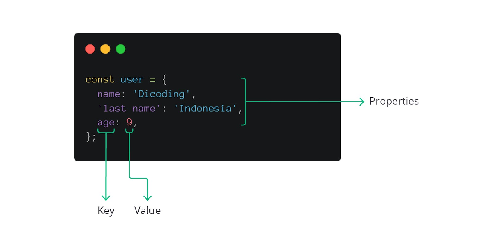

#programming 
Object adalah kumpulan pasangan key-value dan merupakan tipe data yang bukan `primitif`. Jika tipe data primitif hanya dapat menyimpan satu jenis data seperti string atau number, tipe data object dapat menyimpan data yang beragam dan kompleks. Object dapat menyimpan data secara tidak terurut. Selain tipe data seperti string, number, symbol, boolean, null, dan undefined dalam JavaScript, semuanya dianggap sebagai object. Sebagai informasi tambahan, object di bahasa pemrograman lain disebut dengan hash-table, map, dan dictionary.

### Membuat Object
Ada berbagai cara untuk membuat object seperti menggunakan object constructor atau yang paling mudah adalah dengan menggunakan object literals. Membuat object dengan object literals sangat mudah yaitu cukup dengan menulis kurung kurawal {}.
```js
const user = {};
const products = { 
	name: 'Sepatu', 
	price: 230000 
	};
```
Dapat dilihat bahwa selain membuat object dengan beberapa properti, kita juga dapat membuat object dengan properti kosong. Properti yang ada di dalam object dapat ditambah dan dihapus. Di dalam kurung kurawal tersebut dapat ditulis properti dari object. 

Properti memiliki key dan value. Key dari properti dapat berupa string dan value dapat bernilai tipe data apa pun, seperti string, number, atau boolean. Properti yang ada di dalam object dipisahkan oleh koma.


### Mengakses Properti di Object

Setelah berhasil membuat object, tentunya kita akan mengakses properti yang ada di object tersebut. Object yang sudah dibuat dapat diakses dengan beberapa teknik.

#### Mengakses menggunakan dot
Cara pertama untuk mengakses nilai properti yang ada di object adalah menggunakan dot notation (.). Contohnya ketika ingin mengakses properti `name` dari object `user` dapat ditulis seperti berikut ini.
```js
const user = {
  name: 'Dicoding',
  'last name': 'Indonesia',
  age: 9,
};

console.log(user.name); // Output: Dicoding
```

Kita dapat memanggil nama object, kemudian menuliskan tanda titik yang diikuti dengan nama propertinya. Sebelum titik adalah nama object-nya dan setelah titik adalah nama properti yang ingin diakses. Kekurangan dari dot notation adalah nama key yang ingin diakses harus valid; tidak boleh mengandung spasi; tidak boleh diawali angka; dan tidak boleh mengandung spesial karakter.  
  
#### Mengakses menggunakan square bracket
Untuk menutupi kekurangan menggunakan dot notation, ada cara lain yaitu menggunakan square bracket. Contoh:
```js
console.log(user['last name']); // Output: Indonesia
```
Tulislah nama object terlebih dahulu dan di dalam kurung siku kita menuliskan nama properti yang ingin diakses. Dengan menggunakan square bracket, key yang memiliki spasi pun dapat diakses.

#### Mengakses menggunakan object destructuring
Selain itu nilai properti dari object dapat diakses juga dengan cara lainnya yaitu menggunakan object destructuring. Destructuring dalam JavaScript merupakan sintaksis yang dapat mengeluarkan nilai dari properti object ke dalam satuan yang lebih kecil (variabel). Contohnya seperti berikut.
```js
const user = {
  'name': 'Dicoding',
  lastName: 'Indonesia',
  age: 9
};

const { name, lastName } = user;
console.log(name, lastName); // Output: Dicoding Indonesia
```

### Mengubah Nilai di Properti Object
Untuk mengubah nilai properti di object sangat mudah asalkan kita mengetahui nama object dan nama properti yang ingin diubah. Memodifikasi object dapat dilakukan dengan assignment operator (=).

```js
const account = {
  balance: 1000,
  debt: 10,
};

account.balance = 2000;
console.log(account.balance); // Output: 2000
```

### Menghapus Properti di Object
Untuk menghapus properti pada object dapat menggunakan operator `delete` dengan menuliskan nama object lalu tanda titik dan diikuti nama propertinya. Contohnya seperti di bawah ini.

```js
const user = {
  'name': 'Dicoding',
  'last name': 'Indonesia',
  age: 9,
};

delete user.age;
console.log(user); // Output: { name: 'Dicoding', 'last name': 'Indonesia' }
```