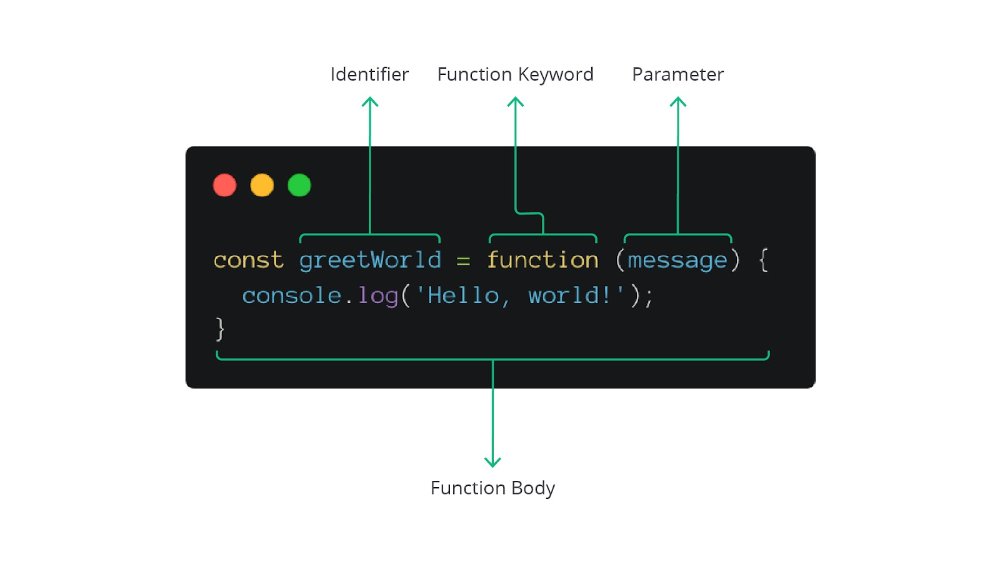

#programming 
Function expression terdiri dari dua kata, yaitu "function" dan "expression". Kita sudah mengenal function, begitu juga dengan expression. Lantas, function expression dapat kita artikan sebagai kode yang mengembalikan nilai function. Bagaimana bentuknya, ya?

Kali ini, kita sudah mahir membuat function. Tata caranya adalah keyword function, identifier, parentheses untuk parameter, dan function body. Disadari ataupun tidak, sebetulnya kita sedang membuat, sebut saja, function statement. Artinya, kita memerintahkan JavaScript membuat function dengan statement tersebut. Tentunya, ini tidak akan mengembalikan nilai apa pun. Nah, kita dapat membuat function dengan gaya expression layaknya membuat variabel seperti kode di bawah ini.


Sebetulnya, sintaksis pembuatan function expression tidak jauh berbeda dengan function statement. Bahkan, tidak ada perbedaan apa pun dari segi fiturnya. Sebagaimana Anda lihat dalam gambar di atas, kita menyimpan function pada sebuah variabel. Kini variabel menjadi identifier bagi function.

Lalu, bagaimana cara menjalankan function expression ini? Jawabannya, tidak ada yang berbeda dengan cara kita sebelumnya. Cukup sebut identifier dan diikuti dengan parentheses.

Oke, mari ubah function pengonversi suhu kita menjadi function expression.
```js
const convertCelsiusToFahrenheit = function (temperature) {
  const result = (9 / 5) * temperature + 32;
  return result;
};

const temperatureInFahrenheit = convertCelsiusToFahrenheit(90);
console.log('Hasil konversi:', temperatureInFahrenheit);

/* Output:
Hasil konversi: 194
*/
```

Perbedaan lainnya dari function expression ialah tidak memiliki hoisting (Mekanisme JavaScript yang mengangkat deklarasi variabel dan function ke bagian atas scope sebelum kode dieksekusi) padanya sehingga kita tidak dapat memanggil atau menjalankan function ini sebelum dideklarasikan.

### Menjadi First-Class Citizen
Jika ada bahasa pemrograman yang mengatakan bahwa function dapat diperlakukan layaknya variabel, function tersebut dinyatakan sebagai first-class citizen. Apa maksud dari diperlakukan mirip variabel?

Pada JavaScript, function dapat kita jadikan sebagai nilai dan disimpan dalam variabel, nilai argumen function lain, mengembalikan nilai function dari suatu function, dsb. Mari kita lihat contohnya.

```js
function multiply(a, b) {
  return a * b;
}

function calculate(operation, numA, numB) {
  return operation(numA, numB);
}

const result = calculate(multiply, 2, 4);
console.log(result);
```

Kita memiliki program kalkulator sederhana. Berdasarkan contoh program di atas, kita punya dua function. Function `multiply` untuk melakukan operasi perkalian, sedangkan `calculate` sebagai function utama yang perlu dijalankan jika ingin melakukan proses aritmetika dua angka.

Identifier function `multiply` kita jadikan sebagai nilai argumen pertama dari `calculate` saat pemanggilannya. Artinya, parameter `operation` akan bernilai function dari `multiply`. Oleh karena itu, kita bisa melakukan _invoke_ (menjalankan) parameter tersebut layaknya function.

Bagaimana dengan mengembalikan nilai function dari suatu function? Mari kita lihat contohnya.
```js
function multiplier(x) {
  return function (num) {
    return x * num;
  };
}

const double = multiplier(2);
const triple = multiplier(3);

console.log(double(10));
console.log(triple(11));

/* Output:
20
33
*/
```
Penjelasan dari code diatas:
saya memiliki 1 function bernama `multiplier` dengan paremeter x, function `multiplier` berisikan sebuah return yang juga berisi function di dalamnya yang memiliki paremeter num yang dimana function di dalam ini mengembalikan nilai x di kali num.

lalu saya mempunyai variable yang berfungsi untuk menyimpan argument function multiplier, yaitu double = 10, dan triple = 11.

pada langkah terakhir, saya memanggil variable yang menyimpan argument function pertama, lalu di isi dengan value yang berguna sebagai argument untuk function di bawahnya...

lalu dengan itu code akan mengeluarkan output return x * num, yang artinya:
2 kali 10.
3 kali 11.

Mantap! Oke, mari coba kami rangkum mengenai function sebagai first-class citizen dalam beberapa keuntungan berikut.

- Dapat disimpan sebagai nilai dalam variabel.
- Dapat dikembalikan dari suatu function.
- Dapat dikirimkan sebagai parameter bagi function lain.
- Dapat disimpan dalam elemen array dan object literal.
- Dapat memiliki method dan properties sendiri.