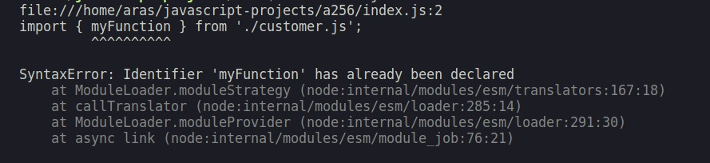

#programming 

JavaScript memungkinkan kita untuk menggunakan function/method dari modul lainnya dengan dua syarat: 
- Harus meng-import function/method tersebut.
- Function/method tersebut sudah di-export.

Import dapat dilakukan dengan menulis kata kunci import kemudian diikuti oleh nama function/method/variable. Perhatikan contoh berikut ini.

Main.js;
```js
import myFunction from './anotherfile.mjs';

myFunction();
```
Anotherfile.mjs:
```js
export default function myFunction() {
  console.log('Ini adalah function export default.');
}
```
Contoh di atas akan menghasil tulisan “Ini adalah function export default”. Contoh tersebut dikatakan sebagai default import. Default import dapat bekerja jika di modul lainnya terdapat function/method/variable yang di-export default.

Pada contoh di atas, export default-nya adalah myFunction. Default import juga memungkinkan kita untuk import function/method/variable yang namanya tidak harus sama dengan function/method/variable aslinya. Simak contoh berikut agar lebih terbayang.
```js
import result from './anotherfile.mjs';

result();
```
Apa pun nama yang kita tulis ketika mengimpor function dari berkas anotherFile.mjs di main.mjs, function `myFunction` akan tetap terimport. Begitulah cara kerja default import. 

Lalu, bagaimana ketika kita ingin mengimpor dari suatu modul yang memiliki banyak function/method/variable yang di-export? Jawabannya adalah kita dapat menggunakan named import.

Berbeda dengan default import yang tidak memerlukan nama spesifik, named import memungkinkan kita mengimpor function/method/variable tertentu berdasarkan namanya. Saat menggunakan named import, pastikan nama fungsi yang ingin diimpor sesuai.
```js
import { myFunction } from './anotherfile.mjs';

myFunction();
```
Ketika menggunakan named import, selain memastikan nama function sesuai, kita juga akan menuliskan nama function yang diimpor dalam kurung kurawal {}. Selain itu, kita juga dapat mengimpor lebih dari satu function/method/variable. Perhatikan contoh berikut ini.
Main.js:
```js
import { name, email, age } from './anotherfile.mjs';

console.log(name);
console.log(email);
console.log(age);
```

anotherfile.mjs:
```js
const name = 'John';
const email = 'john@gmail.com';
const age = 25;

export { name, email, age };
```

Output:
```output
John 
john@gmail.com 
25
```

Apa yang dilakukan pada contoh di atas sebenarnya sah-sah saja. Namun, ada cara lainnya yaitu menggunakan import *. Import * dapat dilakukan ketika function/method/variable yang ingin kita impor dari modul yang sama sangat banyak.

Jika function/method/variable yang ingin kita import sangat banyak, kita dapat menggunakan import * .
```js
import * as variable from './anotherfile.mjs';

console.log(variable.name);
console.log(variable.email);
console.log(variable.age);
```

Selain menggunakan tanda bintang (*), kita juga dapat menambahkan `as` variable (sebagai alias) untuk mengimpor seluruh variable yang berasal dari modul lainnya (pada contoh anotherfile.mjs). Apa perbedaan antara import {} dan import *?

import * memungkinkan kita untuk mengimpor seluruh module yang di export. Namun, kekurangannya adalah sulit untuk dibaca karena tidak eksplisit, sedangkan menggunakan import {} akan menjadi eksplisit sehingga kita bisa tahu apa saja function/method/variable yang ingin di-import.

Pada contoh sebelumnya, Anda telah melihat contoh penggunaan keyword `as`. Keyword tersebut digunakan pada import yang disebut dengan import alias. Import alias digunakan untuk mengubah nama dari function/method/variable yang berasal dari modul lain menjadi nama yang kita inginkan. Tujuan dari import alias adalah mempermudah ketika kita memiliki nama function/method/variable yang sama di beberapa modul.

Misalnya, Anda memiliki function dengan nama `myFunction` di dua modul berbeda, yaitu user.mjs dan customer.mjs. Lalu, Anda ingin menggunakan kedua function tersebut di satu modul yaitu main.mjs.

Tanpa menggunakan import alias, Anda akan mendapatkan error seperti berikut.

Error tersebut terjadi karena `myFunction` diimpor sebanyak dua kali. Untuk mengatasi hal tersebut, gunakanlah import alias.

main.mjs:
```js
import { myFunction as userFunction } from './user.mjs';
import { myFunction as customerFunction } from './customer.mjs';

userFunction();
customerFunction();
```

user.mjs:
```js
export function myFunction() {
  console.log('Ini dari user.js');
}
```

customer.mjs:
```js
export function myFunction() {
  console.log('Ini dari customer.js');
}
```

Alih-alih menggunakan myFunction, kita mengubah namanya menjadi `userFunction` dan `customerFunction`. Import alias juga meningkatkan readability kode yang ditulis. Kita langsung tahu konteks dan maksud dari function/method/variable yang diimpor contohnya `userFunction` yang berasal dari modul user dan konteksnya adalah user. Menggunakan **alias** saat mengimpor tidak hanya menghindari konflik seperti kasus sebelumnya, tetapi juga meningkatkan keterbacaan kode.

Bagi sebagian orang, terutama bagi Anda yang pertama kali belajar pemrograman, Anda mungkin kesulitan untuk memahami import. Untuk memahami konsep ini, mari kita gunakan analogi sehari-hari yang mungkin lebih familiar.

- **Import**: Bayangkan Anda sedang memasak di dapur, tetapi Anda kehabisan bahan tertentu. Anda tahu bahwa tetangga Anda memiliki bahan yang Anda butuhkan. Proses "import" ini mirip dengan meminjam bahan dari tetangga. Dalam pemrograman, "import" memungkinkan Anda menggunakan kode atau fungsi yang sudah dibuat oleh orang lain, sehingga Anda tidak perlu membuat semuanya dari awal.
- **Named Import**: Ini seperti meminjam barang dan menyebutkan secara spesifik nama barangnya. Misalnya, Anda tahu tetangga Anda punya wajan, jadi, Anda pergi ke rumah tetangga dan mengatakan, "Boleh nggak saya meminjam wajannya?"
- **Default Import**: Jika Anda tidak ingin menyebutkan secara spesifik apa yang Anda butuhkan dan hanya ingin meminjam sesuatu yang sering dipakai, Anda bisa mengatakan, "Bolehkah saya pinjam bahan utamanya?" Dalam hal ini, Anda meminjam bahan yang paling umum dipakai dari dapur tetangga tanpa menyebutkan nama tertentu.