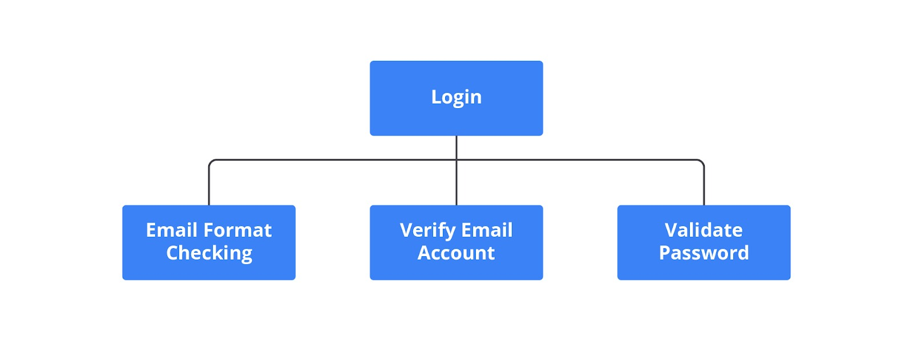

#programming 
Program yang bertambah besar dan memiliki banyak fitur, kodenya pun akan menjadi kompleks. Idealnya, kode yang ditulis memiliki struktur yang jelas dan ringkas. Untuk menjaga kode tetap terstruktur dan ringkas ketika programnya semakin kompleks, butuh upaya yang besar. Salah satu cara agar kode program yang kompleks menjadi tetap terstruktur dan jelas adalah dengan menerapkan modularisasi.

Modularisasi adalah cara kita untuk memecahkan kode program yang kompleks dan besar menjadi bentuk yang lebih sederhana dan ringkas. Implementasi dari modularisasi di JavaScript adalah dengan membuat berkas-berkas terpisah per bagian function/method yang disebut dengan modul. Kode yang ada di dalam Modul dapat digunakan oleh modul lainnya dengan cara export dan import.

Manfaat dari modularisasi adalah dapat menyelesaikan masalah terkait struktur dan kode program. Modularisasi dapat mempermudah kita untuk memahami keseluruhan struktur program sehingga gampang untuk berkolaborasi. Modularisasi membuat struktur kode menjadi rapi, memahami struktur dan membaca kode program yang sudah kompleks pun menjadi lebih mudah. Selain itu, function/method yang ditulis dapat digunakan kembali di tempat lainnya (reusable). Misalnya, satu function dapat digunakan di dua fitur yang berbeda.

JavaScript awalnya tidak memiliki konsep modularisasi. JavaScript hanya mengenal scope yang sama dari function/method/variable. Namun, semenjak adanya ECMAScript 2015, JavaScript bisa menggunakan konsep modularisasi dan dapat menggunakan keyword `import` dan `export`.  

Import memungkinkan kita untuk memasukkan function/method/variable dari modul lain. Export memungkinkan kita untuk mengeluarkan function/method/variable ke modul lain agar dapat digunakan.