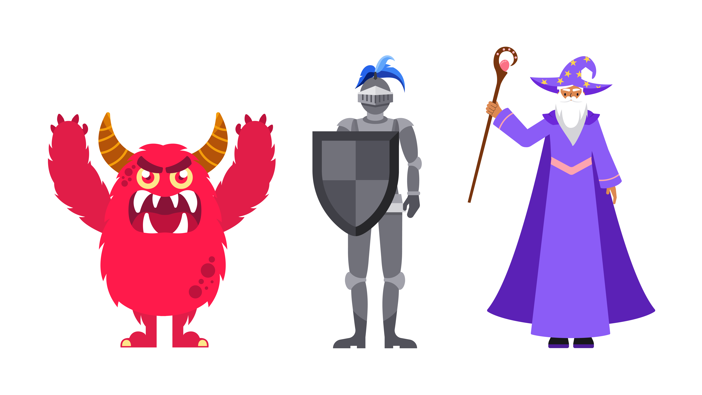
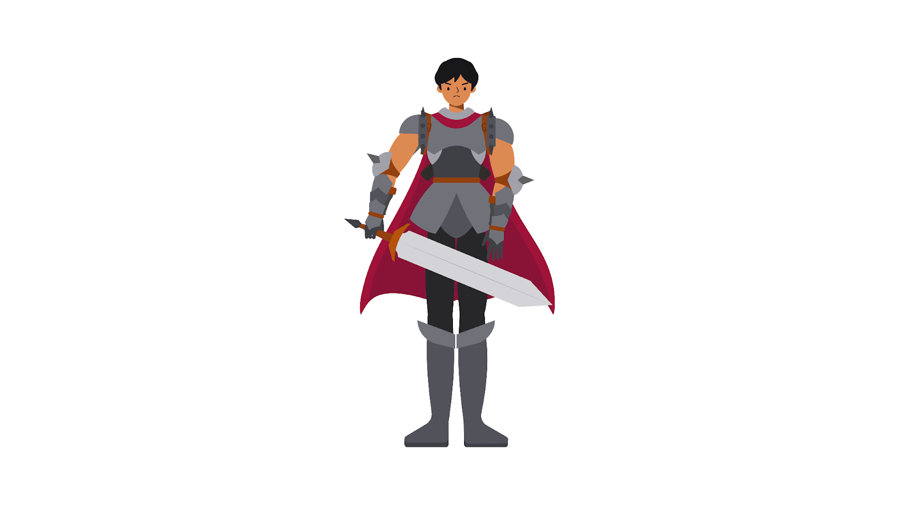

#programming 

 apakah pewarisan mampu untuk memecahkan masalah kode yang kompleks? Apakah pewarisan hanya mampu untuk kasus sesederhana sebelumnya? Yuk, kita eksplorasi bersama.
 


Misalnya, Anda sedang mengembangkan sebuah video game. Video game tersebut memiliki banyak karakter seperti monster, wizard dan guardian. Setiap karakter memiliki kemampuan yang sama yaitu bergerak. Selain itu, setiap karakter memiliki kemampuan yang unik pada dirinya seperti menyerang, bertahan, dan mengeluarkan sihir. Jika skenario video game ini kita gambarkan dengan konsep OOP, karakter akan menjadi SuperClass, sedangkan monster, wizard, dan guardian akan menjadi SubClass seperti contoh berikut ini.

```js
class Character {
  constructor(name, health, position) {
    this.name = name;
    this.health = health;
    this.position = position;
  }
 
  canMove() {
    console.log(`${this.name} moves to ${this.position}!`);
  }
}
 
 
class Monster extends Character {
  canAttack() {
    console.log(`${this.name} attacks with a weapon!`);
  }
}
 
class Guardian extends Character {
  canDefend() {
    console.log(`${this.name} defends with a shield!`);
  }
}
 
class Wizard extends Character {
  canCastSpell() {
    console.log(`${this.name} casts a magic spell!`);
  }
}

```

Oke, tidak ada yang salah dengan implementasi kode tersebut kan? Nah, timbul masalah ketika kita ingin menambahkan satu karakter lagi, misalnya karakter warrior. Warrior adalah karakter yang memiliki kekuatan super, ia bisa menyerang, bertahan, dan bergerak.


Bagaimana cara kita untuk membuat class Warrior? Anda mungkin menjawab dengan melakukan pewarisan dari SuperClass Character. Yup, hal itu benar karena memang itulah satu-satunya cara.

```js
class Warrior extends Character {
  canAttack() {
    console.log(`${this.name} attacks with a weapon!`);
  }
 
  canDefend() {
    console.log(`${this.name} defends with a shield}!`);
  }

```

### Object Composition.
Object composition dapat menjadi solusi untuk masalah pewarisan yang kompleks seperti di kasus polymorphism. Jika sebelumnya, pewarisan menggunakan pendekatan peran atau identitas dalam menstrukturkan kode, yakni Monster, Wizard, Warrior, dan Guardian. Ketika menggunakan object composition, pendekatan yang digunakan adalah berbasis kemampuan, bukanlah peran atau identitas. 

Kode distrukturkan berdasarkan kemampuan, apakah ia bisa menyerang, bertahan atau mengeluarkan sihir seperti berikut ini.
```js
function canAttack(character) {
  return {
    attack: () => {
      console.log(`${character} attacks with a weapon!`);
    }
  }
}
 
function canDefend(character) {
  return {
    defend: () => {
      console.log(`${character} defends with a shield!`);
    }
  }
}
 
function canCastSpell(character) {
  return {
    castSpell: () => {
      console.log(`${character} casts a spell!`);
    }
  }
}
```

Karena struktur kode sudah dipecah berdasarkan kemampuan, bukan peran atau identitas, ke depannya ketika ada karakter baru yang memiliki kombinasi kemampuan, akan lebih mudah untuk membuatnya. Untuk membuat object, kita dapat membuat function sebagai object creator dan mengomposisikan kemampuan-kemampuan tersebut.

Di JavaScript, kita dapat mengomposisikan objek secara mudah dengan menggunakan method `Object.assign()`. `Object.assign()` adalah method statis untuk menyalin semua properti dari satu atau lebih object ke objek target. `Object.assign()` akan mengembalikan objek target yang dimodifikasi.

```js
function createMonster(name) {
  const character = new Character(name, 100, 0);
  return Object.assign(character, canAttack(name));
}
 
function createGuardian(name) {
  const character = new Character(name, 100, 0);
  return Object.assign(character, canDefend(name));
}
 
function createWizard(name) {
  const character = new Character(name, 100, 0);
  return Object.assign(character, canCastSpell(name));
}
 
function createWarrior(name) {
  const character = new Character(name, 100, 0);
  return Object.assign(character, canAttack(character), canDefend(character));
}
```

Setelah membuat object creator, Buatlah object `Monster`, `Warrior`, `Wizard`, dan `Guardian`. Anda dapat melihat dan menjalankan kode lengkapnya di bawah ini.

```js
class Character {
  constructor(name, health, position) {
    this.name = name;
    this.health = health;
    this.position = position;
  }
 
  canMove() {
    console.log(`${this.name} moves to another position!`);
  }
}
 
function canAttack(character) {
  return {
    attack: () => {
      console.log(`${character.name} attacks with a weapon!`);
    }
  };
}
 
function canDefend(character) {
  return {
    defend: () => {
      console.log(`${character.name} defends with a shield!`);
    }
  };
}
 
function canCastSpell(character) {
  return {
    castSpell: () => {
      console.log(`${character.name} casts a spell!`);
    }
  };
}
 
function createMonster(name) {
  const character = new Character(name, 100, 0);
  return Object.assign(character, canAttack(character));
}
 
function createGuardian(name) {
  const character = new Character(name, 100, 0);
  return Object.assign(character, canDefend(character));
}
 
function createWizard(name) {
  const character = new Character(name, 100, 0);
  return Object.assign(character, canCastSpell(character));
}
 
function createWarrior(name) {
  const character = new Character(name, 100, 0);
  return Object.assign(character, canAttack(character), canDefend(character));
}
 
const monster = createMonster('Monster');
monster.canMove();
monster.attack();
 
const guardian = createGuardian('Guardian');
guardian.canMove();
guardian.defend();
 
const wizard = createWizard('Wizard');
wizard.canMove();
wizard.castSpell();
 
const warrior = createWarrior('Warrior');
warrior.canMove();
warrior.attack();
warrior.defend();
```


### Generic Composition
Sekarang kita punya ini
```js
createMonster
createGuardian
createWizard
createWarrior
```
Sampai suatu hari game kamu punya 20 tipe karakter. Lalu hidup developer mulai terasa berat.

Bayangkan kalau ada ability:
```js
canWalk
canAttack
canDefend
canHeal
canCastSpell
canFly
canShootArrow
canStealth
```
lalu kita harus membuat banyak karakter seperti:
```js
createElf
createKnight
createPaladin
createAssassin
createDragon
createPriest
createArcher
createMage
```
Dan setiap function bakal isi seperti ini lagi dan lagi dengan ini:
```js
const character = new Character(name)
return Object.assign(...)
```
Copy paste fiesta. Maintenance nightmare.
Itulah alasan muncul versi yang lebih **generic**, Alih-alih membuat 100 factory function, kita buat **1 factory saja**, Dengan structure begini:
```js
createCharacter(name, abilities)
```

Ability dimasukkan sebagai **array**.
contoh:
```js
createCharacter("Warrior", [canWalk, canAttack])
```
atau
```js
createCharacter("Paladin", [canWalk, canAttack, canHeal])
```

Jadi sekarang kita hanya punya **1 factory function**, Secara konsep kira-kira seperti ini:
```js
function createCharacter(name, abilities) {
    const character = new Character(name)
    for (const ability of abilities) {
        Object.assign(character, ability(character))
    }
    return character
}
```
Perhatikan bagian pentingnya.
```js
for (const ability of abilities)
```
Artinya kita **loop semua ability yang diberikan**.
Setiap ability akan mengembalikan object seperti ini:

```js
{  
   walk(){...}  
}
```

atau

```js
{  
   attack(){...}  
}
```

Lalu `Object.assign` menggabungkan semuanya ke `character`.

Hasilnya:
```js
const warrior = createCharacter("Warrior", [canWalk, canAttack])  
  
warrior.walk()  
warrior.attack()
```
jadi kita tidak perlu lagi menuliskan Factory yang begitu banyaknya seperti sebelumnya, cukup 1 factory saja untuk banyak karakter, Lebih scalable. Lebih clean. Lebih modular.
Ini yang biasanya disebut **true composition style**.

Ini contoh code lengkapnya untuk Generic Composition:
```js
class Character {
    constructor(name) {
        this.name = name;
    }
}

function canWalk(character) {
    return {
        walk() {
            console.log(`${character.name} sedang berjalan`);
        }
    }
}

function canAttack(character){
    return {
        attack() {
            console.log(`${character.name} menyerang musuh`);
        }
    }
}

function canHeal(character) {
    return {
        heal() {
            console.log(`${character.name} menyembuhkan diri`);
        }
    }
}

function createCharacter(name, abilities){
    const character = new Character(name)

    for (const ability of abilities){
        Object.assign(character, ability(character))
    }

    return character
}

const warrior = createCharacter("Warrior", [
    canWalk,
    canAttack
]);

const priest = createCharacter("Priest", [
    canWalk,
    canHeal
]);

const paladin = createCharacter("Paladin", [
    canWalk,
    canAttack,
    canHeal
]);
```

dengan begini jika ingin menambahkan skill baru, kita tidak perlu lagi mengubah factorynya,.
cukup buat ability barunya saja, misalnya saja mau menambahkan beberapa skill ini
```
canFly
canSwim
canShootArrow
```
cukup dengan begini:
```js
function canFly(character){
    return {
        fly(){
            console.log(character.name + " terbang")
        }
    }
}

function canSwim(character){
    return {
        fly(){
            console.log(character.name + " Berenang")
        }
    }
}

function canShootArrow(character){
    return {
        fly(){
            console.log(character.name + " Menembak Panah")
        }
    }
}
```

Lalu pakai:
```js
const angel = createCharacter("Angel", [
    canWalk,
    canFly,
    canHeal
])
```

Itulah kekuatan **composition**, Class inheritance sering berubah jadi **pohon keluarga kerajaan yang absurd**. Composition lebih seperti **lego ability**.