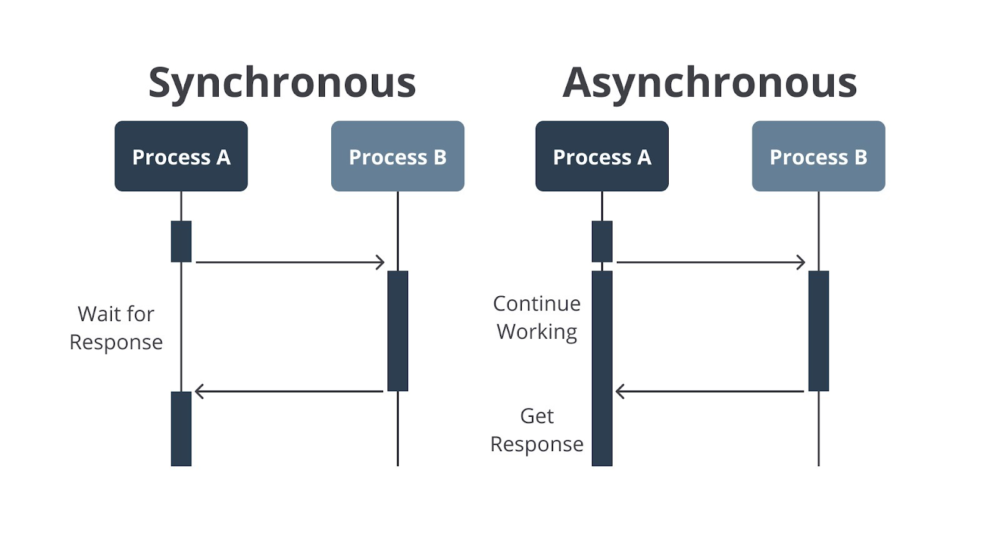

#programming 
_Hello, welcome to this module!_ Asynchronous process adalah topik yang sangat esensial untuk dipahami sebagai developer JavaScript. Sebagai bocoran, materi ini akan mengajarkan Anda bahwa kode JavaScript tidak harus selalu ditunggu hingga kelar agar kode yang mengikutinya dapat dieksekusi. Maknanya, antrean kode setelahnya akan tetap berjalan sembari menunggu dan mengharapkan hasil dari kode sebelumnya. Menarik, ya?

Meskipun terbilang topik baru, pembahasan ini akan kami bungkus agar Anda dapat belajar dengan mudah dan nyaman. Berikut adalah beberapa poin yang akan Anda miliki setelah menghabiskan materi ini.

- Mampu menentukan perbedaan alur proses yang berjalan secara asynchronous dan synchronous.
- Mampu membilang _workload_ yang dijalankan secara asynchronous dalam kasus nyata.
- Mampu mengilustrasikan sebuah proses yang berjalan secara asynchronous menggunakan setTimeout.
- Mampu menggunakan callback, Promise, dan async-await dalam menangani proses asynchronous secara paralel ataupun serial.
- Mampu menggunakan Promise.all dan Promise.allSettled untuk menjalankan banyak Promise sekaligus.

## Apa Itu Asynchronous Process

Dalam pengembangan aplikasi web atau Node.js, menangani proses yang berjalan secara asynchronous menjadi topik yang cukup menantang. Lalu, apa _sih_ proses asynchronous atau asinkron itu?

Dalam KBBI, asinkron berarti tidak dalam waktu atau kecepatan yang sama atau tidak serentak. Jika dimaknai dalam konteks pemrograman, proses atau operasi asinkron adalah sebuah operasi yang memungkinkan dijalankan oleh mesin dan kemudian dapat beralih fokus untuk menjalankan tugas-tugas (operasi) berikutnya sembari menunggu operasi sebelumnya selesai. Apa alasan adanya proses seperti ini?

Bayangkan Anda memiliki suatu tugas yang berpotensi mengonsumsi banyak waktu dan tidak seharusnya selalu ditunggu agar tugas lain bisa berjalan.

Jika dicontohkan, ada banyak proses yang berjalan secara asinkron. Bahkan, tidak terhitung angkanya. Katakanlah proses yang terjadi dalam kehidupan kita sebagai manusia. Disadari ataupun tidak, kita sering mengalami proses ini. Menjaga kebersihan di lingkungan rumah menjadi salah satu contoh nyata. Misalnya, kita dihadapkan kepada beberapa tugas berikut.

1. Mencuci baju dengan mesin cuci.
2. Mengelap ruangan dapur.
3. Menjalankan dishwasher untuk piring dan gelas kotor.
4. Menyapu dan mengepel lantai.

Untuk mengerjakan tugas pertama, berapa waktu yang dibutuhkan oleh mesin cuci agar selesai? Apakah 10, 20, atau bahkan 50 menit? Berapa pun lama waktunya, mesin cuci dapat menyita waktu bagi kita. Gambaran kita saat ini adalah tugas berikutnya tidak akan dimulai sebelum tugas sebelumnya selesai. Namun, kenyataannya tidak!

Sebab tugas telah didelegasikan kepada mesin cuci dan tinggal menunggu, kita bisa mengerjakan tugas kedua dalam waktu yang bersamaan. Begitu juga mirip dengan beberapa tugas berikutnya jika bisa dikerjakan dalam satu waktu. Inilah yang disebut dengan proses asinkron.

Dengan konsep yang sama, pengembangan aplikasi web juga memanfaatkan operasi-operasi yang berjalan secara asinkron. Mesin dapat menjalankan tugas lainnya sembari menunggu proses asinkron selesai. Beberapa contoh operasinya seperti melakukan koneksi dengan jaringan (_network request_), menjalankan kueri ke basis data (_querying a database_), melakukan baca-tulis berkas dalam file system, dan operasi lainnya yang berpotensi mengonsumsi banyak waktu.

Jadi, apa kesimpulan dari proses asynchronous? Proses yang tidak melakukan blocking process terhadap proses berikutnya karena tugas komputasi yang besar dan memakan banyak waktu. Lawan dari proses tersebut adalah synchronous. Jika synchronous process adalah proses yang dijalankan secara berurutan, mulai dari awal sampai akhir, asynchronous process adalah proses yang dapat dieksekusi secara paralel.

Perhatikan ilustrasi berikut untuk melihat perbedaan antara synchronous dan asynchronous process.

Keren! Kali ini Anda sudah paham maksud dari asynchronous process. Pada beberapa materi ke depan, kita akan belajar metode penanganan asynchronous process dalam JavaScript, mulai dari cara lama hingga terkini.