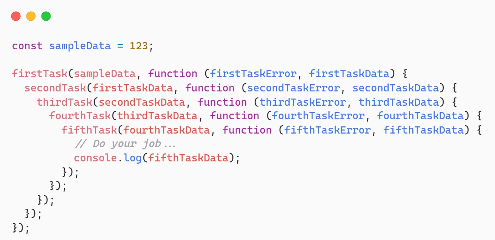
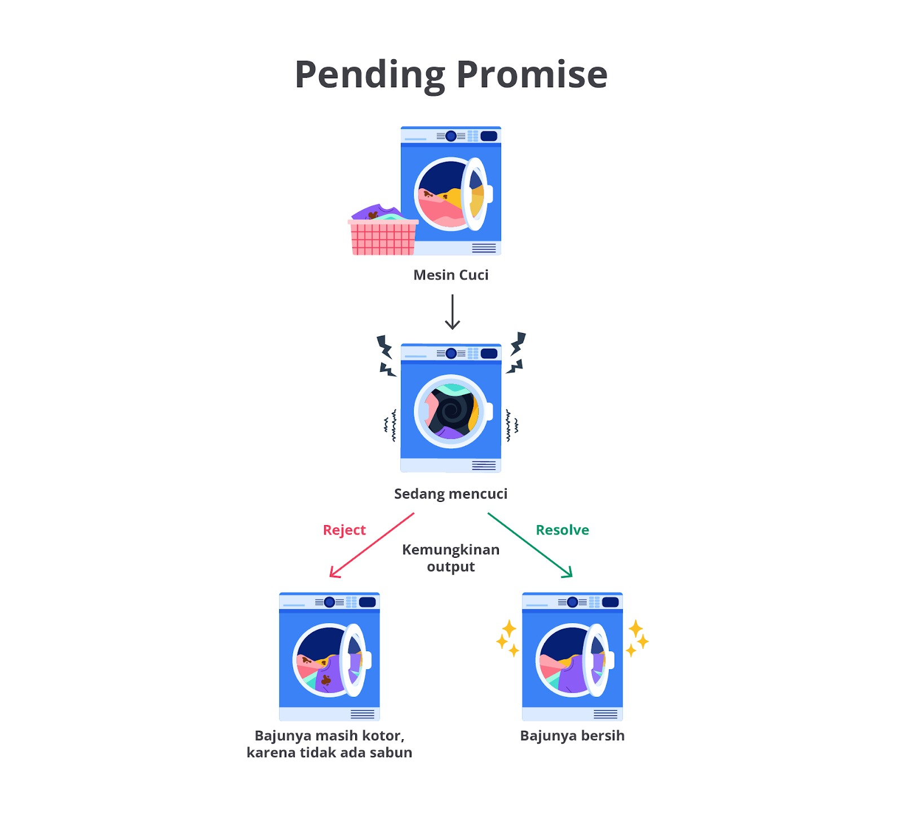

#programming 

Callback bukanlah satu-satunya cara penanganan proses asynchronous sebenarnya. Callback dapat menjalankan tugasnya dengan sangat baik. Namun, ada hal yang menyebabkan callback ini mencapai taraf tidak efektif. Bayangkan saja bila suatu tugas bergantung terhadap hasil dua atau lebih tugas asynchronous seperti studi kasus kita sebelumnya.

```js
makeCoffee(order, (makeCoffeeError, makeCoffeeData) => {
  if (makeCoffeeError) {
    console.log(makeCoffeeError);
    return;
  }
 
  sendCoffee(makeCoffeeData, (sendCoffeeError, sendCoffeeData) => {
    if (sendCoffeeError) {
      console.log(sendCoffeeError);
      return;
    }
 
    console.log(`Pramusaji memberikan ${sendCoffeeData} pesanan.`);
    console.log(`Saya mendapatkan ${sendCoffeeData} dan menghabiskannya.`);
  });
});
```

Tentunya kode di atas baik-baik saja. Katakanlah aktivitas meminum kopi ditandai dengan munculnya teks “Saya mendapatkan Kopi Espresso dan menghabiskannya”. Hal yang menjadi permasalahan adalah bagaimana jika proses minum kopi bergantung pada lebih dari dua, tiga, empat, atau lebih async process? Dalam konteks penulisan kode, itu akan makin menjorok ke dalam dan lebih sulit dipahami. Inilah efek dari pemanfaatan callback dan akan merujuk pada istilah [callback hell](http://callbackhell.com/).



Teknik terkini yang disajikan oleh JavaScript adalah Promise. Promise adalah sebuah objek khusus yang akan menentukan keberhasilan atau kegagalan dari proses asynchronous. Secara bahasa, Promise memiliki arti janji dan memang konsep yang dianut sangat mirip dengan makna tersebut.

Promise bekerja dengan tiga buah state atau kondisi.

- **Pending**: kondisi awal sebuah proses berjalan. Belum ada hasil yang diharapkan.
- **Fulfilled**: kondisi keberhasilan proses dan akan mengembalikan nilai positif. Misalnya mengembalikan isi berkas jika pembacaannya sukses.
- **Rejected**: operasi terjadi kegagalan dan membawa alasan atau data mengenai masalah ini. Biasanya, data kegagalan berupa instance dari class [Error](https://developer.mozilla.org/en-US/docs/Web/JavaScript/Reference/Global_Objects/Error).

Dari ketiga kondisi Promise, ini mirip dengan kehidupan nyata. Pending menandakan sebuah janji sedang berproses untuk menuju state diselesaikan, baik itu fulfilled maupun rejected. Masuk ke kategori fulfilled untuk menandakan sebuah janji ditepati dan memberikan hasil kesuksesannya serta rejected untuk menandakan sebuah janji teringkari dan memberikan alasannya.



Mari kita ambil contoh tugas mencuci pakaian pada mesin cuci. Bayangkan saja mesin cuci punya tiga buah state.

- **Pending**: mesin cuci sedang berjalan dan belum bisa memberikan hasil apa pun.
- **Fulfilled**: mesin cuci menyelesaikan tugasnya dengan baik dan pakaian sudah dibersihkan.
- **Rejected**: mesin cuci mengalami kegagalan ketika berproses dan mengembalikan baju kotor beserta alasannya. Misalnya belum diberi sabun, air tiba-tiba tidak mengalir, dan berbagai faktor lainnya.

Promise pada akhirnya akan diselesaikan. Tugas kita sebagai developer adalah memberikan kode logika untuk menangani jika proses masuk ke fulfilled atau terjadi kesalahan (rejected).

## Penanganan dengan Promise
Sebelumnya, Anda sudah tahu efek di balik penggunaan callback yang makin kompleks. Ya, callback hell akan muncul. Promise dapat memberikan kode yang lebih simpel dan mudah dipahami. Mari kita mulai penerapan ini.

Anda masih ingat cara penggunaan callback, kan?
```js
doSomething((doSomethingError, doSomethingData) => {
  if (doSomethingError) {
    console.log(doSomethingData);
  }
 
  console.log(doSomethingData);
});
```

Dari contoh kode di atas, kita bisa menyederhanakannya seperti berikut dengan Promise.
```js
function onFulfilled(doSomethingData) {
  // Do your jobs when "fulfilled" happens…
  console.log(doSomethingData);
}
 
function onRejected(doSomethingError) {
  // Do your jobs when "rejected" happens…
  console.log(doSomethingError);
}
 
doSomething().then(onFulfilled, onRejected);
```

Lebih enak dibaca, ya? Ada sesuatu yang baru di sini, yaitu then. `then` adalah method khusus milik objek Promise. Ia yang akan menangani atau menerima hasil dari proses asinkron. Method ini menerima dua buah callback, yaitu callback untuk menangani keberhasilan (fulfilled) dan callback untuk menangani kegagalan (rejected).

Lalu, apa itu Promise? Mungkin, Anda penasaran juga isi dari `doSomething`. Nah, berikut isinya.
```js
function promiseExecutor(resolve, reject) {
  setTimeout(() => {
    console.log('Melakukan sesuatu sebelum Promise diselesaikan.');
 
    // Penentuan hasil dari proses asinkron
    const number = Math.random();
 
    // Nilai fulfillment dari Promise
    if (number > 0.5) {
      resolve('You did it!');
    }
 
    // Nilai rejection dari Promise
    else {
      reject(new Error('Sorry, something went wrong!'));
    }
  }, 2000);
}
 
function doSomething() {
  return new Promise(promiseExecutor);
}
 
 
```

Function `doSomething` akan membuat dan mengembalikan nilai objek Promise. Ini ditandai dengan keyword new dan diikuti dengan objek `Promise`. Oleh karena itu, proses asinkron dimulai. Constructor Promise menerima satu buah callback dengan dua buah argumen. Kita namai argumen pertama adalah `resolve` dan argumen kedua adalah `reject`.

**Ingat!** Karena ini proses asinkron, kita harus menanganinya dengan method `then` untuk memasuki penanganan berikutnya, baik fulfilled maupun rejected.

Kunci dari cara kerja Promise adalah ia akan memasuki kondisi fulfilled dan mengeksekusi `onFulfilled` jika `resolve` terpanggil. Sebaliknya, jika `reject` yang ditemui, Promise akan memasuki kondisi rejected dan `onRejected` berjalan.

contoh promise yang lain:
utils.mjs
```js
function promiseExecutor(resolve, reject) {
  setTimeout(() => {
    console.log('Melakukan sesuatu sebelum Promise diselesaikan.');

    // Penentuan hasil dari proses asinkron
    const number = Math.random();

    // Nilai fulfillment dari Promise
    if (number > 0.5) {
      resolve('You did it!');
    }
    // Nilai rejection dari Promise
    else {
      reject('Sorry, something went wrong!');
    }
  }, 2000);
}

export function doSomething() {
  return new Promise(promiseExecutor);
}
```

main.mjs:
```js
import { doSomething } from './utils.mjs';

function onFulfilled(doSomethingData) {
  // Do your jobs when "fulfilled" happens…
  console.log(doSomethingData);
}

function onRejected(doSomethingError) {
  // Do your jobs when "rejected" happens…
  console.log(doSomethingError);
}

doSomething().then(onFulfilled, onRejected);
```

Jika ada yang menebak bahwa kita masih pakai callback, yap, memang hal itu benar. Namun, Promise dapat terhindar dari callback hell dengan melakukan chaining method then.

### Chaining

Kita lanjutkan lagi kasus pemesanan kopi di kafe. Di sana, kita sudah mendapati dua buah proses asinkron, yaitu membuat kopi dan mengantarkan kopi. Keduanya dilakukan oleh pramusaji dan proses berikutnya sangat bergantung terhadap proses sebelumnya. Di sinilah chaining promise dapat mengatasi masalah.

Perhatikan penerapan chaining pada kode berikut.
coffee.mjs:
```js
export function makeCoffee(name) {
  return new Promise((resolve, reject) => {
    const estimationTime = 2000;
    let isSuccess = false;

    const inSecond = Math.ceil(estimationTime / 1000);
    console.log(`Mohon menunggu. Pramusaji sedang membuatkan kopi dalam ${inSecond} detik`);

    setTimeout(() => {
      const number = Math.random();
      if (number > 0.3) {
        isSuccess = true;
      }

      if (!isSuccess) {
        reject(new Error('Maaf, kopi gagal dibuatkan.'));
        return;
      }

      console.log('Pramusaji selesai membuat kopi.');
      resolve(name);
    }, estimationTime);
  });
}

export function sendCoffee(name) {
  return new Promise((resolve, reject) => {
    const estimationTime = 1000;
    let isSuccess = false;

    console.log('Pramusaji sedang mengantarkan kopi pesanan');

    setTimeout(() => {
      const number = Math.random();
      if (number > 0.1) {
        isSuccess = true;
      }

      if (!isSuccess) {
        reject(new Error('Maaf, kopi gagal diantarkan.'));
        return;
      }

      console.log('Pramusaji sudah sampai ke meja.');
      resolve(name);
    }, estimationTime);
  });
}
```

main.mjs:
```js
import { makeCoffee, sendCoffee } from './coffee.mjs';

const order = 'Kopi Espresso';

console.log(`Saya memesan ${order} di kafe.`);

makeCoffee(order)
  .then(
    (value) => {
      return sendCoffee(value);
    },
    (error) => {
      console.error(error.message);
      throw error;
    },
  )
  .then(
    (value) => {
      console.log(`Pramusaji memberikan ${value} pesanan.`);
      console.log(`Saya mendapatkan ${value} dan menghabiskannya.`);
    },
    (error) => {
      console.error(error.message);
      throw error;
    },
  );
```

Pada main.mjs, pemanggilan `then` terjadi dua kali karena masih ada proses berikutnya, yaitu mengirimkan kopi, setelah pembuatan kopi sukses. Penanganan ini disebut dengan **chaining method**. Ini bisa dilakukan karena method `then` juga mengembalikan nilai Promise sebetulnya sehingga proses asinkron bisa kita teruskan.

Jika merasa penanganan error setiap proses asinkron sama, kita bisa memanfaatkan method `catch`. Ini artinya seluruh kemungkinan error yang dapat terjadi pada setiap proses akan memasuki method tersebut.
```js
makeCoffee(order)
  .then((value) => {
    return sendCoffee(value);
  })
  .then((value) => {
    console.log(`Pramusaji memberikan ${value} pesanan.`);
    console.log(`Saya mendapatkan ${value} dan menghabiskannya.`);
  })
  .catch((error) => {
    console.log(error.message);
  });
```

Silakan ubah kode pada interactive code di atas agar menerapkan method `catch`.

Berapa pun banyaknya proses asinkron yang perlu dilakukan untuk mencapai suatu hasil, kita dapat memanfaatkan method then.

```js
makeCoffee(order)
  .then((value) => { /* Do your jobs... */ })
  .then((value) => { /* Do your jobs... */ })
  .then((value) => { /* Do your jobs... */ })
  .then((value) => { /* Do your jobs... */ })
  .then((value) => { /* Do your jobs... */ })
  .then((value) => { /* Do your jobs... */ })
  .catch((error) => console.log(error.message));
```

### Common Problem with Promise
Tahukah Anda bahwa kita bisa saja terjebak kepada callback hell lagi meskipun memanfaatkan Promise sebagai penanganannya? Berikut buktinya.

```js
makeCoffee(order).then((value) => {
  sendCoffee(value).then((value) => {
    console.log(`Pramusaji memberikan ${value} pesanan.`);
    console.log(`Saya mendapatkan ${value} dan menghabiskannya.`);
  });
});
```

Walaupun tetap berjalan dengan baik, kode di atas akan berpotensi terjebak pada callback hell. Makin banyak proses asinkron berikutnya maka kode makin menjorok ke dalam. Jadi, silakan manfaatkan chaining method untuk mengatasi ketergantungan proses ini.

Pastikan kita mengembalikan nilai Promise-nya (return) jika memanfaatkan chaining method. Hal ini karena `then` akan berjalan jika menemukan objek Promise.
```js
makeCoffee(order)
  .then((value) => {
    sendCoffee(value); // <-- tidak akan dilanjutkan ke then berikutnya.
  })
  .then((value) => {
    console.log(`Pramusaji memberikan ${value} pesanan.`);
    console.log(`Saya mendapatkan ${value} dan menghabiskannya.`);
  })
  .catch((error) => {
    console.log(error.message);
    throw error;
  });
```

