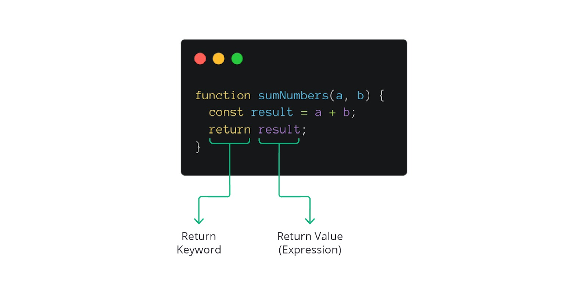

#programming 

elain ada data yang masuk, function juga bisa mengeluarkan nilai, _lo_. Ini kita sebut sebagai return value.

Saat kita menjalankan function JavaScript, mesin akan menjalankan seluruh kode dalam function body. Ada hasil yang akan dievaluasi. Secara bawaan (default), function akan mengembalikan undefined.

```js
const result = console.log('JavaScript keren!');
console.log(result);

/* Output:
JavaScript keren!
undefined
*/
```
Lihat! Ternyata variabel `result` berisi **undefined**. Hal ini karena memang method `console.log` tidak mengembalikan nilai apa pun dan JavaScript tidak menganggap ini sebagai error.

Untuk memberikan kemampuan function mengembalikan nilai (return statement), kita gunakan kata kunci return dan diikuti nilai kembaliannya. Perhatikan notasinya pada gambar berikut.


Kita memiliki function dengan identifier `sumNumbers`. Ia menerima dua input, yaitu `a` dan `b` untuk diproses operasi penjumlahan. Agar function ini dapat mengembalikan nilai, kita tambahkan return statement beserta nilai yang diharapkan ingin keluar.

Jika dijalankan, output pada console akan terlihat seperti berikut.
```js
function sumNumbers(a, b) {
  const result = a + b;
  return result;
}

const result = sumNumbers(2, 4);
console.log('2 + 4:', result);

/* Output:
2 + 4: 6
*/
```