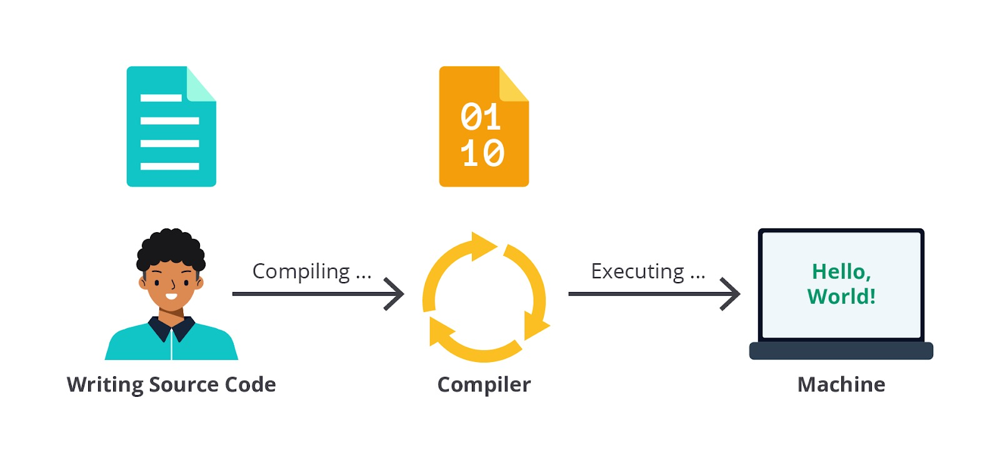

#programming 
Pada dasarnya, pemrograman memungkinkan komputer menjalankan perintah-perintah sistematis dalam bahasa yang dimengerti. _Yup_, komputer memerlukan bahasa khusus sehingga perintah-perintah tersebut dapat terlaksana dengan baik. Sebagai pemrogram atau developer, kita perlu menggunakan bahasa yang tepat dan nantinya dapat dimengerti oleh komputer.

Serangkaian perintah komputer ditulis oleh developer dalam bentuk kode. Kode dapat berupa sekumpulan karakter, angka, dan simbol. Kode-kode ini hanya dipahami oleh manusia atau disebut dengan bahasa tingkat tinggi. Ada sangat beragam bahasa pemrograman di luar sana dan memiliki penulisan kode atau sintaksis yang bermacam-macam. Beberapa contohnya adalah JavaScript, Java, C, C++, Python, Matlab, dsb.

Hasil kegiatan menulis kode ini disebut sebagai _source code_. Berikutnya, source code tersebut akan diubah ke bahasa yang dapat dipahami oleh komputer sehingga bisa dianalisis dan dieksekusi perintah-perintahnya. Inilah yang disebut dengan bahasa mesin. Bahasa ini sangat sulit dipahami oleh manusia dan komputer hanya memahami bahasa ini.

Tahukah kamu bahwa bahasa mesin juga disebut sebagai bahasa tingkat rendah (_low-level language_)? Ia disebut demikian karena dapat dieksekusi langsung oleh mesin alias bahasa yang lebih dekat dengannya. Tentu ada bahasa tingkat tinggi (_high-level language_) juga. Namun, ia hanya lebih dekat dengan manusia sehingga mudah ditulis, dibaca, dan dipahami olehnya. Agar bahasa tingkat tinggi bisa dieksekusi oleh mesin, kita perlu mengonversi atau mengolah source code ini ke bahasa rendah.

Dalam tahapan perubahan dari bahasa tingkat tinggi ke bahasa tingkat rendah, ada dua mekanisme yang dapat dilakukan serta setiap bahasa dapat menggunakan cara berbeda, yaitu _compiler_ dan _interpreter_. Mari kita bahas satu per satu.

### Compiled Language
Ada beberapa bahasa pemrograman yang membutuhkan satu tahapan sebelum instruksinya dapat dijalankan oleh mesin, yaitu proses kompilasi atau _compile_. Bagi bahasa yang membutuhkan ini, mereka memiliki compiler-nya masing-masing.

Misalnya, developer membuat sebuah program dengan suatu bahasa yang menggunakan compiler. Agar instruksi dapat dijalankan oleh komputer, source code perlu diubah dahulu ke bahasa mesin menggunakan compiler. Terakhir, program tersebut dapat diserahkan ke mesin agar dijalankan.

Beberapa bahasa yang menggunakan compiler adalah Java, C++, Swift, dsb.

### Scripting Language
Tidak seperti _compiled language_, sebuah program atau source code yang ditulis dengan _scripting language_ tidak memerlukan compiler. Source code dapat langsung diberikan, diterjemahkan, dan dijalankan oleh mesin. Mesin ini menggunakan interpreter dalam melakukannya. Contoh yang sangat dekat dengan kita adalah browser. Masing-masing aplikasi pasti membawa kode JavaScript dan langsung dibaca oleh browser.

Beberapa bahasa pemrograman yang menggunakan interpreter adalah JavaScript, PHP, Python, dsb.

