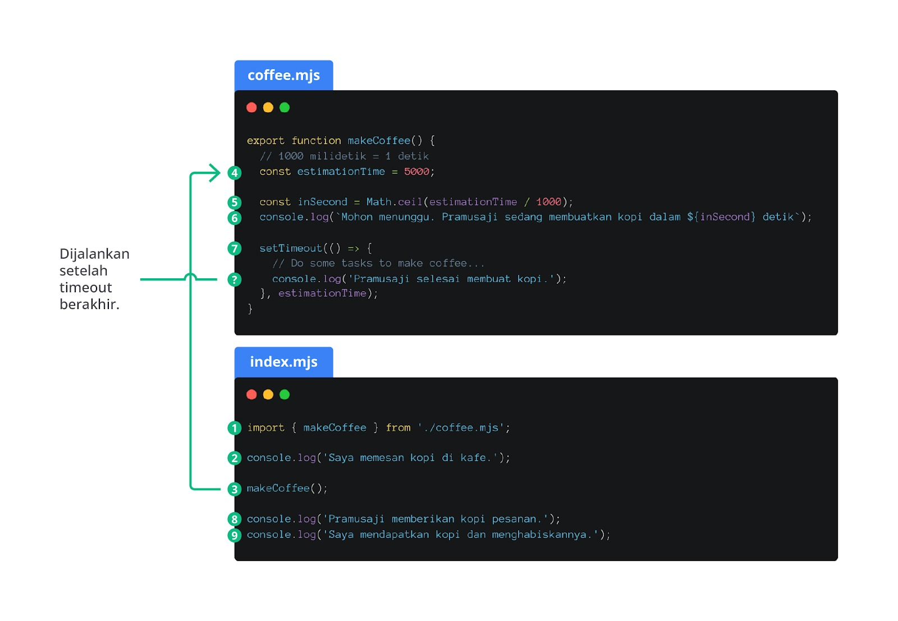

#programming 
Ada banyak sekali kejadian dari asynchronous process, terutama dalam web development. Kita sudah mengetahui beberapa contoh dari masalah ini dalam materi sebelumnya. Selama pembelajaran ini, kita belum pernah mempelajari dan memerintahkan mesin untuk mengemban tugas besar, seperti berkoneksi dengan network. Langkah awalnya, kita akan memanfaatkan satu global function dari JavaScript sebagai simulasi untuk menciptakan proses asinkron, yaitu setTimeout.

setTimeout adalah salah satu dari sekian global function yang dapat menetapkan timer (pengatur waktu) bagi function agar dieksekusi. Jadi, ada dua parameter wajib, yaitu nilai berupa function dan number sebagai timer. Setelah timer sudah berakhir, seluruh cuplikan kode dalam function akan dieksekusi.

Simpelnya, perhatikan contoh berikut.

```js
const estimationTime = 10_000;

setTimeout(() => {
  console.log('Hello, world!');
}, estimationTime);

/* Output:
Hello, world!
*/
```

Apakah Anda sudah menjalankan kode di atas? Program di atas seharusnya cukup mewakili dalam memahami cara kerja `setTimeout`. Tentunya Anda bisa membuktikan bahwa teks “Hello, world!” akan muncul setelah sepuluh detik, kan?

Lalu, manakah sisi dari proses asinkronnya? Mari kita periksa contoh kasus lain. Coba tebak hasil yang akan dikeluarkan dari cuplikan kode berikut.

Ekspektasi yang kita miliki adalah output dengan urutan berikut.

1. Saya memesan kopi di kafe.
2. Mohon menunggu. Pramusaji sedang membuatkan kopi dalam 5 detik.
3. Pramusaji selesai membuat kopi.
4. Pramusaji memberikan kopi pesanan.
5. Saya mendapatkan kopi dan menghabiskannya.

Sebagaimana hasil yang diberikan oleh mesin, perintah `console.log` dalam `makeCoffee` dijalankan belakangan. Ini ditandai dengan teks “Pramusaji selesai membuat kopi.” muncul di akhir. Bagaimana bisa pramusaji memberikan kopi dan kita menghabiskannya jika kopinya saja masih dalam proses pembuatan? Tentunya ini tidak sesuai dengan urutan kode (sequential order) dan beginilah perilaku dari asynchronous process. Ingat! Ini kita simulasikan dengan `setTimeout`.

Bagi kita yang terbiasa dengan sequential order, ini terlihat aneh. Namun, kita bisa membuktikan bahwa proses yang memakan waktu lama (asynchronous) tidak melakukan _blocking process_ dan kode-kode setelahnya tetap dapat dijalankan sembari proses asinkron diselesaikan.

Demi kemudahan membaca kode, Anda dapat memahami gambar berikut yang menunjukkan alur jalannya program.



Pada gambar di atas, kita menemukan ada sembilan langkah yang akan terjadi. Ada satu titik lagi yang ditandai dengan “?”. Apakah maksudnya langkah kesepuluh? Belum tentu atau bahkan tidak. Karena berjalan secara asinkron, kode tersebut dapat dijalankan kapan pun hingga proses asinkron selesai tanpa memedulikan urutan jalannya.

Sampai sini, mungkin Anda berpikir, “Bagaimana jika `estimationTime` dibuat 0 saja agar tidak ada waktu tunggu?”, dan seharusnya hasil akan sesuai dengan ekspektasi. Kenyataannya, tidak akan ada perbedaan hasil karena bagaimanapun setTimeout akan berjalan secara asinkron. Silakan ubah saja nilai dari variabel `estimationTime` dan perhatikan hasilnya.

Lalu, bagaimana solusinya agar kopi kita bisa diterima dan dihabiskan setelah pramusaji menyelesaikan pekerjaannya? Kita bisa memanfaatkan callback dan Promise.


