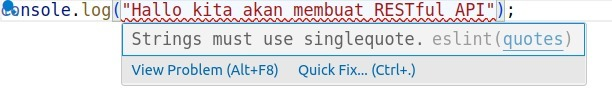
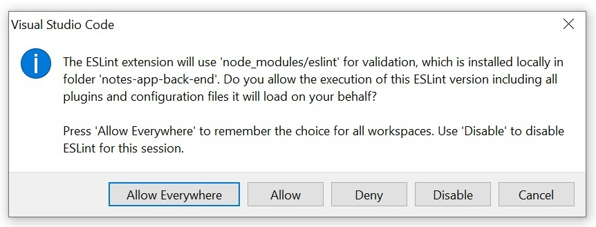
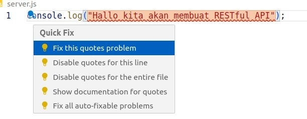

#programming 
Sebelum membuat berkas JavaScript, kita akan gunakan dua tools tambahan untuk memudahkan proses pengembangan web server. Jadi, mari kita siapkan kedua tools tersebut. Apa saja?

## Nodemon
Tools pertama adalah `nodemon`, ia bisa dikatakan wajib digunakan selama proses pengembangan. Pasalnya, dengan tools ini kita tak perlu menjalankan ulang server ketika terjadi perubahan pada berkas JavaScript. Nodemon akan mendeteksi perubahan kode JavaScript dan mengeksekusi ulang secara otomatis.

1. Untuk menggunakannya, pasanglah package [nodemon](https://www.npmjs.com/package/nodemon) pada `devDependencies`dengan mengeksekusi perintah berikut di Terminal proyek.
```shell
npm install nodemon --save-dev
```

2. Untuk memastikan nodemon terpasang pada proyek, Anda bisa memeriksa berkas `package.json`, lebih tepatnya di objek `devDependencies`.
```js
  "devDependencies": {
    "nodemon": "^3.1.10"
  }
```
Bila package berhasil terpasang, Anda bisa lihat properti nodemon dan versi yang digunakan di sana.

3. Untuk mencoba nodemon, silakan buat berkas JavaScript dulu pada proyek kita dan berikan nama “**server.js**”. Di dalamnya, tulislah kode berikut:
```js
console.log('Hallo kita akan membuat RESTful API');
```

4. Kemudian di dalam **package.json**, buat npm runner script baru untuk menjalankan **server.js** menggunakan nodemon.
```json
"scripts": {
  "start": "nodemon server.js"
},
```

5. Lalu, jalankan perintah `npm run start` pada Terminal.
6. Nodemon berhasil mengeksekusi **server.js** dan akan terus mengawasi perubahan kode yang ada.
```shell
[nodemon] starting `node server.js`
Hallo kita akan membuat RESTful API

[nodemon] clean exit - waiting for changes before restart
[nodemon] restarting due to changes...
[nodemon] starting `node server.js`
Hallo kita akan membuat RESTful API dengan tools nodemon
```
Anda tidak perlu menjalankan ulang perintah `npm run start` setiap terjadi perubahan pada berkas JavaScript. Cukup simpan perubahannya dan nodemon akan menjalankan ulang secara otomatis.


## ESLint
Tools yang kedua adalah ESLint, ia dapat membantu atau membimbing Anda untuk selalu menuliskan kode JavaScript dengan gaya yang konsisten. Seperti yang Anda tahu, JavaScript tidak memiliki aturan yang baku untuk gaya penulisan kode, bahkan penggunaan semicolon. Karena itu, terkadang kita jadi tidak konsisten dalam menuliskannya.

ESlint dapat mengevaluasi kode yang dituliskan berdasarkan aturan yang Anda terapkan. Anda bisa menuliskan aturannya secara mandiri atau menggunakan gaya penulisan yang sudah ada. Kami menyediakan ESlint sharable config untuk Anda yang ingin menerapkan gaya penulisan sama seperti di kelas Dicoding dengan mengunjungi _repository_ berikut ini: [Dicoding Academy JavaScript Style Guide](https://github.com/dicodingacademy/javascript-style-guide).

1. Untuk menggunakan ESLint, pasanglah package ESLint pada devDependencies proyek Anda. Caranya, silakan eksekusi perintah berikut di Terminal:
```shell
npm init @eslint/config@latest
```

2. Kemudian Anda akan diberikan beberapa pertanyaan, silakan jawab pertanyaan yang ada dengan jawaban berikut:

- What do you want to lint? -> javascript
- How would you like to use ESLint? -> _To check syntax and find problems._
- What type of modules does your project use? -> _JavaScript modules (import/export)._
- Which framework does your framework use? -> _None of these._ 
- Does your project use TypeScript? -> _No_.
- Where does your code run? -> _Node_ (pilih menggunakan spasi).
- Would you like to …… (seluruh pertanyaan selanjutnya) -> _Y_. 
- Which package manager do you want to use? -> npm.

3.  Sama seperti package _nodemon_, setelah berhasil terpasang, package ESlint akan muncul di **package.json** lebih tepatnya pada _devDependencies_.
```json
 "devDependencies": {
    "@eslint/js": "^9.33.0",
    "eslint": "^9.33.0",
    "globals": "^16.3.0",
    "nodemon": "^3.1.10"
  }
```
Selain itu, akan terbentuk berkas konfigurasi ESlint dengan nama **.eslint.config.js.** Di dalam berkas tersebut tertulis konfigurasi sesuai dengan jawaban pada pertanyaan-pertanyaan yang diberikan seperti berikut.
```js
import js from "@eslint/js";
import globals from "globals";
import { defineConfig } from "eslint/config";

export default defineConfig([
{ files: ["**/*.{js,mjs,cjs}"],
plugins: { js },
extends: ["js/recommended"],
languageOptions: { globals: globals.node } },
]);
```

4. Selanjutnya, kita akan menambahkan style guide Dicoding Academy dengan cara menjalankan perintah berikut ini.
```shell
npm install --save-dev eslint-config-dicodingacademy
```

5. Setelah itu, tambahkan kode berikut ini di berkas eslint.config.js.
```js
import globals from 'globals';
import pluginJs from '@eslint/js';
import daStyle from 'eslint-config-dicodingacademy';
 
 
export default [
  daStyle,
  { files: ['**/*.js'], languageOptions: { sourceType: 'module' } },
  { languageOptions: { globals: globals.node } },
  pluginJs.configs.recommended,
];
```

6. Setelah membuat konfigurasi ESLint, selanjutnya kita gunakan ESLint untuk memeriksa kode JavaScript yang ada pada proyek. Namun sebelum itu, kita perlu menambahkan _npm runner_berikut di dalam berkas package.json:
```json
"scripts": {
  "start": "nodemon server.js",
  "lint": "eslint ./"
},
```

7. Jalankan perintah **npm run lint** pada Terminal proyek, lalu perhatikan hasilnya.

Pada Terminal, kita dapat melihat terdapat eror (jangan khawatir, ini hanya eror styling, bukan kode). Seperti inilah fungsi dari ESLint, ia akan memberi tahu alasan dan letak kesalahan dalam penulisan kode. Setiap eror yang tampil, itu menandakan adanya penulisan kode yang tidak sesuai dengan style guide yang sudah kita tetapkan. Melalui ESLint ini, kita dapat mencari letak kesalahan secara akurat dan cepat.

Selain itu, ESLint dapat diintegrasikan dengan berbagai text editor, termasuk VSCode. Untuk mengaktifkan integrasi, Anda bisa menggunakan ekstensi [ESLint](https://marketplace.visualstudio.com/items?itemName=dbaeumer.vscode-eslint) untuk Visual Studio Code.

8. Untuk mengunduh dan memasang ekstensi [ESLint](https://marketplace.visualstudio.com/items?itemName=dbaeumer.vscode-eslint), silakan pilih menu extensions.

9. Kemudian, cari ekstensi dengan nama “ESLint”.  

10. Tekan tombol “**install**” untuk memasang ESLint. Simpel ‘kan? Di contoh, karena sudah terpasang yang tampil adalah Uninstall.

11. Sekarang, mari kita kembali ke berkas **server.js**, di sana Anda akan melihat tanda kuning pada kode console.

Untuk pengguna Windows, ekstensi ESLint belum sepenuhnya diaktifkan. Anda perlu mengizinkan ekstensi ESLint berjalan melalui icon ‘Lampu’ yang muncul ketika Anda mengarahkan kursor ke kode console.  
  
Tekan ikon lampu tersebut, kemudian pilih opsi **ESLint: Manage Library Execution**.

> **Catatan:** Jika Manage Library Execution tidak muncul pada VSCode Anda, itu berarti ESLint extensions sudah dapat digunakan. Anda bisa abaikan langkah tersebut.

Pilih “**Allow Everywhere**” pada pop-up yang muncul. Kemudian, tutup dan buka ulang proyek menggunakan VSCode.


Kini ekstensi ESLint sudah berjalan dengan normal.


Penggunaan tanda petik dua dianggap sebuah error karena tidak sesuai dengan style guide yang digunakan, dimana style guide tersebut menggunakan tanda petik satu. Inilah fungsi ESLint, ia dapat membantu menyoroti hal tersebut. 

12. Agar sinkron dengan gaya penulisan di ESLint, Anda dapat mengatur indentasi dan line spacing di VSCode sesuai dengan style guide yang digunakan pada ESLint. Pengaturan tersebut berada di bottom bar VSCode.