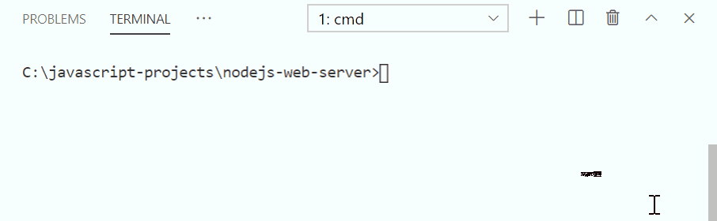

#programming 
Pengembangan back-end adalah hal prioritas untuk Node.js. Ia andal dalam membangun aplikasi back-end, salah satunya web server alias sebuah komputer yang dapat menangani dan menanggapi permintaan dari client. Node.js menyediakan core modules http untuk membangun web server.
```js
import http from 'http';
```

HTTP module memiliki banyak member seperti objek, properti, atau method yang berguna untuk melakukan hal-hal terkait protokol HTTP. Salah satu member yang penting untuk kita ketahui sekarang adalah method `http.createServer()`.

Sesuai namanya, method ini berfungsi untuk membuat HTTP server yang merupakan instance dari `http.server`. Method ini menerima satu parameter custom callback yang digunakan sebagai request listener. Di dalam request listener inilah logika untuk menangani dan menanggapi sebuah request dituliskan.
```js
import http from 'http';
 
/**
 * Logika untuk menangani dan menanggapi request dituliskan pada fungsi ini
 * 
 * @param request: objek yang berisikan informasi terkait permintaan
 * @param response: objek yang digunakan untuk menanggapi permintaan
*/
const requestListener = (request, response) => {
    
};
 
const server = http.createServer(requestListener);
```

Request listener memiliki 2 parameter, yakni `request` dan `response`. Seperti yang tertulis pada contoh kode di atas, request merupakan objek yang menyimpan informasi terkait permintaan yang dikirimkan oleh client. Di dalam objek ini kita bisa melihat alamat yang diminta, data yang dikirim, ataupun HTTP metode yang digunakan oleh client.

Sementara itu, response merupakan objek yang digunakan untuk menanggapi permintaan. Melalui objek ini kita bisa menentukan data yang diberikan, format dokumen yang digunakan, kode status, atau informasi response lainnya.
```js
const requestListener = (request, response) => {
    response.setHeader('Content-Type', 'text/html');
 
    response.statusCode = 200;
    response.end('<h1>Halo HTTP Server!</h1>');
};
```

Kode di atas merupakan contoh logika yang bisa dituliskan di dalam request listener. Request listener akan menanggapi setiap permintaan dengan dokumen HTML, kode status 200, dan menampilkan konten “Halo HTTP Server!”.

Lalu, bagaimana caranya agar server selalu sedia menangani permintaan yang masuk? Setiap instance dari http.server juga memiliki method `listen()`. Method inilah yang membuat `http.server` selalu standby untuk menangani permintaan yang masuk dari client. Setiap kali ada permintaan yang masuk, request listener akan tereksekusi.

Method `listen()` dapat menerima 4 parameter, berikut detailnya:

- `port` (number) : jalur yang digunakan untuk mengakses HTTP server.
- `hostname` (string) : nama domain yang digunakan oleh HTTP server.
- `backlog` (number) : maksimal koneksi yang dapat ditunda (pending) pada HTTP server.
- `listeningListener` (function) : callback yang akan terpanggil ketika HTTP server sedang bekerja (listening).

Namun, keempat parameter di atas bersifat opsional. Kita bisa memberikan nilai port saja, atau kombinasi apa pun dari keempatnya. Hal itu tergantung terhadap kebutuhan Anda. Namun lazimnya, ketika memanggil method `listen()` kita memberikan nilai `port`, `hostname`, dan `listeningListener`.
```js
const port = 5000;
const host = 'localhost';
 
server.listen(port, host, () => {
    console.log(`Server berjalan pada http://${host}:${port}`);
});
```


#### Latihan Membuat HTTP Server
Nah, sekarang giliran kita praktikan pada proyek **nodejs-web-server**. Silakan hapus kode yang ada pada **server.js** dan ganti dengan kode untuk membuat http server seperti ini:

```js
import http from 'http';
 
const requestListener = (request, response) => {
    response.setHeader('Content-Type', 'text/html');
 
    response.statusCode = 200;
    response.end('<h1>Halo HTTP Server!</h1>');
};
 
const server = http.createServer(requestListener);
 
const port = 5000;
const host = 'localhost';
 
server.listen(port, host, () => {
    console.log(`Server berjalan pada http://${host}:${port}`);
});
```

Setelah itu, jalankan perintah npm run start pada Terminal. Jika server berhasil dijalankan, maka Anda akan melihat pesan ‘Server berjalan pada [http://localhost:5000](http://localhost:5000/)’.


Selamat! Anda berhasil membuat HTTP Server pertama menggunakan Node.js. Anda bisa coba melakukan request pada server tersebut melalui cURL seperti ini:
`curl -X GET http://localhost:5000/`

Silakan eksekusi kode di atas pada Terminal atau CMD. Anda akan mendapatkan response sesuai dengan yang dituliskan pada _request listener_.

Anda juga bisa mencoba langsung pada browser dengan mengunjungi halaman [http://localhost:5000/](http://localhost:5000/).


_Good Job!_ Akhirnya Anda berhasil membuat web server pertama menggunakan Node.js! Walau masih sangat sederhana, namun hal tersebut merupakan hal pertama yang dilakukan oleh back-end developer dalam meniti karirnya.
