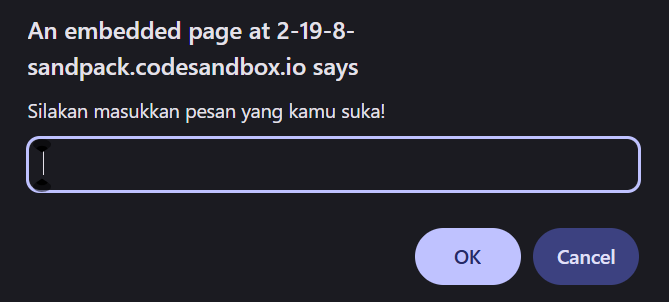

#programming 
Sebelumnya kita telah mempelajari penggunaan method `alert()` untuk menampilkan pesan dalam dialog browser. Nah, selain menampilkan pesan, kita juga akan belajar cara mengambil data input dari user melalui dialog browser, yaitu `prompt()`. Method ini akan menampilkan sebuah dialog browser yang meminta user untuk mengisi kolom inputnya. Karena bisa menangkap input dari _user_, method ini memiliki lebih banyak fungsionalitas ketimbang `alert()`. Yuk, kita bahas satu-satu.

### Nilai Kembalian dari prompt

Jika kita lihat, sebenarnya method `alert()` mengembalikan sebuah value berupa _undefined_. Namun, _`prompt()`_ akan mengembalikan sebuah nilai sesuai dengan inputan _user_. Sebagai contoh, mari jalankan kode berikut pada _console_ _browser._
```js
let pesanInput = prompt('Silakan masukkan pesan yang kamu suka!');
console.log(pesanInput);
```

Lalu, coba kita tampilkan isi dari variabel `pesanInput`, maka hasilnya pasti akan sesuai dengan pesan yang kita input pada pop-up.



Output yang keluar tidak akan di tampilkan ke dalam layar di websitenya, tetapi ke dalam console web tersebut.

Kita bisa melihat bahwa nilai yang tersimpan di variabel `pesanInput` sesuai dengan input yang diberikan user, yakni "Hello world". Jika _user_ tidak mengisi apa pun dan tetap menekan tombol "OK", maka nilai yang diberikan hanya _string_ kosong.

Pada contoh di atas, kita telah menekan tombol "OK", tetapi apa yang terjadi jika kita menekan tombol "Cancel"? Jika kita menekan tombol "Cancel", justru nilai yang dikembalikan adalah null. Silahkan coba kembali contoh di atas tetapi kali ini tekan tombol "Cancel", nanti nilai dari variabel pesanInput akan bernilai null.

Ada satu hal yang perlu kita ingat selama menggunakan `prompt()`, yakni nilai apa pun yang dimasukkan oleh user akan diproses dan dikembalikan menjadi data string. walau yang kita masukkan berupa angka.

Meskipun demikian, kita bisa _cast_ atau _parse_ hasilnya ke tipe data tertentu, Sebagai contoh, kita ingin mendapatkan value number dari `prompt()` maka kita bisa menggunakan cara ini.
```js
let pesanInput = Number(prompt('Masukkan angka sesukamu...'));
```
Selain `Number()`, kita juga bisa menggunakan function `parseInt()` untuk melakukan parsing data string ke number.

### Memberikan Nilai Default untuk prompt

Terdapat satu parameter lagi yang bisa kita masukkan ke `prompt()`, di mana parameter ini berguna sebagai nilai alternatif. Mari kita jalankan kode berikut.
```js
let name = prompt('Silakan masukkan nama Anda!', 'John Doe');
```

Ketika kita jalankan pada _browser_, maka kolom input yang muncul pada _dialog box_ akan memiliki data secara otomatis.

Terdapat satu hal penting, yaitu ketika _dialog box_ dari `prompt()` muncul, maka kita tidak bisa berinteraksi dengan komponen lain pada halaman _web_ sampai _dialog box_ tersebut ditutup. Hal ini sama halnya dengan `alert()`.